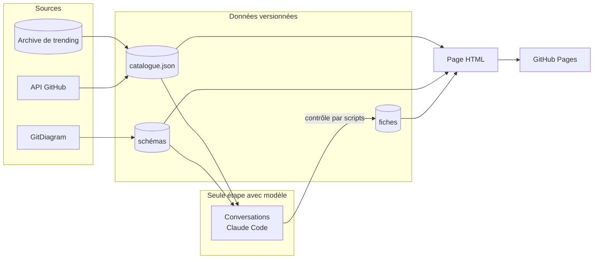

# Veille-Repo

**Un catalogue des dépôts passés par le trending GitHub depuis septembre 2024 : chacun décrit, classé et résumé en une page, consultable en ligne ou hors ligne.**

[](https://flosa.github.io/Veille-Repo/)


[](https://github.com/microsoft/playwright)
[](https://github.com/mermaid-js/mermaid)
[](https://github.com/ahmedkhaleel2004/gitdiagram)
[](https://github.com/anthropics/claude-code)
[](https://pages.github.com/)
[](LICENSE)

Période couverte : **2024-09-01 → 2026-09-29**.

| Pertinence | Dépôts | README hors ligne | Schémas d'architecture | Synthèses |
|---|---|---|---|---|
| cœur métier | 2 184 | 2 172 | 1 819 | 1 810 |
| périphérie | 958 | 949 | 583 | 574 |
| hors périmètre | 763 | 748 | 325 | 323 |
| à trier | 398 | 374 | 177 | 173 |
| **total** | **4 303** | **4 243** | **2 904** | **2 880** |

Une synthèse s'écrit à partir du README **et** du schéma : c'est le schéma qui fixe le rythme.
Les écarts restants tiennent à trois causes — **60 dépôts** n'ont pas de README (supprimés,
bloqués par GitHub, ou sans fichier README), les schémas manquants sont générés au rythme du
quota gratuit de GitDiagram, et **11 outils offensifs** n'ont pas de synthèse, leur rédaction
étant refusée par le filtre de sécurité du modèle.

## Sommaire

- [Architecture](#architecture)
- [Documentation](#documentation)
- [Démarrage](#démarrage)
- [Configuration](#configuration)
- [Tests](#tests)
- [Structure du projet](#structure-du-projet)
- [Licences & composants](#licences--composants)

## Architecture

Le catalogue est produit par une **chaîne de scripts**, et **un seul maillon fait appel à un
modèle** : la rédaction des synthèses. Tout le reste — collecte, téléchargement, découpage,
contrôle, rendu, publication — est mécanique et ne coûte aucun token.

| Maillon | Rôle |
|---|---|
| Collecte | l'archive de trending donne les dépôts du jour, l'API GitHub les complète, les facettes en découlent |
| Hors ligne | le README complet et le schéma GitDiagram de chaque dépôt sont stockés |
| Rédaction | une conversation Claude Code par bloc de 30 dépôts écrit les synthèses selon un contrat fixe |
| Contrôle | les scripts redécoupent, corrigent et valident les fiches, puis recalculent les alertes factuelles |
| Rendu | une page HTML autonome, publiée sur GitHub Pages |



> Détails : [documentation/architecture.md](documentation/architecture.md)

## Documentation

| Document | Contenu |
|---|---|
| [architecture.md](documentation/architecture.md) | Composants, flux, stockage, décisions, limites |
| [fonctionnalites.md](documentation/fonctionnalites.md) | La page : recherche, facettes, onglets, schémas zoomables, statuts |
| [mise-a-jour.md](documentation/mise-a-jour.md) | Mettre le catalogue à jour en trois commandes, dépannage |
| [fiches.md](documentation/fiches.md) | Le contrat des synthèses : front matter, huit sections, règles, contrôles |
| [couts.md](documentation/couts.md) | Coûts mesurés de la rédaction et ce qui les fait baisser |
| [SECURITY.md](documentation/SECURITY.md) | Ce qui est publié, ce qui ne l'est jamais, secrets masqués |

## Démarrage

**Consulter** : ouvrir **https://flosa.github.io/Veille-Repo/**. Rien à installer.

**Sur sa machine**, avec les scripts du skill `veille-github` installés :

**Prérequis** : Python **3.12**, et pour la génération des schémas manquants Node.js **24**
avec Playwright **1.61**. La CLI `gh` connectée à GitHub donne un quota d'API de 5 000
requêtes par heure au lieu de 60.

```bash
S=~/.claude/skills/veille-github/scripts
python3 $S/readmes.py            # télécharge les README (non versionnés, ~2 min)
python3 $S/rendre_page.py        # fabrique veille/catalogue.html
xdg-open veille/catalogue.html
```

**Mettre à jour** le catalogue :

```bash
bash $S/mettre-a-jour.sh         # collecte et blocs, puis coller les prompts de PROMPTS.md
bash $S/integrer.sh              # contrôle, rendu, commit
bash $S/publier.sh               # mise en ligne
```

> Procédure complète : [documentation/mise-a-jour.md](documentation/mise-a-jour.md)

| Accès | Adresse | Note |
|---|---|---|
| Site public | https://flosa.github.io/Veille-Repo/ | branche `site`, sans la facette « déjà chez toi » |
| Page locale | `veille/catalogue.html` | avec la facette « déjà chez toi » |

## Configuration

| Variable | Défaut | Effet |
|---|---|---|
| `GITHUB_TOKEN` ou `GH_TOKEN` | à défaut, `gh auth token` | quota d'API authentifié pour l'enrichissement |

Les réglages de la rédaction — taille des blocs, plafond des README, isolement des outils
offensifs — sont des options de `preparer.py`, décrites dans
[documentation/mise-a-jour.md](documentation/mise-a-jour.md).

## Tests

```bash
node $S/test_page.mjs                   # 115 assertions sur la page rendue
python3 $S/fiches.py --valider          # contrat des fiches
python3 $S/fiches.py --etat             # fraîcheur : à jour, à écrire, à refaire
```

## Structure du projet

```text
Veille-Repo/
├── README.md
├── LICENSE
├── documentation/              # cette documentation
└── veille/
    ├── mermaid.min.js          # rendu des schémas, embarqué pour le hors ligne
    ├── 2026-09-16-veille-github.md   # notes de veille quotidienne et mensuelles
    └── .data/
        ├── catalogue.json      # le magasin : un enregistrement par dépôt
        ├── fiches/             # une synthèse par dépôt
        ├── diagrammes/         # un schéma GitDiagram par dépôt
        ├── declenches.txt      # schémas déjà générés chez GitDiagram
        └── exclus.txt          # dépôts sans fiche, refusés par le filtre de sécurité
```

Non versionnés : les README bruts (**80 Mo**), les blocs de rédaction, la page et ses pièces
jointes, et tout ce qui est personnel (voir [SECURITY.md](documentation/SECURITY.md)).

## Licences & composants

| Composant | Rôle | Licence |
|---|---|---|
| [bonfy/github-trending](https://github.com/bonfy/github-trending) | Archive quotidienne du trending, source du catalogue | MIT |
| API GitHub | Métadonnées des dépôts | conditions d'utilisation de GitHub |
| [GitDiagram](https://github.com/ahmedkhaleel2004/gitdiagram) | Schémas d'architecture tirés du code | MIT |
| [Mermaid](https://github.com/mermaid-js/mermaid) | Rendu des schémas dans la page | MIT |
| [Playwright](https://github.com/microsoft/playwright) | Déclenchement des schémas manquants | Apache-2.0 |
| [Claude Code](https://github.com/anthropics/claude-code) | Rédaction des synthèses et traductions | propriétaire (Anthropic) |
| GitHub Pages | Hébergement du site | conditions d'utilisation de GitHub |
| README et schémas recopiés | Contenu des dépôts catalogués | **licence de chaque dépôt d'origine** |
| **Ce projet** | Scripts, page, synthèses | MIT — Copyright (c) 2026 floSa |
