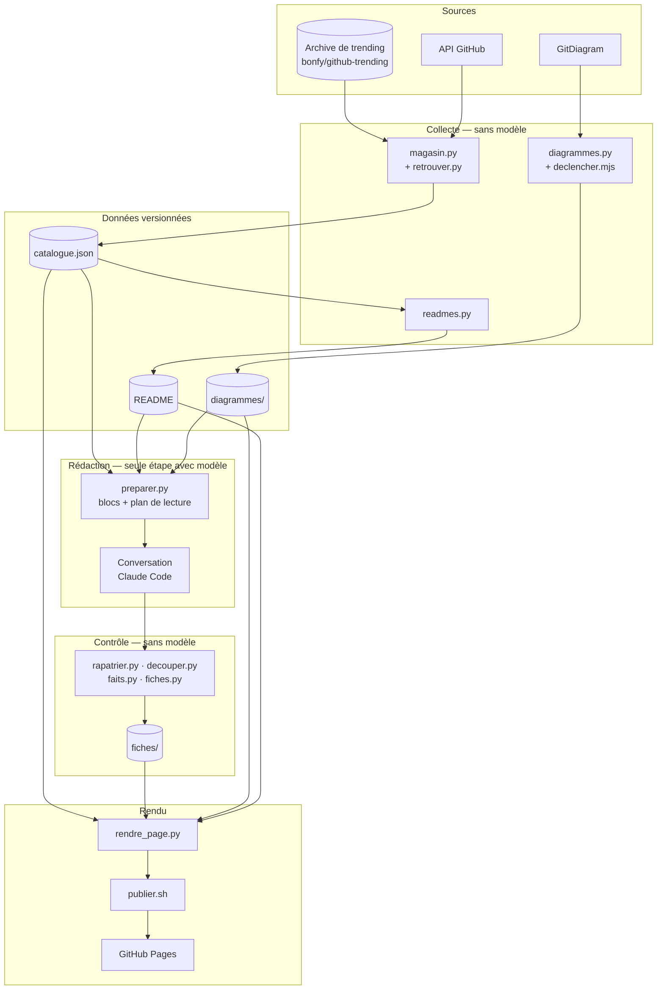

# Architecture — Veille-Repo

## 1. Vue d'ensemble

Veille-Repo est un **catalogue de veille GitHub** : les dépôts passés par le trending depuis
septembre 2024, décrits, classés et consultables dans une page web unique. Le système est une
**chaîne de scripts** qui transforme une archive de trending en fiches, et une **page statique**
qui les affiche, hors ligne ou en ligne.

Principe directeur : **tout ce qui est mécanique est un script, sans aucun appel de modèle**.
Le modèle n'intervient qu'à une étape, l'écriture des synthèses, et chacun de ses appels est
mesuré (voir [couts.md](couts.md)).

| Chiffre | Valeur |
|---|---|
| Période couverte | **2024-09-01 → 2026-09-29** |
| Dépôts au catalogue | **4 303** |
| README stockés hors ligne | **4 242** |
| Schémas d'architecture (GitDiagram) | **2 751** |
| Synthèses rédigées | **1 831** |

---

## 2. Composants

Les scripts vivent dans le skill `veille-github`, maintenu à part. Ce dépôt contient les
**données** qu'ils produisent et la **page** qui les affiche.

| Script | Rôle | Appel de modèle |
|---|---|---|
| `magasin.py` | Lit l'archive de trending jour par jour, enrichit chaque dépôt par l'API GitHub, calcule les facettes | ❌ |
| `retrouver.py` | Retrouve un par un les dépôts renommés que l'enrichissement par lots n'a pas su suivre | ❌ |
| `readmes.py` | Télécharge le README complet de chaque dépôt | ❌ |
| `diagrammes.py` | Récupère les schémas d'architecture déjà calculés par GitDiagram | ❌ |
| `declencher.mjs` | Fait générer chez GitDiagram les schémas manquants, au rythme de leur quota | ❌ |
| `preparer.py` | Nettoie les README et fabrique les blocs de dépôts à synthétiser, avec leur plan de lecture | ❌ |
| *conversation Claude Code* | Lit un bloc, écrit une synthèse par dépôt | ✅ |
| `rapatrier.py` | Récupère les sorties des conversations, en les reconnaissant à leur contenu | ❌ |
| `decouper.py` | Redécoupe une sortie en fiches, complète le front matter, corrige titres et vocabulaire | ❌ |
| `faits.py` | Recalcule les alertes factuelles des fiches (licence, archivage, ancienneté) | ❌ |
| `fiches.py` | État de fraîcheur des fiches et validation du contrat | ❌ |
| `traduire.py` | Sort et réinjecte les lots de descriptions à traduire en français | ✅ (traduction) |
| `rendre_page.py` | Fabrique la page et ses pièces jointes | ❌ |
| `publier.sh` | Publie la page sur GitHub Pages | ❌ |

Trois scripts d'orchestration les enchaînent : `mettre-a-jour.sh`, `integrer.sh` et
`publier.sh` (voir [mise-a-jour.md](mise-a-jour.md)).

---

## 3. Flux de bout en bout

1. L'archive de trending donne, pour chaque jour, les dépôts qui y sont passés.
2. L'API GitHub complète chaque dépôt : étoiles, licence, dates, sujets. Les facettes en découlent.
3. Le README complet et le schéma GitDiagram de chaque dépôt sont stockés hors ligne.
4. Les dépôts du périmètre sans synthèse sont regroupés en blocs.
5. Une conversation par bloc écrit les synthèses, selon un contrat fixe.
6. Les scripts redécoupent, corrigent et valident les fiches.
7. La page est régénérée, puis publiée.

---

## 4. Stockage

| Chemin | Contenu | Versionné |
|---|---|---|
| `veille/.data/catalogue.json` | Le magasin : un enregistrement par dépôt (métadonnées, facettes, jours de trending) | ✅ |
| `veille/.data/fiches/<owner>__<repo>.md` | Une synthèse par dépôt, front matter + 8 sections | ✅ |
| `veille/.data/diagrammes/<owner>__<repo>.json` | Schéma mermaid, explication et date, tirés de GitDiagram | ✅ |
| `veille/.data/declenches.txt` | Journal des schémas déjà générés chez GitDiagram, pour ne jamais les redemander | ✅ |
| `veille/.data/exclus.txt` | Dépôts jamais mis en bloc (rédaction refusée par le filtre de sécurité) | ✅ |
| `veille/.data/readmes/` | README bruts, **80 Mo**, retéléchargeables en deux minutes | ❌ |
| `veille/.data/blocs/` | Blocs de rédaction, regénérables gratuitement | ❌ |
| `veille/catalogue.html` + pièces jointes | La page, regénérée à chaque rendu | ❌ |

Règle de versionnement : **ce qui a coûté un appel de modèle, une longue passe réseau ou une
décision se versionne ; ce qui se régénère en quelques minutes, non.**

La page publiée ne vit pas sur `main` : elle part sur une branche à part, `site`, en un seul
commit remplacé à chaque publication.

---

## 5. Décisions d'architecture

- **Des scripts pour tout le mécanique, plutôt que des agents**, parce que télécharger,
  découper ou valider ne demande aucune intelligence et coûte zéro token en script. *Limite* :
  chaque cas particulier (titre écorché, séparateur oublié) doit être prévu dans le code.

- **Le schéma GitDiagram plutôt qu'un schéma rédigé depuis le README**, parce qu'il est tiré
  du **code** et nomme les vrais fichiers, là où un README décrit ce que l'auteur veut qu'on
  retienne. *Limite* : quelques schémas sont génériques ou périmés, et la fiche le signale.

- **Lire le cache de GitDiagram, puis faire générer seulement les manquants**, plutôt
  qu'auto-héberger GitDiagram, parce que l'auto-hébergement suppose une clé d'API payante. Le
  cache se lit gratuitement ; une génération coûte environ **0,005 $** au service. *Limite* :
  leur quota gratuit autorise environ **8 générations par heure**.

- **Des blocs de 30 dépôts lus en parallèle**, plutôt qu'un dépôt par conversation, parce que
  chaque appel renvoie toute la fenêtre de contexte : c'est le nombre d'appels qui fait le prix
  (voir [couts.md](couts.md)).

- **Les alertes factuelles recalculées par script**, plutôt que laissées au modèle, parce que
  licence, archivage et date du dernier push sont connus du catalogue. Le modèle les devinait
  mal dès que le catalogue était vide pour un dépôt.

- **Une page HTML autonome plutôt qu'une application**, parce qu'elle s'ouvre sans serveur,
  hors ligne comme en ligne. Les pièces jointes sont chargées par balise `<script>`, puisqu'un
  `fetch()` est refusé sur `file://`. *Limite* : **166 Mo** et près de **8 800 fichiers** à
  publier.

---

## 6. Limites connues

- **Couverture partielle** : seules les synthèses du périmètre retenu sont écrites (voir
  [fiches.md](fiches.md#1-périmètre)). Les autres dépôts ont README, description et parfois
  schéma, mais pas de synthèse.
- **Archive limitée à quatre langages** : l'archive de trending ne couvre que Python,
  JavaScript, Go et Swift. Un dépôt Rust ou C++ n'y entre que par d'autres chemins.
- **Dépôts disparus** : **37** dépôts ont été supprimés ou bloqués par GitHub depuis leur
  passage en trending. Ils restent au catalogue avec les données collectées à l'époque.
- **Outils offensifs** : la rédaction de certaines fiches est refusée par le filtre de
  sécurité du modèle. Ces dépôts sont listés dans `exclus.txt`.
