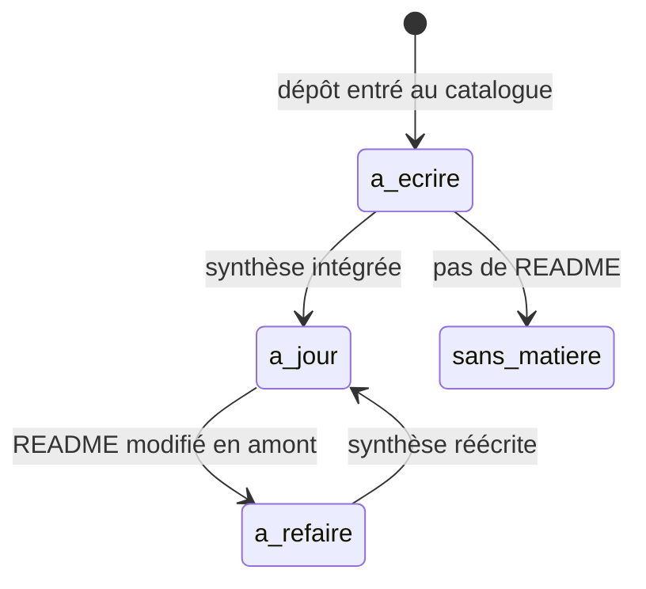

# Le contrat des fiches

Une fiche est une **synthèse d'une page** sur un dépôt, écrite pour un profil data, IA ou
MLOps. Toutes suivent le même contrat, **version 1**, vérifié par `fiches.py --valider`.

---

## 1. Périmètre

Les fiches couvrent en priorité le **cœur de métier** du catalogue, soit **2 184 dépôts**. Un
dépôt n'entre dans un bloc que s'il a un README et, de préférence, son schéma GitDiagram : la
synthèse s'appuie sur les deux.

| Pertinence | Dépôts |
|---|---|
| cœur métier | **2 184** |
| périphérie | 958 |
| hors périmètre | 763 |
| à trier | 398 |

---

## 2. Ce que la conversation reçoit

Pour chaque dépôt, le bloc donne :

| Élément | Source |
|---|---|
| Une ligne d'**identité** : licence, étoiles, dates de création et de dernier push, archivage | le catalogue — ces faits sont vérifiés |
| Le **README complet**, nettoyé des badges, du changelog et des sections sans valeur | `readmes.py` puis `preparer.py` |
| L'**architecture décrite d'après le code**, écrite par GitDiagram | `diagrammes/` |
| La **liste des composants** du schéma, avec leurs fichiers | `diagrammes/` |

---

## 3. Le front matter

```yaml
---
schema: 1                          # ajouté par decouper.py
depot: owner/repo                  # ajouté par decouper.py
source_readme_sha: 16 caractères   # empreinte du README, décide de la fraîcheur
ecrite_le: AAAA-MM-JJ              # ajouté par decouper.py
nature: outil | bibliothèque | liste | service | modèle | doc | app | extension | dataset | jeu
deploiement: pip | npm | docker | binaire | SaaS | rien à installer | compilation | autre
prerequis: [aucun | clé d'API | GPU | Docker | service tiers | compte à créer | version de Python | Node | Go | beaucoup de RAM]
cout: gratuit | freemium | clé d'API à ta charge | payant
maturite: expérimental | utilisable | éprouvé
gouvernance: entreprise | fondation | une personne | communauté
alertes: [licence non déclarée | licence à vérifier | licence copyleft | licence à clauses commerciales | mainteneur unique | archivé | dépend d'un SaaS | télémétrie | dernier commit ancien | matière insuffisante]
verdict: adopter | surveiller | ignorer
---
```

Le vocabulaire est **fermé** : c'est ce qui permet d'en faire des facettes cherchables plutôt
qu'un champ de texte libre.

Les alertes **factuelles** — licence, `archivé`, `dernier commit ancien` (plus d'un an sans
push) — sont recalculées d'après le catalogue par `faits.py`. Les alertes de **jugement** —
`mainteneur unique`, `télémétrie`, `dépend d'un SaaS`, `matière insuffisante` — restent celles
de la synthèse.

---

## 4. Les huit sections

| Section | Contenu attendu |
|---|---|
| Le problème | Deux lignes : ce qui fait mal sans cet outil |
| Ce que ça fait vraiment | Quatre lignes concrètes, sans marketing |
| Comment c'est branché | Un mermaid de 5 à 8 nœuds, avec les vrais noms de fichiers |
| Essayer | Les commandes **réellement présentes** dans le README, aucune inventée |
| Coût et pièges | Clé d'API, GPU, quota, facture à ta charge, compte à créer |
| Ce que ce n'est pas | Malentendus, limites, coût caché — jamais vide |
| Alternatives | Trois au plus, uniquement des dépôts nommés dans le README |
| Pour toi | Un verdict **motivé** pour un profil data, IA ou MLOps |

---

## 5. Règles de rédaction

1. **Aucune invention.** Tout doit être traçable au README, au schéma ou à l'architecture
   décrite d'après le code. « Non documenté » est une réponse attendue.
2. **Les faits de l'identité font foi** : les alertes de licence, d'archivage et d'ancienneté
   s'en déduisent.
3. **Interdits** : *powerful, blazing fast, seamless, production-ready*, et tout superlatif du
   README.
4. **Moins d'une page par fiche**, soit 2 500 à 3 000 caractères.
5. Un README de moins de 800 caractères donne une **fiche minimale**, avec l'alerte
   `matière insuffisante`.
6. Un **outil offensif** ou à double usage est décrit en termes neutres, sans mode opératoire.

---

## 6. Contrôles et corrections automatiques

`fiches.py --valider` signale : un champ hors vocabulaire, une section absente, une section
vide ou réduite à un talon, un schéma mermaid manquant. Une section courte mais honnête
(« Le README ne nomme aucune alternative », une commande `pip install` seule) est acceptée.

`decouper.py` corrige sans appel de modèle ce qui est mécanique :

| Défaut | Correction |
|---|---|
| Titre de section écorché (« branched », « périles ») | Ramené au titre du contrat |
| Valeur approximative (« télémétrie? », « Python ») | Ramenée au vocabulaire |
| Bilan de fin de conversation collé à la dernière fiche | Retiré |
| Front matter technique (`schema`, `depot`, empreinte, date) | Calculé, jamais demandé au modèle |

---

## 7. Fraîcheur

Une fiche porte l'empreinte du README d'après lequel elle a été écrite. `fiches.py --etat` les
classe :



Une fiche à refaire repasse dans un bloc au prochain `mettre-a-jour.sh`. Aucune n'est jamais
écrite deux fois pour le même README.
