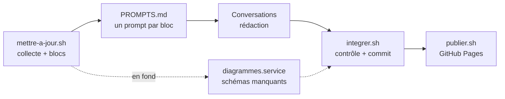

# Mettre le catalogue à jour

Une mise à jour tient en **trois commandes** et une série de prompts à coller. Tout est
mécanique et gratuit, sauf la rédaction des synthèses.

Dans ce document, `$S` désigne le dossier des scripts du skill :

```bash
S=~/.claude/skills/veille-github/scripts
```

---

## 1. Le cycle



| Étape | Commande | Durée | Coût modèle |
|---|---|---|---|
| Collecte et préparation | `bash $S/mettre-a-jour.sh` | quelques minutes | aucun |
| Rédaction | un prompt par bloc, dans une conversation chacun | ~2 min par bloc | ~20 k tokens par dépôt |
| Intégration | `bash $S/integrer.sh` | moins d'une minute | aucun |
| Publication | `bash $S/publier.sh` | 1 à 2 minutes | aucun |

---

## 2. Collecte : `mettre-a-jour.sh`

Il enchaîne, dans l'ordre :

1. `magasin.py --maj` — lit les **seuls jours nouveaux** de l'archive et enrichit les dépôts
   jamais vus ou dont les métadonnées ont plus de 30 jours.
2. `retrouver.py` — retrouve les dépôts **renommés** que l'enrichissement a perdus.
3. `traduire.py --lister` — sort les nouvelles descriptions à traduire.
4. `readmes.py` — télécharge les README manquants.
5. `diagrammes.py --lent 3` — récupère les schémas déjà en cache chez GitDiagram.
6. `possede.py` — recalcule la facette locale « déjà chez toi ».
7. `preparer.py --refaire` — fabrique les blocs : dépôts sans fiche, **et** fiches dont le
   README a changé.
8. `rendre_page.py` — regénère la page.

Il laisse dans `veille/.data/blocs/PROMPTS.md` **un prompt prêt à coller par bloc**, et confie
au service de génération les dépôts du périmètre qui n'ont pas encore de schéma.

---

## 3. Rédaction : un prompt par bloc

Le même prompt sert pour tous les blocs. **Seule la première ligne change** : le numéro du bloc.

```text
BLOC = 38
Dans tout ce qui suit, NN est la valeur de BLOC sur deux chiffres (ex. 12, 07) et N le même
nombre sans zéro initial. Ne traite QUE le bloc NN, aucun autre.
1. Lis les 10 premières lignes de …/veille/.data/blocs/bloc-NN.md pour connaître les offset et
   limit. Puis, en UN SEUL message, lance en parallèle : le Read de PLAN.md ET tous les Read
   de bloc-NN.md avec exactement ces offset et limit.
2. Écris veille/.data/sorties/sortie-NN.md (chemin RELATIF) : une synthèse par repo, dans
   l'ordre, chacune précédée de  ===== DEPOT: owner/repo =====
   Exception : si l'en-tête du bloc dit « BLOC À PART », un fichier et un Write par repo.
CONTRAINTES : uniquement des Read et des Write. Aucun Bash, aucun sous-agent, aucune
relecture, aucune validation, aucun commit.
Termine par "SYNTHESE DE TACHE BLOC N" avec le bilan, puis "FIN DE TACHE".
```

Réglages de la conversation : **effort faible**, rien d'autre à activer. Lancer **cinq
conversations au plus** en même temps.

Trois règles de ce prompt pèsent directement sur le coût (voir [couts.md](couts.md)) :

| Règle | Pourquoi |
|---|---|
| Toutes les lectures dans un seul message | Chaque appel renvoie toute la fenêtre : 4 appels au lieu de 10 divisent le prix par trois |
| Chemin d'écriture relatif | La conversation tourne dans un worktree ; un chemin absolu vers le dépôt principal est refusé et coûte un appel perdu |
| Offset et limit donnés par l'en-tête | Une lecture trop grosse est refusée et recommencée |

---

## 4. Intégration : `integrer.sh`

1. `rapatrier.py` récupère les sorties, dans le dépôt ou dans les worktrees. Il ne retient une
   sortie que si **tous ses dépôts appartiennent au bloc** : un worktree contient aussi des
   fichiers d'anciennes campagnes.
2. `traduire.py --injecter` réinjecte les traductions.
3. `decouper.py` redécoupe en fiches, complète le front matter, retire le bilan de fin que la
   conversation laisse parfois dans le fichier, corrige les titres écorchés et ramène le
   vocabulaire au contrat. Les sorties intégrées sont aussitôt archivées : les redécouper plus
   tard écraserait les corrections faites depuis.
4. `faits.py` recalcule les alertes factuelles.
5. `fiches.py --valider` contrôle le contrat. Une fiche hors contrat est signalée, elle ne
   bloque pas les autres.
6. `diagrammes.py` récupère les schémas générés entre-temps.
7. La page est regénérée, puis tout est commité et poussé sur `main`.

Il ne supprime que les worktrees dont il a pris la sortie : une conversation encore en cours
garde le sien.

---

## 5. Publication : `publier.sh`

Il fabrique le site dans un dossier temporaire, **sans la facette « déjà chez toi »**, et le
pousse en un seul commit sur la branche `site`. GitHub Pages le met en ligne en une à deux
minutes. La branche ne garde que la dernière version.

---

## 6. Les schémas manquants

GitDiagram ne garde en cache que les dépôts que quelqu'un lui a déjà soumis. Pour les autres,
`declencher.mjs` ouvre la page du dépôt chez GitDiagram, ce qui lance la génération chez eux,
puis `diagrammes.py` récupère le résultat.

Le quota gratuit du service autorise environ **7 générations, puis 47 minutes d'attente**. Le
script lit ce délai dans le message de refus, attend, et reprend. Il tourne comme service
utilisateur systemd, `diagrammes.service` :

| Propriété | Valeur |
|---|---|
| Rythme observé | **~8 schémas par heure** |
| Redémarrage | à chaque ouverture de session, et toutes les heures |
| Journal | `veille/.data/declenches.txt` : seuls les succès et les refus définitifs y sont inscrits |
| Suivi | `bash $S/ou-en-est.sh` |

Un raté technique n'est jamais inscrit au journal : il repasse en fin de file. Une génération
obtenue n'est jamais redemandée.

---

## 7. Dépannage

| Problème | Cause | Solution |
|---|---|---|
| Une conversation s'arrête sur un refus de sécurité | Le bloc contient un outil offensif | Ajouter le dépôt à `veille/.data/exclus.txt` et refabriquer les blocs |
| `publier.sh` est refusé par GitHub | Un README contient un secret (jeton, webhook) | Ajouter son motif à `SECRETS` dans `rendre_page.py` |
| Le service de schémas n'écrit plus rien | Le navigateur s'est figé | Il redémarre seul dans l'heure ; sinon `systemctl --user restart diagrammes.service` |
| Des fiches marquées « à refaire » sans raison | Empreinte de README calculée différemment | `decouper.py` et `fiches.py` partagent désormais le même calcul |
