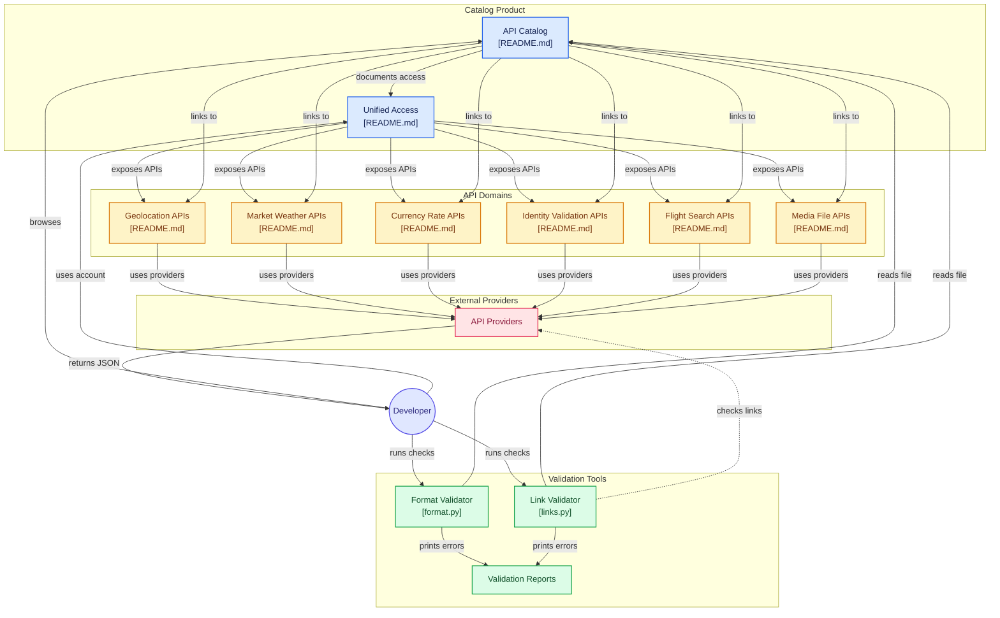

# Bloc 00 — 10 dépôts

Une synthèse par dépôt, dans cet ordre, séparées par une ligne `===== DEPOT: owner/repo =====`.

===== DEPOT: public-apis/public-apis =====

# APILayer Unified Suite in now Live! 🎉 🥳
APILayer unified suite allows you to integrate production-grade REST APIs using **One Account, One Dashboard, and One API key.** Whether you need to geocode an address, validate an email, fetch a flight, pull stock market data, or scrape a search result.
Sign up and start building today!
Fork our official APILayer Postman Collection and get started in under 60 seconds.
### APIs Covered Under APILayer Suite!
- IPstack
- Mediastack
- Aviationstack
- Positionstack
- Mediastack
- Mailboxlayer
- Countrylayer
- Serpstack
- Scrapestack
# Try Public APIs for free
The Public APIs repository is manually curated by community members like you and folks working at APILayer. It includes an extensive list of public APIs from many domains that you can use for your own products. Consider it a treasure trove of APIs well-managed by the community over the years.
APILayer is the fastest way to integrate APIs into any product. Explore APILayer APIs here for your next project.
Join our Discord server to get updates, ask questions, get answers, random community calls, and more.
## APILayer APIs
| API | Description | Call this API |
| IPstack | Locate and Identify Website Visitors by IP Address | |
| Marketstack | Free, easy-to-use REST API interface delivering worldwide stock market data in JSON format | |
| Weatherstack | Retrieve instant, accurate weather information for any location in the world in lightweight JSON format | |
| Numverify | Global Phone Number Validation & Lookup JSON API ||
| Fixer | Fixer is a simple and lightweight API for current and historical foreign exchange (forex) rates. ||
| Aviationstack | Free, real-time flight status and global Aviation data API ||
| Zenserp | Fast, Accurate Google Search Data Built for Developers ||
| Filestack | Powerful API to upload, transform & deliver any file into your app ||
| Screenshotlayer | Capture highly customizable screenshots of any website |Documentation|
| Exchangerate Host | Real-time current and historical foreign exchange and crypto rates |Documentation|
| Mailboxlayer | Email Validation & Verification JSON API for Developers |Documentation|
## MCP Servers
Model Context Protocol servers let AI agents call APIs as tools. You install one into a client, Claude, Cursor, VS Code, instead of calling it from your own code, so these entries list **transport** and **where you can install them** rather than `HTTPS`/`CORS`.
| Name | Description | Auth | Transport | Install |
| IPstack MCP | IP geolocation, threat and timezone lookups for agents | `apiKey` | `stdio`, `HTTP` | Cursor · Glama |
| GitHub | Repos, issues, PRs, code search | `OAuth` | `stdio`, `HTTP` | Glama |
| Filesystem | Read/write local files | No | `stdio` | – |
Maintain an open-source MCP server? Add it.
## Learn more about Public APIs
Get Involved
* Contributing Guide
* API for this project
* Issues
* Pull Requests
* LICENSE
## Index
* Animals
* Anime
* Anti-Malware
* Art & Design
* Authentication & Authorization
* Blockchain
* Books
* Business
* Calendar
* Cloud Storage & File Sharing
* Continuous Integration
* Cryptocurrency
* Currency Exchange
* Data Validation
* Development
* Dictionaries
* Documents & Productivity
* Email
* Entertainment
* Environment
* Events
* Finance
* Food & Drink
* Games & Comics
* Geocoding
* Government
* Health
* Jobs
* Machine Learning
* Music
* News
* Open Data
* Open Source Projects
* Patent
* Personality
* Phone
* Photography
* Programming
* Science & Math
* Security
* Shopping
* Social
* Sports & Fitness
* Test Data
* Text Analysis
* Tracking
* Transportation
* URL Shorteners
* Vehicle
* Video
* Weather
### Animals
API | Description | Auth | HTTPS | CORS
| Axolotl | Collection of axolotl pictures and facts | No | Yes | No |
| Breed Health Score | Dog breed health scores, median lifespans and conditions | No | Yes | No |
| Cat Facts | Daily cat facts | No | Yes | No | |
| Cat Facts | Random cat facts | No | Yes | Yes |
| Cats | Pictures of cats from Tumblr | `apiKey` | Yes | No |
| Dog Facts | Random dog facts | No | Yes | Yes |
| Dog Facts | Random facts of Dogs | No | Yes | Yes |
| Dogs | Based on the Stanford Dogs Dataset | No | Yes | Yes |
| eBird | Retrieve recent or notable birding observations within a region | `apiKey` | Yes | No |
| FishWatch | Information and pictures about individual fish species | No | Yes | Yes |
| HTTP Cat | Cat for every HTTP Status | No | Yes | Yes |
| HTTP Dog | Dogs for every HTTP response status code | No | Yes | Yes |
| IUCN | IUCN Red List of Threatened Species | `apiKey` | Yes | No |
| MeowFacts | Get random cat facts | No | Yes | No |
| Movebank | Movement and Migration data of animals | No | Yes | Yes |
| PlaceBear | Placeholder bear pictures | No | Yes | Yes |
| PlaceDog | Placeholder Dog pictures | No | Yes | Yes |
| RandomDog | Random pictures of dogs | No | Yes | Yes |
| RandomDuck | Random pictures of ducks | No | Yes | No |
| RandomFox | Random pictures of foxes | No | Yes | No |
| RescueGroups | Adoption | No | Yes | Unknown |
| Shibe.Online | Random pictures of Shiba Inu, cats or birds | No | Yes | Yes |
| The Dog | A public service all about Dogs, free to use when making your fancy new App, Website or Service | `apiKey` | Yes | No |
| xeno-canto | Bird recordings | No | Yes | Unknown |
**⬆ Back to Index**
### Anime
API | Description | Auth | HTTPS | CORS |
| AniAPI | Anime discovery, streaming & syncing with trackers | `OAuth` | Yes | Yes |
| AniDB | Anime Database | `apiKey` | No | Unknown |
| AniList | Anime discovery & tracking | `OAuth` | Yes | Unknown |
| AnimeChan | Anime quotes (over 10k+) | No | Yes | No |
| AnimeFacts | Anime Facts (over 100+) | No | Yes | Yes |
| AnimeNewsNetwork | Anime industry news | No | Yes | Yes |
| Catboy | Neko images, funny GIFs & more | No | Yes | Yes |
| Danbooru Anime | Thousands of anime artist database to find good anime art | `apiKey` | Yes | Yes |
| Jikan | Unofficial MyAnimeList API | No | Yes | Yes |
| Kitsu | Anime discovery platform | `OAuth` | Yes | Yes |
| MangaDex | Manga Database and Community | `apiKey` | Yes | Unknown |
| Mangapi | Translate manga pages from one language to another | `apiKey` | Yes | Unknown |
| MyAnimeList | Anime and Manga Database and Community | `OAuth` | Yes | Unknown |
| NekosBest | Neko Images & Anime roleplaying GIFs | No | Yes | Yes |
| Shikimori | Anime discovery, tracking, forum, rates | `OAuth` | Yes | Unknown |
| Studio Ghibli | Resources from Studio Ghibli films | No | Yes | Yes |
| Trace Moe | A useful tool to get the exact scene of an anime from a screenshot | No | Yes | Yes |
| Waifu.im | Get waifu pictures from an archive of over 4000 images and multiple tags | No | Yes | Yes |
| Waifu.pics | Image sharing platform for anime images | No | Yes | No |
**⬆ Back to Index**
### Anti-Malware
API | Description | Auth | HTTPS | CORS |
| AbuseIPDB | IP/domain/URL reputation | `apiKey` | Yes | Unknown |
| AlienVault Open Threat Exchange (OTX) | IP/domain/URL reputation | `apiKey` | Yes | Unknown |
| CAPEsandbox | Malware execution and analysis | `apiKey` | Yes | Unknown |
| Google Safe Browsing | Google Link/Domain Flagging | `apiKey` | Yes | Unknown |
| IPWhois.net Blacklist | Community IP blacklist to check and report abusive IP addresses | No | Yes | Unknown |
| MalDatabase | Provide malware datasets and threat intelligence feeds | `apiKey` | Yes | Unknown |
| MalShare | Malware Archive / file sourcing | `apiKey` | Yes | No |
| Malwagon | Detonates files and URLs in instrumented VMs and returns behaviour, IOCs and ATT&CK | `apiKey` | Yes | Unknown |
| MalwareBazaar | Collect and share malware samples | `apiKey` | Yes | Unknown |
| Metacert | Metacert Link Flagging | `apiKey` | Yes | Unknown |
| NoPhishy | Check links to see if they're known phishing attempts | `apiKey` | Yes | Yes |
| Phisherman | IP/domain/URL reputation | `apiKey` | Yes | Unknown |
| Scanii | Simple REST API that can scan submitted documents/files for the presence of threats | `apiKey` | Yes | Yes |
| ScanMalware | Scan URLs in a sandboxed browser and search past scans by domain, IP, ASN, JARM or favicon hash | No | Yes | Yes |
| URLhaus | Bulk queries and Download Malware Samples | No | Yes | Yes |
| URLScan.io | Scan and Analyse URLs | `apiKey` | Yes | Unknown |
| VirusTotal | VirusTotal File/URL Analysis | `apiKey` | Yes | Unknown |
| Web of Trust | IP/domain/URL reputation | `apiKey` | Yes | Unknown |
**⬆ Back to Index**
### Art & Design
API | Description | Auth | HTTPS | CORS |
| Améthyste | Generate images for Discord users | `apiKey` | Yes | Unknown |
| Art Institute of Chicago | Art | No | Yes | Yes |
| Colormind | Color scheme generator | No | No | Unknown |
| ColourLovers | Get various patterns, palettes and images | No | No | Unknown |
| Cooper Hewitt | Smithsonian Design Museum | `apiKey` | Yes | Unknown |
| Dribbble | Discover the world’s top designers & creatives | `OAuth` | Yes | Unknown |
| DummyImage | Generate placeholder images with custom size, colors and text | No | Yes | Unknown |
| EmojiHub | Get emojis by categories and groups | No | Yes | Yes |
| Europeana | European Museum and Galleries content | `apiKey` | Yes | Unknown |
| Face Shape Guide Lookup | Read-only lookup for published face-shape guide records | No | Yes | Yes |
| Harvard Art Museums | Art | `apiKey` | No | Unknown |
| Icon Horse | Favicons for any website, with fallbacks | No | Yes | Yes |
| Iconfinder | Icons | `apiKey` | Yes | Unknown |
| Iconify | Search and fetch SVG icons from 200+ open source icon sets | No | Yes | Yes |
| Icons8 | Icons (find "search icon" hyperlink in page) | No | Yes | Unknown |
| Lordicon | Icons with predone Animations | No | Yes | Yes |
| Metropolitan Museum of Art | Met Museum of Art | No | Yes | No |
| Noun Project | Icons | `OAuth` | No | Unknown |
| PHP-Noise | Noise Background Image Generator | No | Yes | Yes |
| Pixel Encounter | SVG Icon Generator | No | Yes | No |
| Rijksmuseum | RijksMuseum Data | `apiKey` | Yes | Unknown |
| Smithsonian Open Access | Smithsonian collection metadata and open-access digital media | `apiKey` | Yes | Unknown |
| Thisispaper | Curated architecture, design, photography and art projects with visual-similarity and taste metadata | `apiKey` | Yes | Yes |
| UpRes | AI image upscaling to 8K with 18 models (Real-ESRGAN, SeedVR2, AuraSR) | `apiKey` | Yes | Yes |
| Text-till-Kladdesign | AI fashion design generator — transform Swedish text into clothing concepts | `apiKey` | Yes | Yes |
| Word Cloud | Easily create word clouds | `apiKey` | Yes | Unknown |
**⬆ Back to Index**
### Authentication & Authorization
API | Description | Auth | HTTPS | CORS |
| Auth0 | Easy to implement, adaptable authentication and authorization platform | `apiKey` | Yes | Yes |
| GetOTP | Implement OTP flow quickly | `apiKey` | Yes | No |
| Micro User Service | User management and authentication | `apiKey` | Yes | No |
| MojoAuth | Secure and modern passwordless authentication platform | `apiKey` | Yes | Yes |
| SAWO Labs | Simplify login and improve user experience by integrating passwordless authentication in your app | `apiKey` | Yes | Yes |
| Stytch | User infrastructure for modern applications | `apiKey` | Yes | No |
| Warrant | APIs for authorization and access control | `apiKey` | Yes | Yes |
**⬆ Back to Index**
### Blockchain
| API | Description | Auth | HTTPS | CORS |
| Bitquery | Onchain GraphQL APIs & DEX APIs | `apiKey` | Yes | Yes |
| Blockscout | Multichain block explorer REST API (with Etherscan-compatible JSON-RPC) | `apiKey` | Yes | No |
| Chainlink | Build hybrid smart contracts with Chainlink | No | Yes | Unknown |
| Chainpoint | Chainpoint is a global network for anchoring data to the Bitcoin blockchain | No | Yes | Unknown |
| ClearTrace | Cross-frontend DEX attribution and execution quality data across Ethereum and L2s | No | Yes | Yes |
| Covalent | Multi-blockchain data aggregator platform | `apiKey` | Yes | Unknown |
| Etherscan | Ethereum explorer API | `apiKey` | Yes | Yes |
| Get Started with Web3 | Bilingual Web3 lessons, glossary search and role-based learning paths | No | Yes | Yes |
| Helium | Helium is a global, distributed network of Hotspots that create public, long-range wireless coverage | No | Yes | Unknown |
| Nownodes | Blockchain-as-a-service solution that provides high-quality connection via API | `apiKey` | Yes | Unknown |
| Steem | Blockchain-based blogging and social media website | No | No | No |
| SwiftNodes | Multi-chain blockchain RPC nodes (Ethereum, Solana and 75+ networks) | `apiKey` | Yes | Yes |
| TWZRD Agent Intel | Solana on-chain agent trust scoring via MCP; 4 free tools to score, resolve and verify AI agent wallets | No | Yes | Yes |
| The Graph | Indexing protocol for querying networks like Ethereum with GraphQL | `apiKey` | Yes | Unknown |
| Walltime | To retrieve Walltime's market info | No | Yes | Unknown |
| Watchdata | Provide simple and reliable API access to Ethereum blockchain | `apiKey` | Yes | Unknown |
**⬆ Back to Index**
### Books
API | Description | Auth | HTTPS | CORS |
| A Bíblia Digital | Do not worry about managing the multiple versions of the Bible | `apiKey` | Yes | No |
| Amanah Sunnah | Semantic search across Quran, Hadith, Tafsir & 18K+ Rijal narrators | `apiKey` | Yes | Yes |
| Bhagavad Gita | Open Source Shrimad Bhagavad Gita API including 21+ authors translation in Sanskrit/English/Hindi | `apiKey` | Yes | Yes |
| Bhagavad Gita | Bhagavad Gita text | `OAuth` | Yes | Yes |
| Bhagavad Gita telugu | Bhagavad Gita API in telugu and odia languages | No | Yes | Yes |
| Bible-api | Free Bible API with multiple languages | No | Yes | Yes |
| British National Bibliography | Books | No | No | Unknown |
| Crossref Metadata Search | Books & Articles Metadata | No | Yes | Unknown |
| Ganjoor | Classic Persian poetry works including access to related manuscripts, recitations and music tracks | `OAuth` | Yes | Yes |
| Google Books | Books | `OAuth` | Yes | Unknown |
| GurbaniNow | Fast and Accurate Gurbani RESTful API | No | Yes | Unknown |
| Gutendex | Web-API for fetching data from Project Gutenberg Books Library | No | Yes | Unknown |
| KDP Intelligence | KDP niche demand scores, competition analysis and revenue estimates | No | Yes | Yes |
| Open Library | Books, book covers and related data | No | Yes | No |
| Penguin Publishing | Books, book covers and related data | No | Yes | Yes |
| PoetryDB | Enables you to get instant data from our vast poetry collection | No | Yes | Yes |
| Quran | RESTful Quran API with multiple languages | No | Yes | Yes |
| Quran Cloud | A RESTful Quran API to retrieve an Ayah, Surah, Juz or the entire Holy Quran | No | Yes | Yes |
| Quran-api | Free Quran API Service with 90+ different languages and 400+ translations | No | Yes | Yes |
| Runyankole Bible | Free REST API for the Runyankore-Rukiga Bible — 66 books, 31106 verses | No | Yes | Yes |
| The Bible | Everything you need from the Bible in one discoverable place | `apiKey` | Yes | Unknown |
| Thirukkural | 1330 Thirukkural poems and explanation in Tamil and English | No | Yes | Yes |
| Urantia Papers | Full-text + semantic search across the Urantia Papers, with audio narration, entities, translations | No | Yes | Yes |
| Wizard World | Get information from the Harry Potter universe | No | Yes | Yes |
| Wolne Lektury | API for obtaining information about e-books available on the WolneLektury.pl website | No | Yes | Unknown |
**⬆ Back to Index**
### Business
API | Description | Auth | HTTPS | CORS |
| Apache Superset | API to manage your BI dashboards and data sources on Superset | `apiKey` | Yes | Yes |
| Charity Search | Non-profit charity data | `apiKey` | No | Unknown |
| Clearbit Logo | Search for company logos and embed them in your projects | `apiKey` | Yes | Unknown |
| Crustdata | People and company data covering profiles, headcount, funding and contacts | `apiKey` | Yes | Unknown |
| Domainsdb.info | Registered Domain Names Search | No | Yes | No |
| EuroValidate | EU VAT (VIES), IBAN and EORI validation with company name & address lookup | `apiKey` | Yes | Yes |
| Freelancer | Hire freelancers to get work done | `OAuth` | Yes | Unknown |
| Funding Signals | Companies that just raised funding, scored as sales leads, from public SEC filings | `apiKey` | Yes | No |
| GlobalEntity | Official company data from 56 European business registers as normalized JSON | `apiKey` | Yes | Yes |
| Gmail | Flexible, RESTful access to the user's inbox | `OAuth` | Yes | Unknown |
| Google Analytics | Collect, configure and analyze your data to reach the right audience | `OAuth` | Yes | Unknown |
| Instatus | Post to and update maintenance and incidents on your status page through an HTTP REST API | `apiKey` | Yes | Unknown |
| InvoiceIn | Parse and validate received e-invoices: XRechnung, ZUGFeRD, Peppol, FatturaPA, KSeF | `apiKey` | Yes | Yes |
| Invovate | Generate PDF, JSON & UBL invoices in 11 languages from one JSON POST | `apiKey` | Yes | No |
| Katalis UK Company Enrichment | Verified UK company profiles with an AI summary and accuracy score, from Companies House data | `apiKey` | Yes | Unknown |
| KontragentPro | Russian company data from state registers by INN or OGRN: profile, finances, timeline | No | Yes | Yes |
| Legal Sandbox Georgia | Find verified legal specialists in Georgia from natural-language queries | No | Yes | Yes |
| Mailchimp | Send marketing campaigns and transactional mails | `apiKey` | Yes | Unknown |
| mailjet | Marketing email can be sent and mail templates made in MJML or HTML can be sent using API | `apiKey` | Yes | Unknown |
| markerapi | Trademark Search | No | No | Unknown |
| Meirra | SEO monitoring, email verification, lead generation, and marketing analytics | `apiKey` | Yes | Yes |
| ORB Intelligence | Company lookup | `apiKey` | Yes | Unknown |
| Pick an Agency | Search 47,000+ marketing agencies by service, location and rating | No | Yes | Yes |
| Redash | Access your queries and dashboards on Redash | `apiKey` | Yes | Yes |
| Signaliz | GTM enrichment, lead generation, email verification, and company signals | `apiKey` | Yes | Unknown |
| Smartsheet | Allows you to programmatically access and Smartsheet data and account information | `OAuth` | Yes | No |
| Square | Easy way to take payments, manage refunds, and help customers checkout online | `OAuth` | Yes | Unknown |
| SwiftKanban | Kanban software, Visualize Work, Increase Organizations Lead Time, Throughput & Productivity | `apiKey` | Yes | Unknown |
| Tenders in Hungary | Get data for procurements in Hungary in JSON format | No | Yes | Unknown |
| Tenders in Poland | Get data for procurements in Poland in JSON format | No | Yes | Unknown |
| Tenders in Romania | Get data for procurements in Romania in JSON format | No | Yes | Unknown |
| Tenders in Spain | Get data for procurements in Spain in JSON format | No | Yes | Unknown |
| Tenders in Ukraine | Get data for procurements in Ukraine in JSON format | No | Yes | Unknown |
| TradeDataHub | U.S. contractor datasets with a free discovery API for coverage, pricing and masked previews | No | Yes | Yes |
| Tomba email finder | Email Finder for B2B sales and email marketing and email verifier | `apiKey` | Yes | Yes |
| Trello | Boards, lists and cards to help you organize and prioritize your projects | `OAuth` | Yes | Unknown |
| Village | Person and company enrichment plus warm introduction paths through your network | `apiKey` | Yes | Yes |
**⬆ Back to Index**
### Calendar
API | Description | Auth | HTTPS | CORS |
| caldays | Public holidays for 195+ countries | No | Yes | Yes |
| Calendarific | Worldwide Holidays | `apiKey` | Yes | Unknown |
| Checkiday - National Holiday | Industry-leading holiday data with over 5,000 holidays and thousands of descriptions | `apiKey` | Yes | Unknown |
| Church Calendar | Catholic liturgical calendar | No | No | Unknown |
| Czech Namedays Calendar | Lookup for a name and returns nameday date | No | No | Unknown |
| Festivo Public Holidays | Fastest and most advanced public holiday and observance service on the market | `apiKey` | Yes | Yes |
| Google Calendar | Display, create and modify Google calendar events | `OAuth` | Yes | Unknown |
| Hebrew Calendar | Convert between Gregorian and Hebrew, fetch Shabbat and Holiday times, etc | No | No | Unknown |
| Holidays | Historical data regarding holidays | `apiKey` | Yes | Unknown |
| LectServe | Protestant liturgical calendar | No | No | Unknown |
| Nager.Date | Public holidays for more than 90 countries | No | Yes | No |
| Namedays Calendar | Provides namedays for multiple countries | No | Yes | Yes |
| Non-Working Days | Database of ICS files for non working days | No | Yes | Unknown |
| Non-Working Days | Simple REST API for checking working, non-working or short days for Russia, CIS, USA and other | No | Yes | Yes |
| Public Holidays | Data on national, regional, and religious holidays via API | `apiKey` | Yes | Yes |
| Russian Calendar | Check if a date is a Russian holiday or not | No | Yes | No |
| The Calendar | Public holidays for US states and 30 countries plus sports and finance calendars as static JSON | No | Yes | Yes |
| UK Bank Holidays | Bank holidays in England and Wales, Scotland and Northern Ireland | No | Yes | Unknown |
**⬆ Back to Index**
### Cloud Storage & File Sharing
API | Description | Auth | HTTPS | CORS |
| Box | File Sharing and Storage | `OAuth` | Yes | Unknown | |
| ddownload | File Sharing and Storage | `apiKey` | Yes | Unknown | |
| Dropbox | File Sharing and Storage | `OAuth` | Yes | Unknown | |
| File.io | Super simple file sharing, convenient, anonymous and secure | No | Yes | Unknown | |
| Filestack | Filestack File Uploader & File Upload API | `apiKey` | Yes | Unknown |
| FileUp | Temporary file hosting with upload API, expiration times, and view limits | No | Yes | Unknown |
| GoFile | Unlimited size file uploads for free | `apiKey` | Yes | Unknown | |
| Google Drive | File Sharing and Storage | `OAuth` | Yes | Unknown | |
| Gyazo | Save & Share screen captures instantly | `apiKey` | Yes | Unknown | |
| Imgbb | Simple and quick private image sharing | `apiKey` | Yes | Unknown | |
| OneDrive | File Sharing and Storage | `OAuth` | Yes | Unknown | |
| Pantry | Free JSON storage for small projects | No | Yes | Yes | |
| Pastebin | Plain Text Storage | `apiKey` | Yes | Unknown | |
| Pinata | IPFS Pinning Services API | `apiKey` | Yes | Unknown | |
| Quip | File Sharing and Storage for groups | `apiKey` | Yes | Yes | |
| Storj | Decentralized Open-Source Cloud Storage | `apiKey` | Yes | Unknown | |
| The Null Pointer | No-bullshit file hosting and URL shortening service | No | Yes | Unknown | |
| Web3 Storage | File Sharing and Storage for Free with 1TB Space | `apiKey` | Yes | Yes | |
**⬆ Back to Index**
### Continuous Integration
API | Description | Auth | HTTPS | CORS |
| Azure DevOps Health | Resource health helps you diagnose and get support when an Azure issue impacts your resources | `apiKey` | No | No |
| Bitrise | Build tool and processes integrations to create efficient development pipelines | `apiKey` | Yes | Unknown |
| Buddy | The fastest continuous integration and continuous delivery platform | `OAuth` | Yes | Unknown |
| CircleCI | Automate the software development process using continuous integration and continuous delivery | `apiKey` | Yes | Unknown |
| Codeship | Codeship is a Continuous Integration Platform in the cloud | `apiKey` | Yes | Unknown |
| Travis CI | Sync your GitHub projects with Travis CI to test your code in minutes | `apiKey` | Yes | Unknown |
**⬆ Back to Index**
### Cryptocurrency
API | Description | Auth | HTTPS | CORS |
| Coinlayer | Real-time Crypto Currency Exchange Rates | `apiKey` | Yes | Unknown |
| 0x | API for querying token and pool stats across various liquidity pools | No | Yes | Yes |
| 1inch | API for querying decentralize exchange | `apiKey` | Yes | Unknown |
| Alchemy Ethereum | Ethereum Node-as-a-Service Provider | `apiKey` | Yes | Yes |
| Alpha (Mossland) | Korean crypto channel stance + RAG Q&A + canonical entity/topic/event store | No | Yes | Yes |
| Binance | Exchange for Trading Cryptocurrencies based in China | `apiKey` | Yes | Unknown |
| Bitcambio | Get the list of all traded assets in the exchange | No | Yes | Unknown |
| BitcoinAverage | Digital Asset Price Data for the blockchain industry | `apiKey` | Yes | Unknown |
| BitcoinCharts | Financial and Technical Data related to the Bitcoin Network | No | Yes | Unknown |
| Bitcoin Halving | Halving era, block reward, and schedule arithmetic for any Bitcoin block height | No | Yes | Yes |
| Bitfinex | Cryptocurrency Trading Platform | `apiKey` | Yes | Unknown |
| BitPanda | Cryptocurrency Information | `apiKey` | Yes | Unknown |
| Bitmex | Real-Time Cryptocurrency derivatives trading platform based in Hong Kong | `apiKey` | Yes | Unknown |
| Bittrex | Next Generation Crypto Trading Platform | `apiKey` | Yes 

[…README tronqué ici : au-delà, il ne décrit plus l'outil]

----- DIAGRAMME (à reprendre tel quel) -----


===== DEPOT: mudler/LocalAI =====

**LocalAI** is the open-source AI engine. Run any model - LLMs, vision, voice, image, video - on any hardware. No GPU required.
**A small core, not a bundle.** Each backend wraps a best-in-class engine (llama.cpp, vLLM, whisper.cpp, stable-diffusion, MLX...) in its own image, pulled only when a model needs it. You install nothing you don't use.
- **Composable by design**: backends are separate and pulled on demand, so you install only what your model needs
- **Open and extensible**: load any model, or build your own backend in any language against an open interface
- **Drop-in API compatibility**: OpenAI, Anthropic, and ElevenLabs APIs across every backend
- **Any model, any modality**: LLMs, vision, voice, image, and video behind one API
- **Any hardware**: NVIDIA, AMD, Intel, Apple Silicon, Vulkan, or CPU-only
- **Multi-user ready**: API key auth, user quotas, role-based access
- **Built-in AI agents**: autonomous agents with tool use, RAG, MCP, and skills
- **Privacy-first**: your data never leaves your infrastructure
Created by Ettore Di Giacinto and maintained by the LocalAI team.
> :book: Documentation | :speech_balloon: Discord | 💻 Quickstart | 🖼️ Models | ❓FAQ
## Guided tour
https://github.com/user-attachments/assets/08cbb692-57da-48f7-963d-2e7b43883c18
Click to see more!
#### User and auth
https://github.com/user-attachments/assets/228fa9ad-81a3-4d43-bfb9-31557e14a36c
#### Agents
https://github.com/user-attachments/assets/6270b331-e21d-4087-a540-6290006b381a
#### Usage metrics per user
https://github.com/user-attachments/assets/cbb03379-23b4-4e3d-bd26-d152f057007f
#### Fine-tuning and Quantization
https://github.com/user-attachments/assets/5ba4ace9-d3df-4795-b7d4-b0b404ea71ee
#### WebRTC
https://github.com/user-attachments/assets/ed88e34c-fed3-4b83-8a67-4716a9feeb7b
## Quickstart
### macOS
> **Note:** The DMG is not signed by Apple. After installing, run: `sudo xattr -d com.apple.quarantine /Applications/LocalAI.app`. See #6268 for details.
### Containers (Docker, podman, ...)
> Already ran LocalAI before? Use `docker start -i local-ai` to restart an existing container.
#### CPU only:
```bash
docker run -ti --name local-ai -p 8080:8080 localai/localai:latest
```
#### NVIDIA GPU:
```bash
# CUDA 13
docker run -ti --name local-ai -p 8080:8080 --gpus all localai/localai:latest-gpu-nvidia-cuda-13

# CUDA 12
docker run -ti --name local-ai -p 8080:8080 --gpus all localai/localai:latest-gpu-nvidia-cuda-12

# NVIDIA Jetson ARM64 (CUDA 12, for AGX Orin and similar)
docker run -ti --name local-ai -p 8080:8080 --gpus all localai/localai:latest-nvidia-l4t-arm64

# NVIDIA Jetson ARM64 (CUDA 13, for DGX Spark)
docker run -ti --name local-ai -p 8080:8080 --gpus all localai/localai:latest-nvidia-l4t-arm64-cuda-13
```
#### AMD GPU (ROCm):
```bash
docker run -ti --name local-ai -p 8080:8080 --device=/dev/kfd --device=/dev/dri --group-add=video localai/localai:latest-gpu-hipblas
```
#### Intel GPU (oneAPI):
```bash
docker run -ti --name local-ai -p 8080:8080 --device=/dev/dri/card1 --device=/dev/dri/renderD128 localai/localai:latest-gpu-intel
```
#### Vulkan GPU:
```bash
docker run -ti --name local-ai -p 8080:8080 localai/localai:latest-gpu-vulkan
```
### Loading models
```bash
# From the model gallery (see available models with `local-ai models list` or at https://models.localai.io)
local-ai run llama-3.2-1b-instruct:q4_k_m
# From Huggingface
local-ai run huggingface://TheBloke/phi-2-GGUF/phi-2.Q8_0.gguf
# From the Ollama OCI registry
local-ai run ollama://gemma:2b
# From a YAML config
local-ai run https://gist.githubusercontent.com/.../phi-2.yaml
# From a standard OCI registry (e.g., Docker Hub)
local-ai run oci://localai/phi-2:latest
```
To work with a running LocalAI server from the terminal, start the built-in agent from another shell. It answers questions, reads your files and runs commands on your machine, asking you to approve anything that changes state. Inside a session, `/models` lists installed models and `/model ` switches between them. See the Terminal agent docs.
```bash
# Terminal 1
local-ai run llama-3.2-1b-instruct:q4_k_m

# Terminal 2
local-ai chat --model llama-3.2-1b-instruct:q4_k_m
```
> **Automatic Backend Detection**: LocalAI automatically detects your GPU capabilities and downloads the appropriate backend. For advanced options, see GPU Acceleration.
For more details, see the Getting Started guide.
## Features
- Text generation (`llama.cpp`, `transformers`, `vllm` ... and more)
- Text to Audio
- Audio to Text
- Image generation
- OpenAI-compatible tools API
- Realtime API (Speech-to-speech)
- Embeddings generation
- Constrained grammars
- Download models from Huggingface
- Vision API
- Object Detection
- Reranker API
- P2P Inferencing
- Distributed Mode — Horizontal scaling with PostgreSQL + NATS
- Model Context Protocol (MCP)
- Built-in Agents — Autonomous AI agents with tool use, RAG, skills, SSE streaming, and Agent Hub
- Backend Gallery — Install/remove backends on the fly via OCI images
- Voice Activity Detection (Silero-VAD)
- Integrated WebUI
### Backends built by us
Most backends wrap a best-in-class upstream engine. A handful of them are native C/C++/GGML engines (no Python at inference) developed and maintained by the LocalAI project itself:
| Backend | What it does |
| vllm.cpp | From-scratch C++20 port of vLLM for text generation: paged KV cache, continuous batching, prefix caching, safetensors + GGUF loading, engine-enforced structured output, on CPU, CUDA, Metal and Vulkan. Also serves MiniMax-H3 joint video+audio generation |
| parakeet.cpp | C++/GGML port of NVIDIA NeMo Parakeet ASR (tdt/ctc/rnnt/hybrid), with cache-aware streaming transcription |
| moss-transcribe.cpp | C++/GGML port of OpenMOSS MOSS-Transcribe-Diarize: joint long-form transcription, speaker diarization and timestamping in a single pass |
| moss-tts.cpp | C++/GGML port of the OpenMOSS MOSS-TTS family: text-to-speech (MOSS-TTS-Local v1.5, 48 kHz stereo) with reference-audio voice cloning, through the MOSS-Audio-Tokenizer neural codec |
| magpie-tts.cpp | C++/GGML port of NVIDIA's Magpie TTS Multilingual 357M: 22.05 kHz mono text-to-speech in 5 voices and 9+ languages, with the NanoCodec neural codec and tokenizer/G2P embedded in a single GGUF |
| ced.cpp | C++/GGML port of the CED audio-tagging models: sound-event classification (527-class AudioSet) over REST and the realtime API for live recognition |
| voice-detect.cpp | Speaker recognition and voice analysis (ECAPA-TDNN, WeSpeaker, ERes2Net, CAM++, wav2vec2 age/gender/emotion), replacing the Python speaker-recognition backend |
| voxtral-tts.c | Mistral Voxtral-4B-TTS text-to-speech in pure C: 20 preset voices across 9 languages, 24 kHz WAV output, no dependencies beyond libc |
| vibevoice.cpp | Native port of Microsoft VibeVoice for TTS (voice cloning) and long-form ASR with speaker diarization |
| rf-detr.cpp | Native RF-DETR object detection and instance segmentation |
| locate-anything.cpp | Open-vocabulary object detection and visual grounding (LocateAnything-3B) |
| depth-anything.cpp | Depth Anything 3 monocular metric depth + camera pose estimation |
| face-detect.cpp | Face detection, recognition, demographics and anti-spoofing (SCRFD/ArcFace, YuNet/SFace), replacing the Python insightface backend |
| free-splatter.cpp | Pose-free 3D reconstruction (FreeSplatter): turns a handful of plain photos into 3D Gaussians, no camera poses or GPU required |
| trellis2.cpp | C++/GGML port of Microsoft TRELLIS.2: single-image to textured 3D mesh (GLB with PBR materials) |
| kimodo.cpp | C++/GGML text-to-motion on CPU and Vulkan, exported as animated skeleton GLB |
| privacy-filter.cpp | Standalone GGML PII/NER token-classification engine powering LocalAI's PII redaction tier |
| LocalVQE | Joint acoustic echo cancellation, noise suppression, and dereverberation |
| local-store | Local-first vector database for embeddings (shipped in-tree) |
We also maintain apex-quant, a per-tensor, per-layer quantization recipe for Mixture-of-Experts models that exploits their structural sparsity to produce GGUFs matching or beating Q8_0 quality - and they run out of the box on stock llama.cpp.
## Resources
- Documentation
- LLM fine-tuning guide
- Build from source
- Kubernetes installation
- Integrations & community projects
- Installation video walkthrough
- Blog: release write-ups, benchmarks and engineering notes
- Examples — including the realtime voice assistant demo (Go client for the Realtime API with tool calling)
## Team
LocalAI is maintained by a small team of humans, together with the wider community of contributors.
- **Ettore Di Giacinto** — original author and project lead
- **Richard Palethorpe** — maintainer
A huge thank you to everyone who contributes code, reviews PRs, files issues, and helps users in Discord — LocalAI is a community-driven project and wouldn't exist without you. See the full contributors list.

===== DEPOT: virgiliojr94/book-to-skill =====

book-to-skill
Turn any technical book, document folder, or collection of sources into a unified agent skill — ready to study, reference, and use while you work in GitHub Copilot CLI, Amp, Claude Code, Hermes Agent, or OpenClaw.
24×–51× fewer tokens than dumping the book into context to answer one question, measured on real books (how it's measured).
**How it works, in 3 steps:**
1. **Point** it at a file, folder, or glob — `/book-to-skill ./my-book.pdf`
2. **It distills** the book into a skill — frameworks, decision rules, anti-patterns, and per-chapter files. Structure, not a summary.
3. **Your agent loads it on demand** — ask `/my-book replication` and it reads the right chapter and answers from the real content, no hallucination.
## 🤔 Why
You buy a great technical book. You read it once. Three months later you can't remember chapter 7 existed.
The usual workarounds don't help:
- 📄 "Let me just search the PDF" → you get a list of pages, not answers
- 🧠 "I'll ask the agent about this book" → it either hallucinates or says it doesn't have the content
- 📝 "I'll take notes as I read" → you end up with a 200-line doc you never open again
**book-to-skill solves this by turning the book into a structured skill your agent loads on demand.**
Once installed, you just type `/your-book-slug replication` and the agent reads the right chapter and answers from the actual content. No hallucination. No digging through PDFs. The book becomes part of your workflow.
Works with any host that supports the open Agent Skills standard — GitHub Copilot CLI, Amp, Claude Code, Hermes Agent, and OpenClaw all read the same `SKILL.md` format.
## 📦 What it generates
Running `/book-to-skill your-book.pdf` (or a folder, glob, or list of files) creates a full skill in the user-level cross-agent skills directory `~/.agents/skills//` — one copy that Copilot CLI, Amp, and Codex discover natively; OpenClaw also discovers it when using its default state directory. With a non-default `OPENCLAW_STATE_DIR`, use the active state's `skills/` root or a workspace/extra directory instead. When run under Claude Code, the converter also attempts a verified symlink at `~/.claude/skills//` — Claude Code sees the skill when the link read-back confirms it; otherwise the run report says so. Hermes Agent partitions its personal skills by category and does not scan the cross-agent root, so a Hermes install lands in `$HERMES_HOME/skills///` instead. OpenClaw-managed and project-local destinations remain available when explicitly requested:
| File | Purpose | Size |
| `SKILL.md` | Core mental models + chapter index | ~4,000 tokens |
| `chapters/ch01-*.md` … | One file per chapter, loaded on-demand | ~1,000 tokens each |
| `glossary.md` | Every key term, alphabetically sorted with chapter refs | ~1,500 tokens |
| `patterns.md` | All techniques, algorithms, and design patterns | ~2,000 tokens |
| `cheatsheet.md` | Decision tables and quick-reference rules | ~1,000 tokens |
**Chapter files are loaded on-demand** — they don't count against the skill budget until you ask about that topic.
## 🏢 Beyond books
The name says "book", but the input is any structured prose. The same extraction works on knowledge you own and re-read constantly:
- **Internal documentation** — architecture decision records, runbooks, onboarding guides. Fold a whole `docs/` folder into one skill and ask it while you code.
- **Brand & design systems** — voice guidelines, tone-of-voice docs, component principles. Turn a brand book into a skill your team queries instead of skimming a 60-page PDF.
- **Research clusters** — a stack of papers plus your own notes, merged into a single unified skill and updated as new material lands (see Update / fold-in).
- **Specs & standards** — RFCs, API contracts, compliance docs you reference but never memorize.
If you re-open a document often enough to wish you'd memorized it, it's a candidate.
## 🧾 The Discovery Loop Tax
A PDF-reading agent doesn't just read — it *navigates*: it re-fetches the ToC, backtracks, and re-processes all of it on every turn. book-to-skill pays that structuring cost **once**, at conversion, so queries stay proportional to the answer — **24×–51× fewer tokens** than dumping the book into context, measured on real books.
📊 **Full methodology, numbers, and per-book tables → docs/performance.md**
## ⚙️ How it works
Two halves: a deterministic Python **extractor** (document → clean text + metadata) and a spec-driven **generator** (your agent follows `SKILL.md` to turn that into a structured skill). On-demand chapter files keep the loaded skill small.
🔧 **Full walkthrough (Steps 0–10, extraction modes, token budgets) → docs/how-it-works.md**
## 🚀 Usage
`/book-to-skill  [skill-name]` — plus analyze-only, generate-from-analysis, and update/fold-in modes. After a conversion, the converter can publish the skill to GitHub (private by default) so any host installs it with `npx skills add`.
▶️ **All modes and examples → docs/usage.md**
💬 **In practice → use cases** — a DevEx book became a survey of 300+ engineers; a scanned PDF that stalled became #130. Add yours: the account lives in your own Gist, the index takes a one-line PR.
## 📥 Install
```bash
# One command, any host — via the cross-agent skills CLI:
npx skills add virgiliojr94/book-to-skill

# Or manually — clone into your skills folder (registers /book-to-skill):
git clone https://github.com/virgiliojr94/book-to-skill.git ~/.claude/skills/book-to-skill
# (Copilot CLI: ~/.copilot/skills/ · Amp/cross-agent: ~/.agents/skills/)
# (Hermes Agent: ${HERMES_HOME:-$HOME/.hermes}/skills/<category>/)
# (OpenClaw: ${OPENCLAW_STATE_DIR:-$HOME/.openclaw}/skills/; ~/.agents/skills/ only with default state)
```
📥 **All hosts, optional extractors, and the standalone CLI → docs/install.md**
## ❓ FAQ
Common questions — "why not just dump the PDF?", cost, privacy, non-book inputs, multi-file books.
❓ **Answers → docs/faq.md**
🔧 Requirements
The extractor tries tools in order per format and uses the first available. If nothing is installed, it tells you which command to run. Plain text, Markdown, reStructuredText and AsciiDoc need no extra deps.
> **Check your setup in one command:** `python3 scripts/extract.py --check` prints which extractors are installed for every format and the exact command to install anything missing — no file needed.
**PDF — choose by book type:**
| Book type | Tool | Install | Speed |
| Text-heavy (prose, few tables) | `pdftotext` (poppler) | `sudo apt install poppler-utils` | ⚡ instant |
| Text-heavy fallback | `pypdf` | `pip3 install pypdf` | ⚡ instant |
| Text-heavy fallback | `pdfminer.six` | `pip3 install pdfminer.six` | ⚡ instant |
| **Technical (code, tables, formulas)** | **`docling`** | `pip3 install docling` | ~1.5s/page |
> Before extraction begins, the skill asks you whether the book is **technical** or **text-heavy** and picks the right tool automatically. Docling preserves markdown tables and code blocks; pdftotext is faster for prose-only books.
> **Scanned PDFs need OCR first.** A PDF that is page images with no text layer — a photographed or scanned book — has nothing for these tools to extract. The extractor checks the first pages and stops immediately with an explanation, rather than working through the whole book to produce an empty skill. Run OCR yourself, then convert the result:
>
> ```bash
> ocrmypdf input.pdf output.pdf
> ```
**EPUB:**
| Tool | Install | Quality |
| `ebooklib` + `beautifulsoup4` | `pip3 install ebooklib beautifulsoup4` | ⭐⭐⭐ Best |
| stdlib `zipfile` | built-in — no install needed | ⭐⭐ Always available |
**Other formats:**
| Format | Tool | Install |
| DOCX | `python-docx` (fallback: stdlib ZIP/XML) | `pip3 install python-docx` |
| HTML | `beautifulsoup4` (fallback: stdlib `html.parser`) | `pip3 install beautifulsoup4` |
| RTF | `striprtf` (fallback: regex) | `pip3 install striprtf` |
| MOBI / AZW / AZW3 | Calibre `ebook-convert` (external app, not pip) | https://calibre-ebook.com/download |
| TXT / Markdown / reStructuredText / AsciiDoc | built-in | — |
📁 Repository structure
```
book-to-skill/
├── SKILL.md              # Skill definition + step-by-step instructions (the generator spec)
├── scripts/
│   ├── extract.py        # Thin entrypoint wrapper
│   └── extractor/        # Modular extraction package
│       ├── config.py     # Extensions, paths, dependency constants
│       ├── dependencies.py  # optional-dep probing + --check
│       ├── exceptions.py # ExtractionError (per-source failures, batch-safe)
│       ├── utils.py      # CLI parsing, multi-source resolution, chapter detection, runner
│       └── parsers/      # Format-specific parsers (pdf, epub, docx, html, rtf, calibre, text)
├── tools/
│   ├── discovery_tax.py  # measures token cost vs context-dump / discovery loop
│   └── validate_skill.py # checks a generated SKILL.md against host rules (--lens claude|copilot|amp)
├── tests/                # pytest suite (extraction, detection, discovery tax)
├── docs/
│   ├── performance.md    # measured benchmarks, discovery tax, cost
│   └── architecture.md   # pipeline + component map
├── CHANGELOG.md          # release history (semver)
├── CONTRIBUTING.md       # dev setup, PR conventions, release process
├── SECURITY.md           # vulnerability reporting
└── README.md             # This file
```
## ⚖️ Copyright & fair use
book-to-skill ships **no book content** — not a single page. It's a converter you point at files you already own.
- **Processing is local.** Extraction and analysis run on your machine. Your files are never uploaded by this tool. (If your agent's model runs in the cloud, the text you feed it follows that provider's normal data terms — same as any prompt.)
- **You use your own copy.** Bring a book you bought, docs your company owns, or papers you have the right to read.
- **The output is your notes.** A generated skill is a structured, synthesized derivative — framework names, definitions, takeaways — not a reproduction of the text. The skill explicitly never copies raw passages (see Quality Rule #7). Treat it like handwritten study notes: yours, for personal use.
- **Don't redistribute.** Publishing or sharing a generated skill of a copyrighted work can infringe the rights holder. Keep skills of third-party books private. Internal docs, your own writing, and openly-licensed material are fine to share within the bounds of their license.
When in doubt, follow the license or terms of the source document. This project is a tool; how you use it is on you.

===== DEPOT: chidiwilliams/buzz =====

[简体中文] <- 点击查看中文页面。
# Buzz
Documentation
Transcribe and translate audio offline on your personal computer. Powered by
OpenAI's Whisper.
## Features
- Transcribe audio and video files or Youtube links
- Live realtime audio transcription from microphone
- Presentation window for easy accessibility during events and presentations
- Speech separation before transcription for better accuracy on noisy audio
- Speaker identification in transcribed media
- Multiple whisper backend support
- CUDA acceleration support for Nvidia GPUs
- Apple Silicon support for Macs
- Vulkan acceleration support for Whisper.cpp on most GPUs, including integrated GPUs
- Multiple Transformer model family support via Huggingface whisper type
- Export transcripts to TXT, SRT, and VTT
- Advanced Transcription Viewer with search, playback controls, and speed adjustment
- Keyboard shortcuts for efficient navigation
- Watch folder for automatic transcription of new files
- Command-Line Interface for scripting and automation
- Plugin system with plugins like AI summary generation and automated transcript resizing
## Installation
### macOS
Download the `.dmg` from the SourceForge.
> **Intel Macs:** Buzz now requires Apple silicon. The last version to support
> Intel Macs is **1.4.5**.
### Windows
Get the installation files from the SourceForge.
App is not signed, you will get a warning when you install it. Select `More info` -> `Run anyway`.
### Linux
Buzz is available as a Flatpak, Snap or Appimage.
To install flatpak, run:
```shell
flatpak install flathub io.github.chidiwilliams.Buzz
```
To install snap, run:
```shell
sudo apt-get install libportaudio2 libcanberra-gtk-module libcanberra-gtk3-module
sudo snap install buzz
```
### PyPI
Install ffmpeg
Ensure you use Python 3.12 environment.
Install Buzz
```shell
pip install buzz-captions
python -m buzz
```
**GPU support for PyPI**
To have GPU support for Nvidia GPUS on Windows, for PyPI installed version ensure, CUDA support for torch
```
pip3 install -U torch==2.8.0+cu129 torchaudio==2.8.0+cu129 --index-url https://download.pytorch.org/whl/cu129
pip3 install nvidia-cublas-cu12==12.9.1.4 nvidia-cuda-cupti-cu12==12.9.79 nvidia-cuda-runtime-cu12==12.9.79 --extra-index-url https://pypi.nvidia.com
```
### Latest development version
For info on how to get latest development version with latest features and bug fixes see FAQ.
### Nvidia CUDA GPU acceleration
If you are on Buzz version `1.4.6` or later and have a Nvidia GPU, go to `Help -> About Buzz` and install CUDA Acceleration.
### Screenshots

===== DEPOT: AgriciDaniel/claude-obsidian =====

claude-obsidian
Build an Obsidian knowledge base that becomes more useful every time you use it.
Capture sources, create connected notes, retrieve grounded answers, and keep the vault healthy—without giving up ownership of your files.
claude-obsidian is a local-first knowledge system for Claude Code and compatible
Agent Skills hosts. It turns source material into
linked, source-cited Obsidian pages; answers from the evidence already in the
vault; and provides explicit workflows for research, retrieval, maintenance,
and visual mapping.
Your vault remains a normal directory of Markdown, JSON, and source files. It is
not hidden in a plugin cache, locked in a cloud database, or silently uploaded
to a model.
## From source to living knowledge
Most AI note workflows stop after saving text. claude-obsidian is organized
around a repeatable loop: retain the source, ground the claims, connect the
knowledge, then put it back to work.
- **Capture with context.** Bring local sources through a visible inbox and
preserve immutable, content-addressed copies before synthesis.
- **Ground every important claim.** Source and claim ledgers retain authority,
freshness, support, contradiction, confidence, and review state.
- **Connect what you learn.** Build linked pages, indexes, Maps of Content,
methodology-aware structures, and Obsidian Canvas views.
- **Use the vault again.** Query, research, retrieve, lint, and fold what is
already known instead of starting every conversation from zero.
## See the vault
The output is meant to remain useful with or without an agent: plain Markdown
for portability, Obsidian for navigation and visual exploration.
Linked knowledge in Graph view · A visual knowledge map in Obsidian Canvas
## Why it feels different
- **Local by default.** The vault is user-owned and works as ordinary files.
Network egress is a separate, explicit decision.
- **Sources survive the summary.** Notes point back to durable source evidence;
unsupported and contradictory claims remain visible.
- **Knowledge compounds deliberately.** Ingestion, querying, linting, retrieval,
research, and rollups share one provenance-aware model.
- **Parallel agents cannot race the vault.** Workers return drafts. One
orchestrator inspects and applies one recoverable transaction.
- **Capabilities are stated honestly.** Optional tools are detected, maturity
is declared, and missing adapters degrade clearly instead of being simulated.
This is not an automatic transcript recorder, a cloud sync service, a factual
oracle, or a substitute for backups and source control.
## Quick start
The safest first run uses a source checkout and a separate user vault. Every
mutating setup command previews its exact operation before it can apply.
### 1. Get the product
```bash
git clone https://github.com/AgriciDaniel/claude-obsidian.git
cd claude-obsidian
```
The checkout contains the product. It is not your knowledge vault.
### 2. Initialize a separate vault
```bash
export GENERATED_AT="$(date -u +%Y-%m-%dT%H:%M:%SZ)"
export OPERATION_ID="init-reviewed"

python3 scripts/claude-obsidian.py init "$HOME/Documents/MyKnowledgeVault" \
  --generated-at "$GENERATED_AT" --operation-id "$OPERATION_ID"
```
Review the JSON plan and copy its `approved_plan_sha256`, then apply that exact
operation:
```bash
python3 scripts/claude-obsidian.py init "$HOME/Documents/MyKnowledgeVault" \
  --generated-at "$GENERATED_AT" --operation-id "$OPERATION_ID" \
  --approved-plan-sha256 "<sha256-from-the-plan>" --apply
```
For an existing Obsidian vault, use the non-destructive `adopt` workflow
described in the installation guide.
### 3. Start from the vault
Open the new directory in Obsidian, then run Claude Code from that directory
with the local plugin:
```bash
cd "$HOME/Documents/MyKnowledgeVault"
claude --plugin-dir /absolute/path/to/claude-obsidian
```
Start with:
```text
/claude-obsidian:wiki
```
Then place a source in `inbox/` and invoke
`/claude-obsidian:wiki-ingest`. Save an answer explicitly with
`/claude-obsidian:save`; ask the vault with `/claude-obsidian:wiki-query`.
For Codex, OpenCode, Gemini, or ZCode, preview and then apply the portable
skill links from the product checkout:
```bash
bash scripts/setup-multi-agent.sh --host codex
bash scripts/setup-multi-agent.sh --host codex --apply
```
Cursor and Windsurf use workspace-local skill discovery. Marketplace setup,
every supported host, vault adoption, upgrades, and uninstall steps are covered
in the full installation guide.
## 15 skills, one system
The skills are small enough to invoke directly and coordinated enough to share
the same evidence, vault-selection, and mutation rules.
### Build and use the wiki
| Skill | What it does |
| `wiki` | Initializes or adopts a vault, diagnoses readiness, and routes work |
| `save` | Saves one scoped answer or insight—never an automatic transcript |
| `wiki-ingest` | Turns captured sources into linked pages and provenance records |
| `wiki-query` | Answers read-only from relevant vault evidence |
| `wiki-lint` | Reports dead links, orphans, metadata gaps, stale indexes, and empty sections |
### Extend the workflow
| Skill | What it adds |
| `autoresearch` | Bounded web research with explicit egress and a separate canonical merge |
| `canvas` | Wiki-scoped Obsidian Canvas creation and maintenance |
| `defuddle` | Clean, readable web content before ingestion |
| `wiki-fold` | Extractive, traceable rollups of the operation log |
| `wiki-mode` | Generic, LYT, PARA, or Zettelkasten filing conventions |
| `wiki-retrieve` | Contextual prefixes, BM25, and optional cosine reranking |
| `wiki-cli` | Obsidian CLI reads and search with transaction-safe writes |
### Reference skills
| Skill | What it provides |
| `obsidian-markdown` | Correct Obsidian Flavored Markdown, links, embeds, and callouts |
| `obsidian-bases` | Native `.base` tables, cards, filters, formulas, and summaries |
| `think` | A structured observe, listen, connect, create, and grow review loop |
Claude Code exposes namespaced invocations such as
`/claude-obsidian:wiki-lint`; other hosts use their native Agent Skills
invocation. Trigger phrases and exact contracts live in each
`skills//SKILL.md`.
## Trust is part of the architecture
The product never treats a source checkout, plugin cache, or contributor state
as the default vault. A vault is selected explicitly, through
`CLAUDE_OBSIDIAN_VAULT`, by the nearest `.claude-obsidian.json`, or by one
unambiguous initialized ancestor. If selection is uncertain, the command exits
without writing.
One logical knowledge operation is one recoverable transaction:
1. Read every target and record its expected SHA-256.
2. Let parallel workers return drafts and evidence only.
3. Merge the complete change into one operation bundle.
4. Inspect the bundle, then apply it once.
5. Report the operation ID and exact changed paths.
The core holds one process-lifetime vault lock, journals backups, uses atomic
replacement, and restores the prior state if an apply cannot finish. A changed
target is a conflict, never a silent overwrite. Git checkpoints, destructive
repairs, network egress, and canonical research merges remain explicit
operations.
Read the transaction contract,
provenance contract, and
Compound Vault architecture for the
machine-facing detail.
## Honest capability boundaries
| Input or capability | Current support |
| Local filesystem sources | Implemented bounded, content-addressed byte capture |
| Images | Metadata, hash, size, and bounded dimensions when available |
| PDF and EPUB | Metadata, hash, and size; no built-in semantic extraction |
| URL and YouTube | Validated consent plans; a configured external runner is required |
| OCR | Local-file consent plan; a configured external runner is required |
| BM25 retrieval | Local and deterministic |
| Contextual prefixes or remote models | Optional and gated by explicit egress consent |
| Obsidian CLI | Optional for reads/search; filesystem transport remains available |
High-risk accepted claims require two independent sources. Unsupported or
contradictory evidence stays visible, and a grounded refusal is preferred over
an invented citation. Model-based retrieval falls back to deterministic BM25
when the embedding or reranking stage cannot be trusted.
## Shape the vault to the way you think
`wiki-mode` can route new notes using four methodologies without bulk-moving
existing knowledge:
| Mode | Filing principle |
| Generic | Sources, concepts, entities, and sessions |
| LYT | Maps of Content and linked atomic notes |
| PARA | Projects, Areas, Resources, and Archives |
| Zettelkasten | Stable identifiers, atomic notes, and dense links |
Generic is the default when no mode is configured. Switching modes changes how
new notes are routed; it does not silently reorganize old ones. See the
methodology modes guide.
## Operator reference
Portable CLI
The wrapper is `python3 scripts/claude-obsidian.py`.
| Command | Effect |
| `doctor --vault PATH` | Show vault selection and readiness |
| `init PATH [--approved-plan-sha256 HASH --apply]` | Plan or create a separate vault |
| `adopt PATH [--approved-plan-sha256 HASH --apply]` | Plan or adopt an existing Obsidian vault |
| `migrate --vault PATH [--approved-plan-sha256 HASH --apply]` | Add v1 ledgers and configuration without rewriting legacy data |
| `transaction inspect BUNDLE --vault PATH` | Validate a write bundle without mutation |
| `transaction apply BUNDLE --vault PATH --approved-plan-sha256 HASH` | Apply one inspected, recoverable operation |
| `transaction recover --vault PATH [--force-stale-lock]` | Restore an interrupted operation |
| `lint --vault PATH [--as-of YYYY-MM-DD] [--exclude GLOB]...` | Emit findings deterministic for the declared UTC date |
| `contracts --verify --vault PATH` | Execute capability readiness contracts |
| `capture plan --vault PATH [SOURCE ...]` | Run a local capture preflight without writes |
| `capture apply --vault PATH [SOURCE ...]` | Plan or create immutable content-addressed copies |
| `checkpoint OPERATION_ID --vault PATH` | Explicitly commit one completed operation |
| `package validate` | Check skills, hooks, manifests, and documentation coherence |
| `release build --output FILE.zip` | Build and self-audit a deterministic public artifact |
| `release audit FILE.zip` | Audit an artifact without extracting or publishing it |
High-level mutating planners emit `approved_plan_sha256`. Pin
`--generated-at` and `--operation-id`, review the JSON operation, and pass that
exact hash with `--apply`. Filesystem or generated-bundle drift fails before a
vault write.
Repository and vault layout
```text
product repository/                user vault/
├── claude_obsidian/               ├── .gitignore
├── skills/                        ├── .claude-obsidian.json
├── hooks/                         ├── inbox/
├── scripts/                       ├── .raw/
├── templates/vault/               ├── wiki/
├── config/                        ├── .obsidian/
├── assets/                        └── .vault-meta/   # ignored runtime state
└── tests/
```
Public artifacts contain product code, deterministic templates, and reviewed
README assets. They reject contributor hot/log state, root raw sources, runtime
metadata, private paths, recognizable personal email addresses, secrets,
symlinks, unsafe archive entries, and unreviewed binaries.
The private development checkout deliberately has no marketplace catalog. The
release builder injects the reviewed catalog only into the distribution-clean
artifact. A public default branch must be populated from that audited tree,
never by pushing contributor-vault state.
Upgrade, rollback, and uninstall
Upgrade the product independently from the vault. For an older vault, first
preview the additive, idempotent migration:
```bash
python3 scripts/claude-obsidian.py migrate --vault /path/to/vault \
  --generated-at "$GENERATED_AT" --operation-id migrate-reviewed
```
Review its hash and rerun with `--approved-plan-sha256 HASH --apply`.
Migration preserves the legacy raw manifest byte-for-byte and does not infer
claims from prose.
After an interrupted operation, run:
```bash
python3 scripts/claude-obsidian.py transaction recover --vault /path/to/vault
```
Removing the plugin or host links never removes the vault. Delete only the
integration you installed; user notes, sources, ledgers, and Obsidian settings
remain yours.
## Requirements
- Python 3.11 or newer for the portable core
- Obsidian for the visual vault experience; plain Markdown remains usable
without it
- Bash for setup, optional extensions, and shell test suites
- Git only for development, releases, or an explicit knowledge checkpoint
- A current Claude Code release for the Claude Code plugin path: the
exec-form `args` command hook and the `compact` `SessionStart` matcher used
by `hooks/hooks.json` need it (see the
Claude Code hooks contract). Other
supported hosts and the portable CLI have no Claude Code version
dependency.
CI exercises Linux and macOS, plus a native-Windows smoke job for the portable
surface. On native Windows (including Git Bash), read-only inspection and
dry-run commands work; vault writes require WSL and fail closed with an
`UNSUPPORTED_PLATFORM` error otherwise. Approval hashes bind to the reviewing
environment, so review inside WSL when the apply will happen there. Platform
details, the support matrix, and evidence-bounded WSL hang troubleshooting
live in the
Windows and WSL guide. The bash setup scripts and shell
test suites remain POSIX-only. Optional tools such as Obsidian CLI, Ollama,
and defuddle are capability-detected and affect only their dependent workflow.
## Development and release
```bash
make test
```
The test target runs every hermetic Python and shell suite, product and
capability contracts, skill and hook validation, manifest checks, and package
boundaries. CI repeats the suite on supported Linux and macOS/Python
combinations and verifies a byte-reproducible release build.
Build and audit locally without publishing:
```bash
python3 scripts/claude-obsidian.py release build --output dist/claude-obsidian.zip
python3 scripts/claude-obsidian.py release audit dist/claude-obsidian.zip
```
No command pushes, tags, publishes, opens issues, or creates releases
automatically. See CONTRIBUTING.md,
SECURITY.md, and CODE_OF_CONDUCT.md.

===== DEPOT: QuentinFuxa/WhisperLiveKit =====

### Powered by Leading Research:
- Simul-Whisper/Streaming (SOTA 2025) - Ultra-low latency transcription using AlignAtt policy.
- NLLW (2025), based on distilled NLLB (2022, 2024) - Simulatenous translation from & to 200 languages.
- WhisperStreaming (SOTA 2023) - Low latency transcription using LocalAgreement policy
- Streaming Sortformer (SOTA 2025) - Advanced real-time speaker diarization
- Qwen3-ASR-causal (2026) - Causal streaming audio encoder for Qwen3-ASR: each audio block is encoded exactly once, constant compute per audio second, append-only transcripts.
- AlignAtt4LLM (IWSLT 2026) - Simultaneous translation with decoder-only LLMs: attention-gated commits, append-only output.
> **Why not just run a simple Whisper model on every audio batch?** Whisper is designed for complete utterances, not real-time chunks. Processing small segments loses context, cuts off words mid-syllable, and produces poor transcription. WhisperLiveKit uses state-of-the-art simultaneous speech research for intelligent buffering and incremental processing.
### Architecture
*The backend supports multiple concurrent users. Voice Activity Detection reduces overhead when no voice is detected.*
### Installation & Quick Start
```bash
pip install whisperlivekit
```
#### Quick Start
```bash

# Start the server — open http://localhost:8000 and start talking
wlk --model base --language en

# Auto-pull model and start server
wlk run whisper:tiny

# Transcribe a file (no server needed)
wlk transcribe meeting.wav

# Generate subtitles
wlk transcribe --format srt podcast.mp3 -o podcast.srt

# Manage models
wlk models                             # See what's installed
wlk pull large-v3                      # Download a model
wlk rm large-v3                        # Delete a model

# Benchmark speed and accuracy
wlk bench
```
#### API Compatibility
WhisperLiveKit exposes compatibility-oriented subsets of popular APIs:
```bash
# OpenAI-compatible REST API
curl http://localhost:8000/v1/audio/transcriptions -F file=@audio.wav

# Works with the OpenAI Python SDK
client = OpenAI(base_url="http://localhost:8000/v1", api_key="unused")

# Deepgram-compatible WebSocket
# Native WebSocket for real-time streaming
ws://localhost:8000/asr
```
Per-session WebSocket query parameters:
| param | example | effect |
| `language` | `?language=fr` | transcription language for this session (one shared engine serves mixed-language sessions) |
| `target_language` | `?target_language=de` | translation target for this session (server must run with `--target-language`) |
| `context` | `?context=WhisperLiveKit%2C+Qwen3-ASR` | terminology, names, or phrase-list text used to condition this session; supported by Whisper-family and SimulStreaming backends |
| `mode` | `?mode=diff` | incremental snapshot/diff protocol instead of resending the full state (experimental, for integrators building their own client, see `diff_protocol.py`); the bundled web UI uses `full` |
| `token` | `?token=...` | API token when the server runs with `--api-token` (also accepted as an `Authorization: Bearer` header) |
See docs/API.md for the complete API reference.
For a native SwiftUI macOS client, see macos/WhisperLiveKitMac.
> - See here for the list of all available languages.
> - Check the troubleshooting guide for step-by-step fixes collected from recent GPU setup/env issues.
> - For HTTPS requirements, see the **Parameters** section for SSL configuration options.
#### Optional Dependencies
| Feature | `uv sync` | `pip install -e` |
| **Apple Silicon MLX Whisper backend** | `uv sync --extra mlx-whisper` | `pip install -e ".[mlx-whisper]"` |
| **FunASR SenseVoiceSmall** | `uv sync --extra funasr` | `pip install -e ".[funasr]"` |
| **Voxtral (MLX backend, Apple Silicon)** | `uv sync --extra voxtral-mlx` | `pip install -e ".[voxtral-mlx]"` |
| **CPU PyTorch stack** | `uv sync --extra cpu` | `pip install -e ".[cpu]"` |
| **CUDA 12.9 PyTorch stack** | `uv sync --extra cu129` | `pip install -e ".[cu129]"` |
| **Translation** | `uv sync --extra translation` | `pip install -e ".[translation]"` |
| **Sentence tokenizer** | `uv sync --extra sentence_tokenizer` | `pip install -e ".[sentence_tokenizer]"` |
| **Voxtral (HF backend)** | `uv sync --extra voxtral-hf` | `pip install -e ".[voxtral-hf]"` |
| **Qwen3-ASR vLLM (CUDA)** | `uv sync --extra qwen3-vllm` | `pip install -e ".[qwen3-vllm]"` |
| **Qwen3-ASR streaming (HF, CUDA/MPS/CPU)** | `uv sync --extra qwen3-streaming` | `pip install -e ".[qwen3-streaming]"` |
| **Qwen3-ASR vLLM Metal (Apple Silicon)** | Install vLLM with the official vllm-metal script first, then `uv sync --extra qwen3-vllm-metal` | Install vLLM with the official vllm-metal script first, then `pip install -e ".[qwen3-vllm-metal]"` |
| **Speaker diarization (Sortformer / NeMo 3)** | `uv sync --extra diarization-sortformer` | `pip install -e ".[diarization-sortformer]"` |
| *[Not recommended]* Speaker diarization with Diart (Python 3.11 or 3.12) | `uv sync --extra diarization-diart` | `pip install -e ".[diarization-diart]"` |
| **Canary-1b-v2 (NeMo, CUDA/CPU)** | `uv sync --extra canary` | `pip install -e ".[canary]"` |
The Diart profile is limited to Python 3.11 and 3.12 because Diart 0.9.2 requires NumPy below 2. Use Sortformer for diarization on Python 3.13.
Supported GPU profiles:
```bash
# Profile A: Sortformer diarization
uv sync --extra cu129 --extra diarization-sortformer

# Profile B: Voxtral HF + translation
uv sync --extra cu129 --extra voxtral-hf --extra translation

# Profile C: Qwen3-ASR vLLM
uv sync --extra qwen3-vllm
```
`qwen3-vllm` uses vLLM's CUDA wheel stack and must be installed in a separate environment from `cu129`. Several heavy extras (`voxtral-hf`, `qwen3-vllm-metal`, and the vLLM stacks) intentionally conflict with one another and must be installed in separate environments; the authoritative list is `[tool.uv].conflicts` in `pyproject.toml`. The `canary` extra conflicts with `voxtral-hf` and `qwen3-vllm-metal`, but is compatible with `diarization-sortformer` (both pull `nemo-toolkit[asr]`).
See **Parameters & Configuration** below on how to use them.
Benchmarks use 6 minutes of public LibriVox audiobook recordings per language (30s + 60s + 120s + 180s), with ground truth from Project Gutenberg. The figures above were measured on an NVIDIA H100 (CUDA); the qwen3 causal tower is English-only, so it only appears on the English chart. Fully reproducible with `python scripts/run_scatter_benchmark.py` (the script picks a matching combo set on Apple Silicon: mlx-whisper and voxtral-mlx instead of the CUDA-only backends). Raw results: benchmarks/h100_scatter/.
We are actively looking for benchmark results on other hardware (different NVIDIA GPUs, Apple Silicon chips, cloud instances). If you run the benchmarks on your machine, please share your results via an issue or PR!
#### Use it to capture audio from web pages.
Go to `chrome-extension` for instructions.
### Voxtral Backend
WhisperLiveKit supports Voxtral Mini,
a 4B-parameter speech model from Mistral AI that natively handles 100+ languages with automatic
language detection. Whisper also supports auto-detection (`--language auto`), but Voxtral's per-chunk
detection is more reliable and does not bias towards English.
```bash
# Apple Silicon (native MLX, recommended)
pip install -e ".[voxtral-mlx]"
wlk --backend voxtral-mlx

# Linux/GPU (HuggingFace transformers)
pip install transformers torch
wlk --backend voxtral
```
Voxtral uses its own streaming policy and does not use LocalAgreement or SimulStreaming.
See BENCHMARK.md for performance numbers.
### FunASR / SenseVoiceSmall
Install the optional backend and run
SenseVoiceSmall through
WLK's existing LocalAgreement and VAC/VAD pipeline:
```bash
pip install "whisperlivekit[funasr]"
wlk --backend funasr --language auto
```
Use a verified local model snapshot without executing remote model code:
```bash
wlk --backend funasr --model_dir /path/to/SenseVoiceSmall --language yue
```
The initial integration supports SenseVoiceSmall transcription in Mandarin
(`zh`), Cantonese (`yue`), English (`en`), Japanese (`ja`), Korean (`ko`), and
automatic detection. FunASR uses LocalAgreement only; selecting it with the
default policy switches that policy automatically. It does not support
`--direct-english-translation`, and WLK remains responsible for voice activity
control rather than enabling FunASR's internal VAD. This compatibility contract
does not cover arbitrary FunASR models. SenseVoiceSmall is distributed under
its model license.
### Qwen3-ASR streaming (HF Transformers)
`qwen3-streaming` runs Qwen3-ASR through plain HF Transformers with a
bounded-recompute audio cache: the pretrained audio tower only re-encodes a
local window (default 12 s) per update, cached audio embeddings are
append-only, and text is committed with a stable-prefix rule. Works on CUDA,
Apple Silicon (MPS) and CPU, no vLLM required.
```bash
pip install -e ".[qwen3-streaming]"
wlk --backend qwen3-streaming --language en
```
Notes:
- An explicit `--language` is required (automatic detection switches language
mid-stream on accented audio).
- Word timestamps are interpolated estimates (~1 s precision): good enough
for lines and diarization alignment. Use `--backend qwen3-vllm`
(ForcedAligner) when exact word timing matters.
- Decode pacing self-adjusts to the hardware; on GPUs slower than real time
the update cadence grows instead of lagging. Plan one realtime session per
GPU.
- Defaults encode the validated operating point (12 s left context, ~15 s
segments); see `--help` for the `--qwen3-streaming-*` knobs.
**Causal mode (minimum compute per chunk).** The windowed default re-encodes
up to 12 s of audio on every update. The causal mode runs an append-only
causal-KV encoder instead: each ~2 s audio block is encoded exactly once,
memory is bounded (15 s window + sentence-boundary segment resets), and
per-chunk compute is constant in stream length:
```bash
wlk --backend qwen3-streaming --language en \
    --qwen3-streaming-audio-backend causal \
    --qwen3-streaming-tower-checkpoint qfuxa/qwen3-asr-0.6b-streaming
```
The fine-tuned tower (qfuxa/qwen3-asr-0.6b-streaming)
downloads automatically. The Qwen runtime, tests, experiments, benchmarks and
figures now live in Qwen3-ASR-causal,
which is consumed here through `third_party/qwen3-asr-causal`. WhisperLiveKit
keeps only the backend wiring and CLI flags.
Use causal mode for many concurrent streams, energy-constrained serving or
unbounded session lengths; keep the windowed default for best accuracy. English
only for now. Detailed WER/RTF results are in the Qwen3-ASR-causal repository.
**Experimental vLLM Metal causal mode.** On Apple Silicon, `qwen3-vllm-metal`
can also load the same causal tower and keep a rolling MLX decoder KV over the
`[prompt + audio]` prefix. New audio blocks are encoded once, and the decoder
replays only the new audio embeddings, prompt tail, and previous-hypothesis
draft:
```bash
wlk --backend qwen3-vllm-metal --language en \
    --qwen3-vllm-metal-audio-backend causal \
    --qwen3-vllm-metal-tower-checkpoint qfuxa/qwen3-asr-0.6b-streaming
```
This path has passed local short-form smoke tests and is useful for comparing
the Metal decoder path against the HF/MPS causal backend. It is still
experimental; use `qwen3-streaming` causal for the validated production stack.
**Experimental vLLM CUDA causal mode.** On NVIDIA GPUs, `qwen3-vllm` can load
the same causal tower, use vLLM for the text decoder, and keep vLLM
ForcedAligner timestamps:
```bash
WLK_QWEN3_VLLM_LIVE_MULTIPROCESSING=1 \
wlk --backend qwen3-vllm --language en \
    --qwen3-vllm-audio-backend causal \
    --qwen3-vllm-causal-decoder-backend vllm-live \
    --qwen3-vllm-tower-checkpoint qfuxa/qwen3-asr-0.6b-streaming
```
The `vllm-text` backend is the conservative fallback when you do not want the
live request-local append path; it still uses vLLM prefix caching but starts one
text-decoder request per chunk. The `append-kv` and `rolling` names remain as
compatibility aliases for the HF decoder path. Keep standard `qwen3-vllm` for
best current accuracy until the causal quality gate is fixed.
### Canary Backend
WhisperLiveKit supports NVIDIA Canary-1b-v2
via NeMo, a 1B-parameter model covering 25 European
languages with native word-level timestamps. Automatic language detection uses NeMo's
AmberNet language-ID model when `--language auto` is set; the detected language is locked
in once enough audio has accumulated. Canary streams through the LocalAgreement policy.
```bash
pip install -e ".[canary]"
wlk --backend canary --language auto
```
Notes:
- Runs on CUDA and CPU. A GPU is strongly recommended: CPU works (see
`scripts/smoke_canary.py`) but is slow for a 1B-parameter model. On Apple
Silicon, NeMo's current restore path uses CPU; this backend does not enable
MPS device placement. NeMo is a heavy dependency (torch, Lightning, and
friends).
- Supports WhisperLiveKit's Python range, 3.11 through 3.13. The `canary` extra
intentionally selects `nemo-toolkit[asr]>=3.0,<4`, the NeMo line validated
with Canary timestamps and Python 3.13.
- Explicit `--language ` skips language detection entirely. Tune detection
with `--canary-lid-min-sec` (minimum audio before detecting) and
`--canary-lid-min-conf` (confidence threshold to lock in the detected language).
- Canary-1b-v2 is distributed under CC-BY-4.0. The separate
AmberNet language-ID model
is downloaded from NVIDIA NGC; review its model-card terms for your deployment.
### Usage Examples
**Command-line Interface**: Start the transcription server with various options:
```bash
# Large model and translate from french to danish
wlk --model large-v3 --language fr --target-language da

# Diarization and server listening on */80
wlk --host 0.0.0.0 --port 80 --model medium --diarization --language fr

# Voxtral multilingual (auto-detects language)
wlk --backend voxtral-mlx
```
**Python API Integration**: Check basic_server for a more complete example of how to use the functions and classes.
```python
import asyncio
from contextlib import asynccontextmanager

from fastapi import FastAPI, WebSocket, WebSocketDisconnect
from fastapi.responses import HTMLResponse

from whisperlivekit import AudioProcessor, TranscriptionEngine, parse_args

transcription_engine = None

@asynccontextmanager
async def lifespan(app: FastAPI):
    global transcription_engine
    transcription_engine = TranscriptionEngine(model_size="medium", diarization=True, lan="en")
    yield

app = FastAPI(lifespan=lifespan)

async def handle_websocket_results(websocket: WebSocket, results_generator):
    async for response in results_generator:
        await websocket.send_json(response)
    await websocket.send_json({"type": "ready_to_stop"})

@app.websocket("/asr")
async def websocket_endpoint(websocket: WebSocket):
    global transcription_engine

    # Create a new AudioProcessor for each connection, passing the shared engine
    audio_processor = AudioProcessor(transcription_engine=transcription_engine)
    results_generator = await audio_processor.create_tasks()
    results_task = asyncio.create_task(handle_websocket_results(websocket, results_generator))
    await websocket.accept()
    while True:
        message = await websocket.receive_bytes()
        await audio_processor.process_audio(message)
```
**Frontend Implementation**: The package includes an HTML/JavaScript implementation here. You can also import it using `from whisperlivekit import get_inline_ui_html` & `page = get_inline_ui_html()`
## Parameters & Configuration
| Parameter | Description | Default |
| `--model` | Whisper model size. List and recommandations here | `small` |
| `--model-path` | Local .pt file/directory **or** Hugging Face repo ID containing the Whisper model. Overrides `--model`. Recommandations here | `None` |
| `--language` | List here. If you use `auto`, the model attempts to detect the language automatically, but it tends to bias towards English. | `auto` |
| `--target-language` | If sets, translates using NLLW. 200 languages available. If you want to translate to english, you can also use `--direct-english-translation`. The STT model will try to directly output the translation. | `None` |
| `--translation-backend` | `nllb` (in-process, CPU-friendly) or `alignatt`: streaming LLM translation through an Alignatt4LLM sidecar, with attention-gated append-only commits. See docs/translation-alignatt.md. | `nllb` |
| `--diarization` | Enable speaker identification | `False` |
| `--backend-policy` | Streaming strategy: `1`/`simulstreaming` uses AlignAtt SimulStreaming, `2`/`localagreement` uses the LocalAgreement policy | `simulstreaming` |
| `--backend` | ASR backend selector. `auto` picks MLX on macOS (if installed), otherwise Faster-Whisper, otherwise vanilla Whisper. Options: `mlx-whisper`, `faster-whisper`, `whisper`, `openai-api` (LocalAgreement only), `funasr` (SenseVoiceSmall, LocalAgreement only), `voxtral-mlx` (Apple Silicon), `voxtral` (HuggingFace), `qwen3-vllm`, `qwen3-vllm-metal` (Apple Silicon), `qwen3-streaming` (HuggingFace, CUDA/MPS/CPU), `canary` (NeMo, CUDA/CPU, LocalAgreement only) | `auto` |
| `--pause-segmentation-seconds` | Create a stable transcript boundary when a VAD pause is longer than this many seconds. Use `0` to disable pause-based segmentation. | `5.0` |
| `--asr-coalesce-min-s` | Defer an ASR call until this much new audio has accrued. Trades update cadence for fewer encoder passes; use `0` to disable. | `0` |
| `--no-vac` | Disable Voice Activity Controller. NOT ADVISED | `False` |
| `--no-vad` | Disable Voice Activity Detection. NOT ADVISED | `False` |
| `--warmup-file` | Audio file path for model warmup | `jfk.wav` |
| `--host` | Server host address | `localhost` |
| `--port` | Server port | `8000` |
| `--ssl-certfile` | Path to the SSL certificate file (for HTTPS support) | `None` |
| `--ssl-keyfile` | Path to the SSL private key file (for HTTPS support) | `None` |
| `--forwarded-allow-ips` | Ip or Ips allowed to reverse proxy the whisperlivekit-server. Supported types are  IP Addresses (e.g. 127.0.0.1), IP Networks (e.g. 10.100.0.0/16), or Literals (e.g. /path/to/socket.sock) | `None` |
| `--cors-origins` | Comma-separated list of allowed CORS origins. Empty disables CORS; use `*` to allow all origins. | empty |
| `--pcm-input` | raw PCM (s16le) data is expected as input and FFmpeg will be bypassed. Frontend will use AudioWorklet instead of MediaRecorder | `False` |
| `--lora-path` | Path or Hugging Face repo ID for LoRA adapter weights (e.g., `qfuxa/whisper-base-french-lora`). Only works with native Whisper backend (`--backend whisper`) | `None` |
| Translation options | Description | Default |
| `--nllb-backend` | `transformers` or `ctranslate2` | `transformers` |
| `--nllb-size` | `600M` or `1.3B` | `600M` |
| Diarization options | Description | Default |
| `--diarization-backend` |  `diart` or `sortformer` | `sortformer` |
| `--sortformer-model-path` | Path to a local Sortformer `.nemo` file, a directory containing exactly one `.nemo` file, or a NeMo/Hugging Face model ID. | `None` |
| `--sortformer-max-speakers` | Declare a known upper bound from 1 to 4 for a Sortformer session. The first N speaker channels are retained in arrival order. | all checkpoint channels (4 for the default model) |
| `--disable-punctuation-split` | [NOT FUNCTIONAL IN 0.2.15 / 0.2.16] Disable punctuation based splits. See #214 | `False` |
| `--segmentation-model` | Hugging Face model ID for Diart segmentation model. Available models | `pyannote/segmentation-3.0` |
| `--embedding-model` | Hugging Face model ID for Diart embedding model. Available models | `pyannote/embedding` |
`--sortformer-max-speakers` is an assertion about the audio, not speaker-count
estimation. Use it only when the session is known to contain at most N speakers.
If more speakers are present, later arrival-ordered channels are excluded and
those speakers can be attributed to a retained label. The default preserves the
full checkpoint output. Sortformer produces independent activity probabilities,
including overlapping activity, but WhisperLiveKit currently resolves each
diarization frame and ASR token to one speaker. This option does not add
simultaneous-speaker output.
| Canary backend options (only used with `--backend canary`) | Description | Default |
| `--canary-model` | HuggingFace/NGC model id or local `.nemo` path | `nvidia/canary-1b-v2` |
| `--canary-default-lang` | Fallback language used until auto-detection locks in. An explicit `--language` bypasses it. | `en` |
| `--canary-lid-model` | NeMo language-ID model used for `--language auto` | `langid_ambernet` |
| `--canary-lid-min-sec` | Non-negative minimum seconds of audio before attempting language detection | `2.0` |
| `--canary-lid-min-conf` | Confidence threshold in `[0, 1]` to lock in the detected language | `0.5` |
| SimulStreaming backend options | Description | Default |
| `--disable-fast-encoder` | Disable Faster Whisper or MLX Whisper backends for the encoder (if installed). Inference can be slower but helpful when GPU memory is limited | `False` |
| `--custom-alignment-heads` | Use your own alignment heads, useful when `--model-dir` is used. Use `scripts/determine_alignment_heads.py` to extract them.
| `None` |
| `--frame-threshold` | AlignAtt frame threshold (lower = faster, higher = more accurate) | `25` |
| `--beams` | Number of beams for beam search (1 = greedy decoding) | `1` |
| `--decoder` | Force decoder type (`beam` or `greedy`) | `auto` |
| `--audio-max-len` | Maximum audio buffer length (seconds) | `30.0` |
| `--audio-min-len` | Minimum audio length to process (seconds) | `0.0` |
| `--cif-ckpt-path` | Path to CIF model for word boundary detection | `None` |
| `--never-fire` | Never truncate incomplete words | `False` |
| `--init-prompt` | Initial prompt for the model | `None` |
| `--static-init-prompt` | Static prompt that doesn't scroll | `None` |
| `--max-context-tokens` | Maximum context tokens | Depends on model used, but usually 448. |
| WhisperStreaming backend options | Description | Default |
| `--confidence-validation` | Use confidence scores for faster validation | `False` |
| `--buffer_trimming` | Buffer trimming strategy (`sentence` or `segment`) | `segment` |
> For diarization using Diart, you need to accept user conditions here for the `pyannote/segmentation` model, here for the `pyannote/segmentation-3.0` model and here for the `pyannote/embedding` model. **Then**, login to HuggingFace: `huggingface-cli login`
### 🚀 Deployment Guide
To deploy WhisperLiveKit in production:
1. **Server Setup**: Install production ASGI server & launch with multiple workers
```bash
   pip install uvicorn gunicorn
   gunicorn -k uvicorn.workers.UvicornWorker -w 4 your_app:app
```
2. **Frontend**: Host your customized version of the `html` example & ensure WebSocket connection points correctly
3. **Nginx Configuration** (recommended for production):
```nginx
   server {
       listen 80;
       server_name your-domain.com;
        location / {
            proxy_pass http://localhost:8000;
            proxy_set_header Upgrade $http_upgrade;
            proxy_set_header Connection "upgrade";
            proxy_set_header Host $host;
    }}
```
4. **HTTPS Support**: For secure deployments, use "wss://" instead of "ws://" in WebSocket URL
## 🐋 Docker
Deploy the application easily using Docker with GPU or CPU support.
### Prerequisites
- Docker installed on your system
- For GPU support: NVIDIA Docker runtime installed
### Quick Start
**With GPU acceleration (recommended):**
```bash
docker build -t wlk .
docker run --gpus all -p 8000:8000 --name wlk wlk
```
**CPU only:**
```bash
docker build -f Dockerfile.cpu -t wlk --build-arg EXTRAS="cpu" .
docker run -p 8000:8000 --name wlk wlk
```
### Advanced Usage
**Custom configuration:**
```bash
# Example with custom model and language
docker run --gpus all -p 8000:8000 --name wlk wlk --model large-v3 --language fr
```
**Compose (recommended for cache + token wiring):**
```bash
# GPU Sortformer profile
docker compose up --build wlk-gpu-sortformer

# GPU Voxtral profile
docker compose up --build wlk-gpu-voxtral

# CPU service
docker compose up --build wlk-cpu
```
### Memory Requirements
- **Large models**: Ensure your Docker runtime has sufficient memory allocated
#### Customization
- `--build-arg` Options:
- `EXTRAS="cu129,diarization-sortformer"` - GPU Sortformer profile extras.
- `EXTRAS="cu129,voxtral-hf,translation"` - GPU Voxtral profile extras.
- `EXTRAS="cpu,diarization-diart,translation"` - CPU profile extras.
- Hugging Face cache + token are configured in `compose.yml` using a named volume and `HF_TKN_FILE` (default: `./token`).
## Testing & Benchmarks
```bash
# Quick benchmark with the CLI
wlk bench
wlk bench --backend faster-whisper --model large-v3
wlk bench --languages all --json results.json

# Install test dependencies for full suite
pip install -e ".[test]"

# Run unit tests (no model dow

[…README tronqué ici : au-delà, il ne décrit plus l'outil]

===== DEPOT: aquasecurity/kube-bench =====

[download]: https://img.shields.io/github/downloads/aquasecurity/kube-bench/total?logo=github
[release-img]: https://img.shields.io/github/release/aquasecurity/kube-bench.svg?logo=github
[release]: https://github.com/aquasecurity/kube-bench/releases
[docker-pull]: https://img.shields.io/docker/pulls/aquasec/kube-bench?logo=docker&label=docker%20pulls%20%2F%20kube-bench
[docker]: https://hub.docker.com/r/aquasec/kube-bench
[cov-img]: https://codecov.io/github/aquasecurity/kube-bench/branch/main/graph/badge.svg
[cov]: https://codecov.io/github/aquasecurity/kube-bench
[report-card-img]: https://goreportcard.com/badge/github.com/aquasecurity/kube-bench
[report-card]: https://goreportcard.com/report/github.com/aquasecurity/kube-bench
kube-bench is a tool that checks whether Kubernetes is deployed securely by running the checks documented in the CIS Kubernetes Benchmark.
Tests are configured with YAML files, making this tool easy to update as test specifications evolve.
## CIS Scanning as part of Trivy and the Trivy Operator
Trivy, the all in one cloud native security scanner, can be deployed as a Kubernetes Operator inside a cluster.
Both, the Trivy CLI, and the Trivy Operator support CIS Kubernetes Benchmark scanning among several other features.
## Quick start
There are multiple ways to run kube-bench.
You can run kube-bench inside a pod, but it will need access to the host's PID namespace in order to check the running processes, as well as access to some directories on the host where config files and other files are stored.
The supplied `job.yaml` file can be applied to run the tests as a job. For example:
```bash
$ kubectl apply -f job.yaml
job.batch/kube-bench created

$ kubectl get pods
NAME                      READY   STATUS              RESTARTS   AGE
kube-bench-j76s9   0/1     ContainerCreating   0          3s

# Wait for a few seconds for the job to complete
$ kubectl get pods
NAME                      READY   STATUS      RESTARTS   AGE
kube-bench-j76s9   0/1     Completed   0          11s

# The results are held in the pod's logs
kubectl logs kube-bench-j76s9
[INFO] 1 Master Node Security Configuration
[INFO] 1.1 API Server
...
```
For more information and different ways to run kube-bench see documentation
### Please Note
1. kube-bench implements the CIS Kubernetes Benchmark as closely as possible. Please raise issues here if kube-bench is not correctly implementing the test as described in the Benchmark. To report issues in the Benchmark itself (for example, tests that you believe are inappropriate), please join the CIS community.
1. There is not a one-to-one mapping between releases of Kubernetes and releases of the CIS benchmark. See CIS Kubernetes Benchmark support to see which releases of Kubernetes are covered by different releases of the benchmark.
By default, kube-bench will determine the test set to run based on the Kubernetes version running on the machine.
- see the following documentation on Running kube-bench for more details.

===== DEPOT: microsoft/agent-governance-toolkit =====

🌍 English | 日本語 | 简体中文 | 한국어
# Agent Governance Toolkit
### Ship agents to production without losing sleep
🚀 Quick Start ·
📋 Specifications ·
📦 PyPI ·
📝 Changelog
> [!IMPORTANT]
> **Public Preview** -- production-quality public preview releases. May have breaking changes before GA.
Policy enforcement, identity, sandboxing, and SRE for autonomous AI agents. One `pip install`, any framework.
## The Problem
Your AI agents call tools, browse the web, query databases, and delegate to other agents. Once deployed, they make decisions autonomously. You need answers to three questions:
**1. Is this action allowed?** An agent with access to `send_email` and `query_database` should not be able to `drop_table`. OAuth scopes and IAM roles control which services an agent can reach, not what it does once connected.
**2. Which agent did this?** In a multi-agent system, five agents might share a single API key. When something goes wrong, "an agent did it" is not an incident response.
**3. Can you prove what happened?** Auditors and regulators need tamper-evident records of every decision: what policy was active, what the agent requested, and why it was allowed or denied.
Prompt-level safety ("please follow the rules") is not a control surface. It is a polite request to a stochastic system. OWASP LLM01:2025 states this explicitly: *"it is unclear if there are fool-proof methods of prevention for prompt injection."* The published numbers back this up. Andriushchenko et al. (ICLR 2025) report **100% attack success rate** on GPT-4o, GPT-3.5, Claude 3, and Llama-3 using adaptive attacks with logprob access and suffix optimization, evaluated against the JailbreakBench benchmark (Chao et al., NeurIPS 2024). Microsoft's own AI Red Teaming Agent formalizes **Attack Success Rate (ASR)**, the rate of policy violations under adversarial input, as the canonical metric for this class of failure. *Lessons from Red Teaming 100 Generative AI Products* reinforces the point: *"mitigations do not eliminate risk entirely"* and red teaming must be a continuous process because model-layer defenses are probabilistic by construction.
AGT does not try to win that fight inside the prompt. Every tool call, message send, and delegation is intercepted in deterministic application code *before* the model's intent reaches the wire. Actions the AGT kernel denies are not "unlikely." They are **structurally impossible**. That is the difference between asking an agent to behave and making it incapable of misbehaving.
## Quick Start
**Prerequisites:** Python 3.11+
```bash
pip install "agent-governance-toolkit[full]"
```
Use the `[full]` extra for the quick-start imports below. The base
`agent-governance-toolkit` wheel installs the compliance CLI only; the governance
modules live in the consolidated core distribution. The `agentmesh` quick-start
import remains the current wrapper API. Importing `agent_os` emits a
`DeprecationWarning` because the old `agent-os-kernel` distribution is deprecated.
Use `agent-governance-toolkit-core` (or the `[full]` extra that includes it) as
the replacement distribution. Policy-engine host code uses the ACS SDK;
`agt-policies` provides the one-way v4-to-v5 migration command. The pre-ACS
`agent_os.policies` rule model is gone, and `BREAKING_CHANGES.md` lists its
replacements.
For Claude Code, add AGT as a plugin marketplace and install the governance plugin:
```text
/plugin marketplace add microsoft/agent-governance-toolkit
/plugin install agt-governance@agent-governance-toolkit
```
Govern any tool function in two lines:
```python
from agentmesh.governance import govern

safe_tool = govern(my_tool, policy="policy.yaml")   # every call checked, logged, enforced
```
On every call, `safe_tool` evaluates the YAML policy, logs the decision to an
audit trail, and raises `GovernanceDenied` when the policy blocks the action.
```yaml
# policy.yaml
apiVersion: governance.toolkit/v1
name: production-policy
default_action: allow
rules:
  - name: block-destructive
    condition: "action.type in ['drop', 'delete', 'truncate']"
    action: deny
    description: "Destructive operations require human approval"

  - name: require-approval-for-send
    condition: "action.type == 'send_email'"
    action: require_approval
    approvers: ["security-team"]
```
```python
>>> safe_tool(action="read", table="users")
{'table': 'users', 'rows': 42}

>>> safe_tool(action="drop", table="users")
GovernanceDenied: Action denied by policy rule 'block-destructive':
  Destructive operations require human approval
```
Or use the full `AgentControl` API for programmatic control:
AgentControl example
```python
from agent_control_specification import AgentControl

runtime = AgentControl.from_path(str("manifest.yaml"))
result = runtime.evaluate(
    "input",
    {
        "envelope": {"agent_id": "example-agent"},
        "input": {"body": {"action": "web_search", "params": {}}},
    },
)
print(result.verdict)
runtime.close()
```
Run the complete ACS email-tool example.
TypeScript / .NET / Rust / Go examples
**TypeScript**
```typescript
import { PolicyEngine } from "@microsoft/agent-governance-sdk";

const engine = new PolicyEngine([
  { action: "web_search", effect: "allow" },
  { action: "shell_exec", effect: "deny" },
]);
engine.evaluate("web_search"); // "allow"
engine.evaluate("shell_exec"); // "deny"
```
**.NET**
```csharp
using AgentGovernance;
using AgentGovernance.Extensions.ModelContextProtocol;
using AgentGovernance.Policy;

var kernel = new GovernanceKernel(new GovernanceOptions
{
    PolicyPaths = new() { "policies/default.yaml" },
});
var result = kernel.EvaluateToolCall("did:mesh:agent-1", "web_search",
    new() { ["query"] = "latest AI news" });

// MCP server integration
builder.Services.AddMcpServer()
    .WithGovernance(options => options.PolicyPaths.Add("policies/mcp.yaml"));
```
**Rust**
```rust
use agent_governance::{AgentMeshClient, ClientOptions};

let client = AgentMeshClient::new("my-agent").unwrap();
let result = client.execute_with_governance("data.read", None);
assert!(result.allowed);
```
**Go**
```go
import agentmesh "github.com/microsoft/agent-governance-toolkit/agent-governance-golang"

client, _ := agentmesh.NewClient("my-agent",
    agentmesh.WithPolicyRules([]agentmesh.PolicyRule{
        {Action: "data.read", Effect: agentmesh.Allow},
        {Action: "*", Effect: agentmesh.Deny},
    }),
)
result := client.ExecuteWithGovernance("data.read", nil)
```
CLI tools:
```bash
agt doctor                                        # check installation
agt verify                                        # OWASP compliance check
agt verify --evidence ./agt-evidence.json --strict # fail CI on weak evidence
agt red-team scan ./prompts/ --min-grade B         # prompt injection audit
agt lint-policy policies/                          # validate policy files
```
Full walkthrough: quickstart.md -- zero to governed agents in 5 minutes.
🌍 Also in: 日本語 | 简体中文 | 한국어
## How It Works
```
Agent ──► Policy Engine ──► Identity ──► Audit Log
            (YAML/OPA/Cedar)  (SPIFFE/DID/mTLS)  (Tamper-evident)
                 │                                      │
                 ├── Allowed ──► Tool executes           │
                 └── Denied  ──► GovernanceDenied        │
                                                        ▼
                                                 Decision Record
```
Every layer is optional. Start with `govern()` and add layers as your risk profile grows. Most teams run policy enforcement + audit logging and never need the full stack.
## Packages
| Package | Description |
| **Agent OS** | Policy engine, agent lifecycle, governance gate |
| **Agent Control Specification** (README) | Stateless, deterministic, fail-closed policy decision runtime (Rust core) backing the AGT policy layer |
| **Agent Mesh** | Agent discovery, routing, and trust mesh |
| **Agent Runtime** | Execution sandboxing with four privilege rings |
| **Agent SRE** | Kill switch, SLO monitoring, chaos testing |
| **Agent Compliance** | OWASP verification, policy linting, integrity checks |
| **Agent Marketplace** | Plugin governance and trust scoring |
| **Agent Lightning** | RL training governance with violation penalties |
| **Agent Hypervisor** | Execution audit, delta engine, in-memory commitment tracking, command denylist enforcement |
### Additional Capabilities
| Capability | Description |
| **MCP Security Gateway** | Tool poisoning detection, drift monitoring, typosquatting, hidden instruction scanning (Spec) |
| **Shadow AI Discovery** | Find unregistered agents across processes, configs, and repos (Discovery) |
| **Governance Dashboard** | Real-time fleet visibility for health, trust, and compliance (Dashboard) |
| **PromptDefense Evaluator** | 12-vector prompt injection audit (Evaluator) |
| **Contributor Reputation** | PR/issue author screening for social engineering. Reusable GitHub Action (Action) |
## Install
| Language | Package | Command |
| **Python** | `agent-governance-toolkit` | `pip install "agent-governance-toolkit[full]"` |
| **TypeScript** | `@microsoft/agent-governance-sdk` | `npm install @microsoft/agent-governance-sdk` |
| **Copilot CLI** | `@microsoft/agent-governance-copilot-cli` | `npx @microsoft/agent-governance-copilot-cli install` |
| **Claude Code** | `@microsoft/agent-governance-claude-code` | `claude --plugin-dir ./agent-governance-claude-code` |
| **OpenCode** | `@microsoft/agent-governance-opencode` | `npm install @microsoft/agent-governance-opencode` |
| **.NET** | `Microsoft.AgentGovernance` | `dotnet add package Microsoft.AgentGovernance` |
| **.NET MCP** | `Microsoft.AgentGovernance.Extensions.ModelContextProtocol` | `dotnet add package Microsoft.AgentGovernance.Extensions.ModelContextProtocol` |
| **Rust** | `agent-governance` | `cargo add agent-governance` |
| **Go** | `agent-governance-toolkit` | `go get github.com/microsoft/agent-governance-toolkit/agent-governance-golang` |
All five language SDKs implement core governance (policy, identity, trust, audit). Python has the full stack. Copilot CLI and Claude Code are first-party developer surfaces built on the TypeScript SDK.
See **Language Package Matrix** for detailed per-language coverage.
Python distributions (v4.1.0 — consolidated)
As of v4.1.0, 45 packages have been consolidated into 5 top-level distributions:
| Distribution | PyPI | What's included |
| `agent-governance-toolkit-core` | `agent-governance-toolkit-core` | Policy engine, capability model, audit, MCP gateway, zero-trust identity, trust scoring, A2A/MCP/IATP bridges |
| `agent-governance-toolkit-runtime` | `agent-governance-toolkit-runtime` | Privilege rings, saga orchestration, termination control, execution plan validation, command denylist enforcement |
| `agent-governance-toolkit-sre` | `agent-governance-toolkit-sre` | SLOs, error budgets, chaos engineering, circuit breakers |
| `agent-governance-toolkit-cli` | `agent-governance-toolkit-cli` | `agt` CLI, OWASP verification, integrity checks, policy linting |
| `agent-governance-toolkit[full]` | `agent-governance-toolkit` | Meta-package installing all of the above |
Previous package names (`agent-os-kernel`, `agentmesh-platform`, `agentmesh-runtime`, `agent-sre`, `agent-discovery`, `agent-hypervisor`, `agentmesh-marketplace`, `agentmesh-lightning`) remain installable as stub packages that redirect to the consolidated distributions.
### Prerequisites
- **Python**: 3.10+
- **Node.js**: 18+ / npm 9+ (TypeScript SDK)
- **.NET**: 8+
- **Go**: 1.25+
- **Rust**: 1.70+
- **Optional**: `AZURE_CLIENT_ID`, `AZURE_TENANT_ID`, `AZURE_CLIENT_SECRET` for Azure-integrated features
## Examples
| Example | Framework | What it demonstrates |
| acs-email-tool | Framework-neutral ACS host | Snapshot, verdict, transform, deny, and host enforcement |
| acs-atr-annotator | ACS custom policy | Independent threat-rule annotations with fail-closed decisions |
| openai-agents-governed | OpenAI Agents SDK | Policy-gated tool calls with trust tiers |
| crewai-governed | CrewAI | Multi-agent governance with role-based policies |
| smolagents-governed | HuggingFace smolagents | Lightweight agent governance |
| maf-integration | MAF | Microsoft Agent Framework integration |
| mcp-trust-verified-server | MCP | Trust-verified MCP server implementation |
| governance-dashboard | Streamlit | Real-time fleet visibility dashboard |
| k8s-agent-sandbox-governed | kubernetes-sigs/agent-sandbox | Pre-dispatch command policy on top of Kubernetes-native execution isolation |
## Specifications
Every major component has a formal RFC 2119 specification with conformance tests. These specs define the behavioral contract: what implementations MUST, SHOULD, and MAY do.
| Specification | Scope | Tests |
| Agent OS Policy Engine | Native runtime integration and fail-closed semantics | -- |
| Agent Control Specification | Stateless intervention-point policy runtime, verdicts, transform, fail-closed | -- |
| AgentMesh Identity and Trust | Credentials, trust scoring, delegation chains | 135 |
| Agent Hypervisor Execution Control | Privilege rings, saga orchestration, kill switch | 80 |
| AgentMesh Trust and Coordination | Peer trust negotiation, mesh-wide policy | 62 |
| Agent SRE Governance | SLOs, error budgets, chaos, circuit breakers | 111 |
| MCP Security Gateway | Tool poisoning, drift detection, hidden instructions | 127 |
| Agent Lightning Fast-Path | RL training governance, violation penalties | 100 |
| Framework Adapter Contract | Native framework mediation contract | -- |
| Audit and Compliance | Merkle audit, compliance mapping, Decision BOM | 157 |
| AgentMesh Wire Protocol | Message format, routing, serialization | -- |
**992 conformance tests** ensure code stays aligned to specs. 29 Architecture Decision Records document why.
## Standards Compliance
| Standard | Coverage |
| OWASP Agentic AI Top 10 | All ASI risk categories mapped with deterministic controls |
| NIST AI RMF 1.0 | Full GOVERN, MAP, MEASURE, MANAGE alignment |
| EU AI Act | Compliance mapping with automated evidence |
| SOC 2 | Control mapping with audit trail export |
| AARM Extended | All R1–R9 requirements satisfied; verified Jun 14, 2026 |
| ATF | All five elements mapped: Agent Mesh (identity), Agent OS (policy), Agent Compliance (governance), Agent Runtime (sandboxing), Agent SRE (incident response) |
## Security
AGT enforces governance at the application middleware layer, not at the OS kernel level. The policy engine and agents share the same process boundary.
**Production recommendation:** Run each agent in a separate container for OS-level isolation. See Architecture: Security Boundaries.
| Tool | Coverage |
| CodeQL | Python + TypeScript SAST |
| Gitleaks | Secret scanning on PR/push/weekly |
| ClusterFuzzLite | 7 fuzz targets (policy, injection, MCP, sandbox, trust) |
| Dependabot | 13 ecosystems |
| OpenSSF Scorecard | Weekly scoring + SARIF upload |
See Known Limitations for honest design boundaries and recommended layered defense.
## Documentation
| Category | Links |
| **Getting Started** | Quick Start · Tutorials (60+) · FAQ |
| **Architecture** | System Design · Threat Model · ADRs (29) |
| **Specifications** | All Specs (10 formal specs, 992 conformance tests) |
| **API Reference** | Agent OS · AgentMesh · Agent SRE |
| **Compliance** | OWASP · EU AI Act · NIST AI RMF · SOC 2 · AARM Extended · ATF |
| **Deployment** | Azure · AWS · GCP · Docker Compose |
| **Extensions** | VS Code · Framework Integrations |
## Governance
| Document | Purpose |
| GOVERNANCE.md | Decision-making, roles, contributor ladder |
| CHARTER.md | Technical charter (LF Projects format) |
| MAINTAINERS.md | Maintainers and organizations |
| SECURITY.md | Vulnerability reporting and response SLAs |
| CODE_OF_CONDUCT.md | Microsoft Open Source Code of Conduct |
| ANTITRUST.md | Competition law guidelines for participants |
| TRADEMARKS.md | Trademark usage policy |
## Important Notes
If you use the Agent Governance Toolkit to build applications that operate with third-party agent frameworks or services, you do so at your own risk. We recommend reviewing all data being shared with third-party services and being cognizant of third-party practices for retention and location of data.
## Official Sources
The only official sources for the Agent Governance Toolkit are:
| Resource | Location |
| **Source code** | github.com/microsoft/agent-governance-toolkit |
| **Documentation** | microsoft.github.io/agent-governance-toolkit |
| **Python packages** | pypi.org/user/agentgovtoolkit |
| **npm packages** | `@microsoft/agent-governance-sdk` on npmjs.com |
| **NuGet packages** | `Microsoft.AgentGovernance.*` on nuget.org |
| **Rust crates** | `agent-governance`, `agent-governance-mcp` on crates.io |
The project team does not maintain or endorse any third-party websites,
packages, or documentation sites claiming to be official. If you encounter a
suspicious site or package using the Agent Governance Toolkit name, please
report it through the channels described in SECURITY.md.
## Trademarks
This project may contain trademarks or logos for projects, products, or services. Authorized use of Microsoft
trademarks or logos is subject to and must follow
Microsoft's Trademark & Brand Guidelines.
Use of Microsoft trademarks or logos in modified versions of this project must not cause confusion or imply Microsoft sponsorship.
Any use of third-party trademarks or logos are subject to those third-party's policies.

===== DEPOT: langflow-ai/openrag =====

# OpenRAG
Intelligent Agent-powered document search
OpenRAG is a comprehensive Retrieval-Augmented Generation platform that enables intelligent document search and AI-powered conversations.
Users can upload, process, and query documents through a chat interface backed by large language models and semantic search capabilities. The system utilizes Langflow for document ingestion, retrieval workflows, and intelligent nudges, providing a seamless RAG experience.
Check out the documentation or get started with the quickstart.
Built with FastAPI and Next.js.
Powered by OpenSearch, Langflow, and Docling.
## ✨ Highlight Features
- **Pre-packaged & ready to run** - All core tools are hooked up and ready to go, just install and run
- **Agentic RAG workflows** - Advanced orchestration with re-ranking and multi-agent coordination
- **Document ingestion** - Handles messy, real-world data with intelligent parsing
- **Drag-and-drop workflow builder** - Visual interface powered by Langflow for rapid iteration
- **Modular enterprise add-ons** - Extend functionality when you need it
- **Enterprise search at any scale** - Powered by OpenSearch for production-grade performance
## 🔄 How OpenRAG Works
OpenRAG follows a streamlined workflow to transform your documents into intelligent, searchable knowledge:
## 🚀 Install OpenRAG
To get started with OpenRAG, see the installation guides in the OpenRAG documentation:
* Quickstart
* Install the OpenRAG Python package
* Deploy self-managed services with Docker or Podman
## ✨ Quick Start Workflow
**1. Launch OpenRAG**
↓
**2. Add Knowledge**
↓
**3. Start Chatting**
## 📦 SDKs
Integrate OpenRAG into your applications with our official SDKs:
### Python SDK
```bash
pip install openrag-sdk
```
**Quick Example:**
```python
import asyncio
from openrag_sdk import OpenRAGClient

async def main():
    async with OpenRAGClient() as client:
        response = await client.chat.create(message="What is RAG?")
        print(response.response)

if __name__ == "__main__":
    asyncio.run(main())
```
📖 Full Python SDK Documentation
### TypeScript/JavaScript SDK
```bash
npm install openrag-sdk
```
**Quick Example:**
```typescript
import { OpenRAGClient } from "openrag-sdk";

const client = new OpenRAGClient();
const response = await client.chat.create({ message: "What is RAG?" });
console.log(response.response);
```
📖 Full TypeScript/JavaScript SDK Documentation
## 🔌 Model Context Protocol (MCP)
OpenRAG ships a built-in MCP server over **streamable HTTP**, mounted on your instance at `/mcp`. Connect AI assistants like Cursor, Claude Desktop, and IBM Bob to your OpenRAG knowledge base — no subprocess and no separate install. Authenticate with the same OpenRAG API key you use for the REST API, passed via the `X-API-Key` header.
> **Important:** The standalone `openrag-mcp` PyPI package is deprecated. Connect your MCP client directly to the `/mcp` endpoint instead.
**Quick Example (Cursor/Claude Desktop config):**
```json
{
  "mcpServers": {
    "openrag": {
      "url": "http://localhost:3000/mcp",
      "headers": {
        "X-API-Key": "orag_your_api_key_here"
      }
    }
  }
}
```
The MCP server provides tools for RAG-enhanced chat, semantic search, document ingestion, knowledge filters, and settings management.
📖 Full MCP Documentation
## 🛠️ Development
For developers who want to contribute to OpenRAG or set up a development environment, see CONTRIBUTING.md.

===== DEPOT: Vexa-ai/vexa =====

# Vexa
**Open-source meeting bots and real-time transcription — cloud or fully self-hosted.**
A bot joins your Google Meet, Microsoft Teams, and Zoom calls and streams speaker-attributed
transcripts in real time — through our API or one *you* host — then feeds sandboxed agents that build
a Markdown knowledge base your team owns. Apache-2.0, air-gap-ready. (Jitsi: join + capture
offline-proven, live validation pending — #883.)
**vexa.ai** runs Vexa 0.12 for meeting bots and transcription.
Sandboxed knowledge agents are self-hosted only — self-host Vexa to run the full stack.
**Connect your agent**
· **Get an API key**
· **Talk to the founder**
## Why Vexa
Every meeting-AI tool you can buy sends your conversations to *their* cloud and rents you
access back. Vexa inverts that: run the stack yourself, point it at your own models, own what
your meetings become.
No one else has all three:
1. **Vexa is *in* the meeting.** A real bot joins Meet, Teams and Zoom — Jitsi offline-proven, live
validation pending — and streams speaker-attributed transcripts live. That bot fleet is the
genuinely hard part — every "chat with your docs" tool starts *after* a transcript exists. Vexa
produces it.
2. **Your knowledge is files you own.** Meetings compile into Markdown in a git repo —
portable, diffable, greppable. Knowledge as code.
3. **Agents work it, safely.** Sandboxed coding agents read and write that repo like
developers — isolated ephemeral containers, no egress, thousands in parallel, on Docker
or your Kubernetes.
> **Only here for the transcription API?** It's a complete standalone product — send a bot,
> read the stream, ignore the agent lane entirely.
## ⚡ Quickstart
**Just want a bot in a meeting?** Use the hosted service — no install. Sign in at
vexa.ai/signin, copy your key from your account page,
and send a bot:
```bash
curl -X POST "https://api.cloud.vexa.ai/bots" \
  -H "X-API-Key: $API_KEY" -H "Content-Type: application/json" \
  -d '{"platform":"google_meet","native_meeting_id":"abc-defg-hij","bot_name":"Vexa"}'
```
New accounts get **$2 of free bot credit, no card required** — about 6 hours of bot time at
$0.30/hr (pricing). More calls: Send a bot.
### Or self-host the whole stack
That is also how you get the agent plane, which is not part of the hosted service.
Self-host on one host, then explore it in the Terminal or drive it over the API.
Linux (Ubuntu 24.04) is the production target; a Mac with Docker Desktop works fine for a local
evaluation — everything runs in containers either way.
**Prerequisites** — `make`, **Docker engine ≥ v26** (`make all` checks), and transcription: a free token at
vexa.ai/account, or self-host the (GPU) transcription unit for a fully
air-gapped setup. By default `POST /bots` **requires** STT and answers **503** when it is missing
(`make all` warns when the credentials block in `.env` is empty). Capture-only is an explicit opt-out:
`{"transcribe_enabled": false}` on the spawn (or set `TRANSCRIBE_ENABLED=false` for the deployment).
> **Build machine:** `make all` **pulls** the published, release-validated images — no build, so a
> modest box is fine. `make lite` (the single-container all-in-one image) is lighter still. Building
> from this checkout instead (`make dev`, for contributors) wants **8 vCPUs and 16 GB RAM**.
```bash
git clone https://github.com/Vexa-ai/vexa.git && cd vexa
make all      # full Docker Compose stack — seeds .env, pulls the images (bot included),
              # prints your API key + URLs. Contributors: `make dev` builds from this checkout.
```
When `make all` finishes it prints your key and URLs:
```text
  Terminal UI : http://localhost:13000     # the web workbench
  API gateway : http://localhost:18056     # the API
  API key     : vxa_…
```
### Explore in the Terminal (the fast path)
**The Terminal is the way to see what Vexa can do.** Open **`http://localhost:13000`** — you're
already signed in to a self-host account. From the
workbench you can, with no curl:
- **Send a bot** — paste a Meet / Zoom / Teams / Jitsi URL; a bot joins as a participant.
- **Watch the transcript** stream in live, speaker-attributed, draft-then-confirmed.
- **Chat with your workspace** — ask an agent that has every captured meeting as context, and watch it
commit what you decide.
### Or drive it over the API
```bash
export API_KEY=vxa_...
export API_BASE=http://localhost:18056

# WIN 1 — send a bot into a live call, then read the transcript as it streams
curl -X POST "$API_BASE/bots" \
  -H "X-API-Key: $API_KEY" -H "Content-Type: application/json" \
  -d '{"platform":"google_meet","native_meeting_id":"abc-defg-hij","bot_name":"Vexa"}'

curl -H "X-API-Key: $API_KEY" "$API_BASE/transcripts/google_meet/abc-defg-hij"

# WIN 2 — ask an agent that has your whole workspace as context (answer streams back as SSE)
curl -N -X POST "$API_BASE/agent/chat" \
  -H "X-API-Key: $API_KEY" -H "Content-Type: application/json" \
  -d '{"prompt":"What did we decide in my last meeting?"}'
```
`platform` is `google_meet` · `teams` · `zoom` · `jitsi`; `native_meeting_id` is the code from the join URL. The
agent reply streams as Server-Sent Events — `message-delta` frames carry the text, `commit` frames mark
anything it recorded into your workspace.
## 🧩 How it works
One gateway, two domains — **Meetings** (capture) and **Agents** (work the knowledge) — both running on
the same **runtime**: the engine that spawns every bot and every agent in its own sandboxed container.
alt="One API gateway routes to two domains — Meetings and Agents — both running on one runtime that spawns each bot and agent in its own sandboxed container on Docker, Kubernetes, or Process.">
A bot and an agent are the **same `runtime.v1` workload** — isolated, ephemeral, reaped on idle — so the
machinery already proven by thousands of meeting bots is exactly what runs your agents. Every arrow stays
inside your network.
## ⚙️ The agentic runtime
A CLI coding agent is just a process on Linux. The **runtime** makes that a multi-tenant,
sandboxed execution layer safe to point at real business data — the same engine that already
spawns Vexa's meeting bots in production.
- **Isolated.** Every dispatch gets its own container: no egress except brokered tools, and
only its granted workspaces exist in its filesystem — enforced by the substrate, not by the
agent. Agents never run in the control plane.
- **Ephemeral.** A container lives while it works and is reaped on idle; continuity is a
session file in the workspace. Sub-second starts, thousands in parallel.
- **Orchestration-agnostic.** One `runtime.v1` lifecycle, pluggable substrate — the same
dispatch runs identically across:
| Backend (`RUNTIME_BACKEND`) | A workload is… | State |
| **`docker`** (default) | its own container via the Docker socket — brought up with `make all` | ✅ Shipped (open core) |
| **`process`** | a child process, no Docker socket required | ✅ Available |
| **`k8s`** | a bare **Pod** (`kubectl run --restart=Never`), scheduled across a cluster | ✅ Lifecycle + per-mount workspace isolation; Helm chart in `deploy/helm` |
Same control plane, same worker — only how the container is created changes. One laptop to a
Kubernetes/OpenShift cluster, inside your walls.
## 🧠 Agents & your workspace
Capture is the front door; **agents** make the knowledge compound. Every meeting compiles into
your **workspace** — a git repo of Markdown (an Open Knowledge Format
`kg/` bundle) that agents (Claude Code, Codex, …) read and write like developers work a codebase.
> This is Andrej Karpathy's **LLM Wiki**
> pattern, run as a team service. The idea: don't RAG over raw documents — where the model
> rediscovers everything from scratch on every question — have agents **compile** sources into
> structured, interlinked markdown entity pages (people, companies, projects, decisions) so
> knowledge **compounds**. Vexa builds that wiki for you from the richest source there is: your
> meetings. Each call is ingested into entity pages; agents keep them current between calls; every
> answer starts from what your team already knows — on your own servers.
Agents work *any* workspace; a meeting is just one trigger of four — **chat**, **schedule**
(cron), **event** (e.g. incoming email), **finished meeting**. Meetings themselves are scheduled
work: connect your calendar (ICS) and planned meetings appear with attendees — bots
**auto-join**, agents prepare before the call and process after it.
- **Multiplayer.** Team-shared, attributed workspaces — not one person's private notes.
- **Automated.** The bot captures the call; the transcript compiles itself in.
- **Safe by design.** Agents are untrusted and enforce nothing themselves. You, in chat, write
directly (git is the undo); untrusted input — an email, a web page — runs **propose-only**:
the agent suggests, a human approves, trusted code applies. Irreversible effects are always gated.
> **Status (honest):** capture, transcription, and speaker attribution are **production**; the
> agent dispatch core is **built and proven live** end-to-end. What's still landing is tracked in
> Status.
## 🖥️ The Terminal: AI-augmented meetings
0.12 ships a **new Terminal UI** built to put the backend's scale — thousands of bots and
agents — to work on your actual week. It opens on your meetings: coming up, live now, to review.
- **An agent in your meeting, with your knowledge.** Open a live call: the transcript streams
speaker-attributed, and the agent has the live conversation *and* your workspace in context.
Ask mid-call "what did we promise them last time?" — or research a person, company, or
contract the moment it comes up, grounded in your wiki.
- **Knowledge built on meetings — and between them.** Every planned meeting gets an agent that
**prepares the brief before** (who's coming, history, open threads — it interviews *you* for
what it can't know) and **processes the transcript after**. Arrive prepared, leave with the
wiki updated.
- **Sharing.** Invite colleagues into a workspace — same wiki, attributed. Share a meeting with
its attendees — they get the **real-time feed**, not a recording link after the fact.
- **Collaborative, AI-augmented meetings.** Prep a shared workspace together; during the call,
humans edit the brief while agents stream the transcript in and work the knowledge — one room,
human and AI participants on the same files.
## 📖 How-to recipes
Each is a complete path to one outcome over the Agent API. Full guides at
docs.vexa.ai.
**💬 Chat with your workspace** — ask an agent that has every meeting, email, and note as context; trusted
chat can also record a decision (a git commit).
```bash
curl -N -X POST "$API_BASE/agent/chat" -H "X-API-Key: $API_KEY" -H "Content-Type: application/json" \
  -d '{"prompt":"Brief me on the Acme account: every meeting, the open decisions, and the next step."}'
```
**🌅 Brief me every morning** — an unattended agent on a cron schedule that commits to your workspace.
```bash
curl -X POST "$API_BASE/agent/routines" -H "X-API-Key: $API_KEY" -H "Content-Type: application/json" \
  -d '{"name":"Morning brief","cron":"0 8 * * 1-5",
       "prompt":"Brief me from overnight activity — new meetings, decisions, follow-ups due. Write brief/today.md.",
       "run_now":true}'
```
**📝 Report after every meeting** — dispatch a one-shot agent when a call ends (or a routine that sweeps
recent meetings).
```bash
curl -X POST "$API_BASE/agent/invocations" -H "X-API-Key: $API_KEY" -H "Content-Type: application/json" \
  -d '{"runner":"claude-code","workspaces":[{"id":"u_jane","mode":"rw"}],"trigger":"scheduled",
       "start":{"entrypoint":{"inline":"Write a report for the meeting that just ended: summary, decisions, action items with owners."}}}'
```
**📧 Triage incoming email (safely)** — an event-triggered agent that gets the mailbox **read-only** and can
only *propose* actions as cards; a human approves before anything is written or sent.
```bash
curl -X POST "$API_BASE/agent/events" -H "X-API-Key: $API_KEY" -H "Content-Type: application/json" \
  -d '{"name":"email.received","source":{"uri":"mailbox://u_jane/INBOX/AB12CD"},
       "plan":{"prompt":"Triage this email into tasks; propose a record for each action item and a draft reply."}}'
```
> **During the call** — stream the live transcript with `GET /agent/meeting/stream` and ask your
> agent about it in the chat. Vexa runs no model of its own during a meeting: there is one
> intelligence and it is your agent. See Status.
## 🚀 Deployment options
Two ways to run Vexa, one codebase:
**1. Personal / dev — Docker on your Mac, Linux, or Windows machine.**
Single container (`make lite` — the all-in-one Vexa Lite image) or the full Compose stack
(`make all`). **Reuse your Claude subscription**: workers run the official `claude` CLI against
your own Pro/Max credential, which is a covered, credit-metered use under Anthropic's terms for a
personal deployment — your subscription, your turns, your machine. See
Model credentials & licensing for the exact
terms mapping (Anthropic's Agent SDK plan-usage article
is the primary source). You get the full service — bots, transcripts, agents, Terminal — on the
subscription you already pay for.
**2. Cloud — Helm on Kubernetes / OpenShift, scalable to thousands of users.**
The chart in `deploy/helm` deploys the same control plane with
`RUNTIME_BACKEND=k8s`: **every bot and every agent is its own Kubernetes workload** (a bare Pod
per dispatch), so capacity is your cluster's scheduler, not a bigger box — built multi-tenant and
multiuser from the start. One compliance rule when you go multiuser: other users' turns must run
on an **API key** (Commercial Terms), never a personal subscription credential — the
licensing page spells out the boundary, and
Settings → Models enforces per-user/global credential resolution. K8s backend status is tracked
honestly in Status.
## 🏠 Deploy & configure
`make all` brings up the full stack via Docker Compose on one Linux host — each service in its own
container, bound to loopback:
| Service | Role |
| **gateway** `:18056` | the one front door — auth, scopes, routing |
| **terminal** `:13000` | the web workbench (proxies `/ws` → gateway) |
| **meeting-api** | bots, transcripts, recordings |
| **agent-api** | the agent control plane — dispatch, chat, routines, events |
| **runtime** | spawns bot + agent containers on demand |
| **admin-api** · redis · postgres · **minio** | keys · bus + scheduler · metadata · object storage (recordings + workspaces) |
- **Runtime backend** — `RUNTIME_BACKEND=docker` (default) or `k8s` (a Pod per dispatch).
- **Transcription is a separate GPU unit** — `make all` runs **GPU-free**; stand up the STT service
(faster-whisper, OpenAI-compatible) from `deploy/transcription` on any GPU box and point `.env` at it.
Or use a free hosted token at vexa.ai/account while testing.
- **Bring your own inference** — point the agent at your own LLM endpoint; no inference leaves the network.
- **Air-gapped** — everything in-VPC, **zero egress** — the posture the regulated verticals require.
- **Targets** — `make all` (pulls) · `make dev` (builds from this checkout) · `make lite` ·
`make probe` (full-journey smoke) · `make down` · `make help`. Expose the Terminal via a TLS reverse proxy for
production; full guide in the docs.
## 🆚 How Vexa is different
The crowded "AI second brain / self-hosted knowledge base" space is full of excellent tools for
reasoning over documents you *already have*. None of them join a live meeting — they consume
transcripts other tools produced. That's the whole point: **capture is the moat, and it sits
upstream of where a document-RAG tool's architecture even starts.**
Against the tools developers actually weigh for meeting capture:
| Capability | **Vexa** | Hosted APIs (e.g. Recall.ai) | DIY (Whisper + your own bot) |
| Self-hosted / own your data | ✅ | ❌ their cloud | ✅ |
| Real-time transcript API | ✅ | ✅ | 🟡 build it |
| Joins **Meet + Teams + Zoom + Jitsi** | ✅ 3 production · 🟡 Jitsi | 🟡 varies | ❌ enormous effort |
| Speaker attribution | ✅ | ✅ | 🟡 build it |
| Knowledge as files you own | ✅ | ❌ | 🟡 build it |
| Agents over your workspace | ✅ | ❌ | ❌ |
| Open source | ✅ Apache-2.0 | ❌ | ✅ |
Vexa is the one combination the others don't offer: a **permissively-licensed (Apache-2.0)
meeting-bot-API server** that is **self-hosted × real-time × multi-platform × knowledge-you-own.**
And it's *complementary* to the document-RAG and "second brain" tools — feed them Vexa's clean,
attributed transcripts and let them do what they're good at.
The full field — including Attendee (the other
meeting-bot API, source-available under the **Elastic License 2.0**, which does not permit providing
it to third parties as a hosted or managed service) and the local-notetaker tools — is mapped
honestly, trade-offs and all, in How Vexa compares.
## 🏦 For regulated enterprises
For banks, healthcare, government, and anyone in a regulated industry, the meeting-AI question
isn't "which cloud" — it's "how do we get this **without** a cloud." Vexa is **air-gapped meeting
intelligence** — the sovereign alternative to Microsoft Copilot — built for exactly that buyer.
You don't compete with a notes app here — you replace **Microsoft 365 Copilot** and **Zoom AI
Companion** on the axes they structurally can't move:
| | **Microsoft 365 Copilot / Zoom AI Companion** | **Vexa** |
| Deployment | Vendor cloud only | Your cloud, your VPC, or **fully air-gapped** |
| Models | Vendor-hosted, fixed | **Bring your own** — local or hosted LLMs |
| Commercial model | Rented, per-seat subscription | **Owned** — Apache-2.0, no per-seat tax |
| Adaptable | Generic; no custom vocabulary; vendor roadmap queue | **Your engineers extend it directly** — domain vocabulary, underserved languages, custom workflows |
| Meeting platforms | Teams-only / Zoom-only | **Meet + Teams + Zoom** (+ Jitsi, live validation pending) |
| Data control | Transits the vendor's cloud | **Never leaves your perimeter** |
| Extensibility | Closed black box | Open source, API-first |
What that means in practice:
- **Air-gapped** — fully offline, your infrastructure, your models. Nothing phones home.
- **Adaptive** — your engineers implement requirements directly: domain vocabulary, underserved
languages, custom workflows. No vendor feature queue.
- **Owned, not rented** — deploy once, extend without asking permission. No per-seat tax.
- **Scales inside your walls** — thousands of isolated agents in parallel on Docker or your
Kubernetes/OpenShift cluster.
**Evaluate it for your org** — the artifacts a security review asks for, in this repo:
| Artifact | What it answers |
| `architecture.calm.json` | machine-readable architecture (FINOS **CALM**) — every service and data flow, drift-gated in CI |
| `SECURITY.md` | how to report a vulnerability |
| `security-insights.yml` | OpenSSF Security Insights manifest |
| `license-exceptions.json` | license gating: Category-A permissive deps, exceptions explicit |
| `LICENSE` | Apache-2.0 |
Full review page: Security & compliance in the docs.
> Regulated banks and Fortune-500s run Vexa fully air-gapped on their own OpenShift and local LLMs today.
## 📡 API reference
Two APIs behind the gateway, authenticated with `X-API-Key`. Base URL: `http://localhost:18056`
(self-host) or `https://api.cloud.vexa.ai` (hosted).
**Meetings API** — capture; usable standalone:
| Method | Endpoint | Description |
| `POST` | `/bots` | Send a bot into a meeting (`platform`, `native_meeting_id`, `bot_name`, `language`, `task`, optional `transcribe_enabled` / `recording_enabled`) |
| `GET` | `/transcripts/{platform}/{native_meeting_id}` | Fetch the real-time transcript (poll while live) |
| `GET` | `/bots/status` | List running bots |
| `DELETE` | `/bots/{platform}/{native_meeting_id}` | Stop / remove the bot |
| `GET` | `/meetings` · `/recordings` | List meetings; list recordings (audio in your own storage) |
**Agent API** — the control plane, under the `/agent/*` prefix (identity is derived from your key, server-side):
| Method | Endpoint | Description |
| `POST` | `/agent/chat` | Chat over your workspace — streams SSE (`message-delta`, `tool-call`, `commit`, `done`, `error`) |
| `POST` | `/agent/invocations` | Dispatch a one-shot agent (e.g. a post-meeting report) |
| `POST` | `/agent/routines` | Create a scheduled (cron) agent routine |
| `POST` | `/agent/events` | Fire an integration event that dispatches an agent (e.g. email triage) |
| `GET` | `/agent/workspace/tree` · `/agent/workspace/file` | Browse and read your Markdown workspace |
`platform` ∈ `google_meet` · `teams` · `zoom` · `jitsi`. The gateway also serves an **MCP endpoint**
at `/mcp` for agent clients (docs). Full reference:
**docs.vexa.ai**.
> **v0.12 note:** live bot-control — `PUT /bots/{…}/config` (change language/task mid-call) and
> `POST /bots/{…}/speak` (TTS into the call) — plus WebSocket streaming are not yet wired in the
> open-core stack and return `404` today. So do `POST /agent/meeting/{start,process}`, the removed
> in-product meeting copilot. Send-a-bot, stop, status, transcripts, recordings, the live transcript
> feed, agent chat, routines, and events are live.
