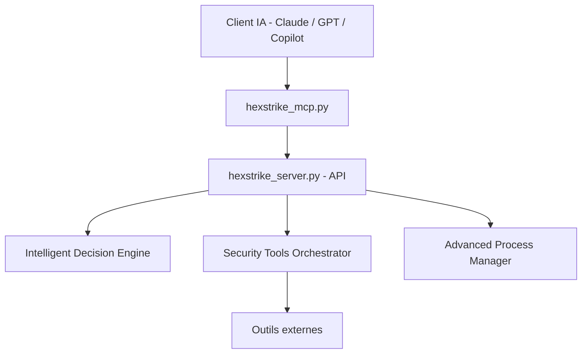

# 0x4m4/hexstrike-ai

> Serveur MCP qui donne à un agent IA l'accès à plus de 150 outils de sécurité, pour tests autorisés.

## Le problème
Les outils de test d'intrusion sont nombreux, chacun avec ses options. Un agent IA n'a pas de moyen standard de les appeler.

## Ce que ça fait vraiment
Deux scripts : `hexstrike_server.py` (API REST, port 8888, orchestrateur qui lance les outils en sous-processus, cache LRU, gestion des processus) et `hexstrike_mcp.py` (adaptateur FastMCP pour Claude Desktop, Cursor, VS Code Copilot). Les outils (réseau, web, binaire, cloud, CTF, OSINT) doivent être installés à part. L'état est en mémoire.

## Comment c'est branché


## Essayer
```bash
git clone https://github.com/0x4m4/hexstrike-ai.git
cd hexstrike-ai
python3 -m venv hexstrike-env
source hexstrike-env/bin/activate
pip3 install -r requirements.txt
python3 hexstrike_server.py
curl http://localhost:8888/health
```

## Coût et pièges
Gratuit, mais il faut installer soi-même les outils tiers et disposer d'un client IA compatible MCP. Le README avertit que l'agent obtient un large accès système (point d'entrée `/api/command` exécutant des commandes) : VM isolée, aucune authentification documentée.

## Ce que ce n'est pas
Les chiffres du README (« 24x plus rapide », taux de détection 98,7 %) ne sont pas sourcés. La « v7.0 » est annoncée, pas livrée. Usage légitime : tests avec autorisation écrite, bug bounty dans le périmètre, CTF, recherche sur systèmes possédés.

## Alternatives
- GreyDGL/PentestGPT : pipeline à étapes, sessions reprenables.
- aliasrobotics/cai : cadre d'agents de sécurité, archivé.

## Pour toi
À surveiller : sert de cas d'école pour brancher des outils à un agent via MCP, mais la surface d'exécution est large, les performances annoncées ne sont pas vérifiables et l'usage suppose un cadre légal strict.
