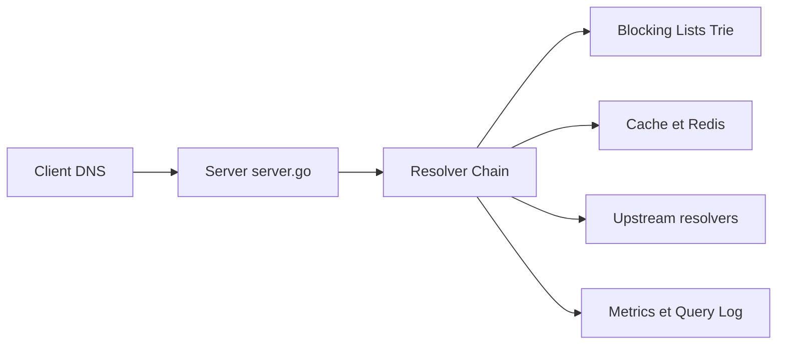

# 0xERR0R/blocky

> Proxy DNS et bloqueur de publicités en Go pour réseau local, configuré en YAML.

## Le problème
Bloquer pubs et domaines malveillants sur tout un réseau, avec des règles différentes par groupe de clients, sans base de données à maintenir.

## Ce que ça fait vraiment
Chaîne de résolveurs : blocage par listes (domaine, CNAME, IP), listes d'autorisation par groupe de clients, redirections DNS personnalisées, transfert conditionnel, cache avec préchargement, DoH, DoT, DoQ, validation DNSSEC. Journal des requêtes (CSV, MySQL, PostgreSQL), métriques Prometheus, API REST et CLI. Le README affirme ne collecter aucune télémétrie.

## Comment c'est branché

## Essayer
Aucune commande documentée dans le README : renvoi vers le chapitre Installation de la documentation en ligne.

## Coût et pièges
Gratuit, binaire unique ou image Docker multi-architecture (x86-64, ARM, MIPS). Redis est optionnel pour partager le cache.

## Ce que ce n'est pas
Pas un serveur DNS autoritatif : c'est un proxy et un filtre. Le blocage dépend des listes externes que tu choisis.

## Alternatives
Aucune alternative nommée dans le README.

## Pour toi
À adopter si tu as un labo ou un réseau maison : léger, avec métriques Prometheus et tableaux Grafana prêts à brancher dans ta stack d'observabilité.

