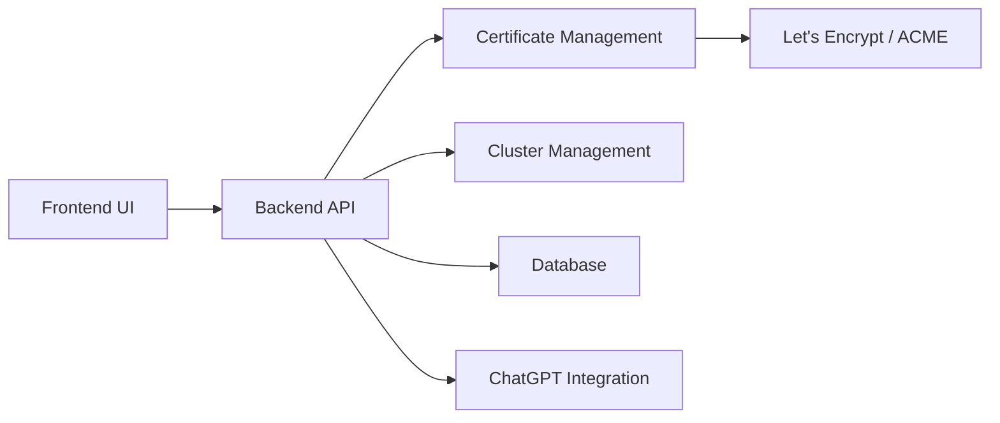

# 0xJacky/nginx-ui

> Interface web pour administrer Nginx : sites, certificats, logs, cluster, en un binaire.

## Le problème
Éditer les configurations Nginx, renouveler les certificats et surveiller plusieurs serveurs à la main est source d'erreurs.

## Ce que ça fait vraiment
Édition des sites avec éditeur par blocs ou Ace (complétion LLM), test automatique puis rechargement de Nginx.
Certificats Let's Encrypt en un clic avec renouvellement, sauvegarde versionnée des configs, export chiffré.
Statistiques serveur, logs Nginx, terminal web, gestion de cluster multi-nœuds.
Assistant ChatGPT et interface MCP pour agents ; backend Go + frontend Vue.

## Comment c'est branché


## Essayer
```bash
nginx-ui -config app.ini
bash -c "$(curl -L https://cloud.nginxui.com/install.sh)" @ install
docker compose up -d
```

## Coût et pièges
Gratuit, AGPL-3.0 ; l'image Docker monte `/var/run/docker.sock`, soit un accès root à l'hôte.
Suppose l'organisation Debian `sites-available`/`sites-enabled`.

## Ce que ce n'est pas
Pas un reverse proxy : il pilote un Nginx existant ou embarqué.
Démo publique en admin/admin : ne pas laisser d'identifiants par défaut.

## Alternatives
Aucune alternative nommée dans le README.

## Pour toi
À ignorer pour ton profil : outil d'administration web, sans usage data/ML spécifique.
