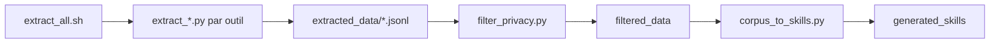

# 0xSero/ai-data-extraction

> Scripts Python qui extraient tes historiques de conversation d'assistants de code (Claude Code, Cursor, Codex…) en JSONL.

## Le problème
Les historiques de tes assistants de code sont dispersés en formats propriétaires (JSONL, SQLite) et inutilisables tels quels pour un fine-tuning.

## Ce que ça fait vraiment
Un script par outil (Claude Code, Codex, Cursor GUI et CLI, Trae, Windsurf, Continue, Gemini CLI, OpenCode) détecte les installations, lit les stockages locaux et écrit des conversations en JSONL (messages, contexte de code, diffs, outils, horodatages). Deux étapes facultatives : `filter_privacy.py` (modèle openai/privacy-filter, poids d'environ 2,8 Go) et `corpus_to_skills.py` qui synthétise des Agent Skills via un LLM compatible OpenAI.

## Comment c'est branché


## Essayer
```bash
python3 extract_claude_code.py
python3 extract_cursor.py
./extract_all.sh
python3 filter_privacy.py extracted_data --output-dir filtered_data
```

## Coût et pièges
Gratuit, bibliothèque standard seulement pour l'extraction. Les données extraites peuvent contenir code propriétaire, clés d'API et chemins personnels : les filtrer et scanner les secrets avant tout partage. Fermer l'outil source si la base SQLite est verrouillée.

## Ce que ce n'est pas
Pas une garantie d'anonymisation : le filtre de confidentialité réduit le risque, sans conformité assurée. Aucune licence déclarée. Le README porte la date de janvier 2025 alors qu'il décrit des fonctions plus récentes.

## Alternatives
Aucune alternative nommée dans le README.

## Pour toi
À surveiller : utile pour constituer un corpus à partir de tes propres historiques, à condition de filtrer, mais sans licence et porté par une seule personne.
