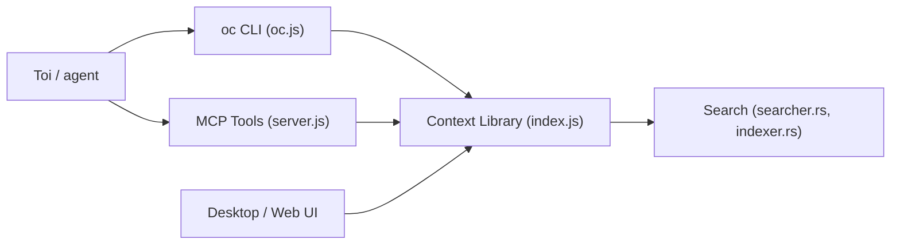

# 0xranx/OpenContext

> Bibliothèque de contexte personnelle, exposée par CLI et MCP, que ton agent de code lit et alimente.

## Le problème
L'assistant oublie décisions et contexte d'un jour, d'un dépôt ou d'un chat à l'autre, et tu te répètes.

## Ce que ça fait vraiment
Une bibliothèque globale de dossiers et documents Markdown, avec recherche, pilotée par la CLI `oc`. `oc init` génère des skills et des commandes slash pour Cursor, Claude Code et Codex (`/opencontext-context`, `-search`, `-create`, `-iterate`) et une config MCP. Une appli desktop et une UI web permettent d'éditer.

## Comment c'est branché


## Essayer
```bash
npm install -g @aicontextlab/cli
cd your-project
oc init
oc search "query"
oc ui
```

## Coût et pièges
Gratuit ; réutilise ta CLI d'agent existante (pas d'abonnement en plus). `oc init` écrit dans tes dossiers utilisateur (`~/.claude`, `~/.cursor`, `~/.codex`). Le README renvoie au site pour la recherche et la FAQ.

## Ce que ce n'est pas
Pas une mémoire automatique : tu organises et fais persister les documents. Le README dit « voir le dépôt pour la licence » alors que le catalogue indique MIT.

## Alternatives
Le README ne cite aucune alternative nommée.

## Pour toi
À surveiller : idée utile si tu jongles entre plusieurs agents de code, mais projet jeune, à mainteneur unique, avec écriture dans les configs globales.
