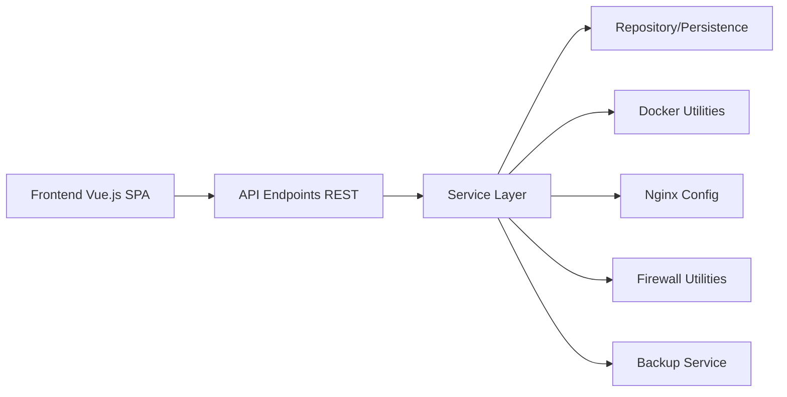

# 1Panel-dev/1Panel

> Panneau web d'administration de serveurs Linux, avec magasin d'applis conteneurisées, pour auto-hébergeurs.

## Le problème
Administrer un serveur Linux (sites, bases, conteneurs, SSL, sauvegardes) en ligne de commande est long et source d'erreurs.

## Ce que ça fait vraiment
Interface web Vue.js pilotant un backend Go (API REST v1, couche service, repository) qui gère Docker, Nginx, pare-feu, fichiers, SSL et sauvegardes vers le cloud.
Magasin de 165+ applis installées en un clic sous forme de conteneurs ; déploiement WordPress/Halo avec domaine et certificat.
Volet « IA » : passerelle et Skills Hub, agents (OpenClaw) limités à 5 en OSS.
Éditions Pro/Ent payantes : multi-nœuds, anti-défiguration, passerelle IA, KVM.

## Comment c'est branché


## Essayer
```bash
bash -c "$(curl -sSL https://resource.1panel.pro/v2/quick_start.sh)"
1pctl user-info
```

## Coût et pièges
Script d'installation `curl | bash` à exécuter en root sur le serveur. Plusieurs fonctions (multi-nœuds, WAF avancé, passerelle IA) réservées aux éditions payantes.

## Ce que ce n'est pas
Pas un orchestrateur multi-serveurs en version gratuite. Pas un outil MLOps : le volet IA est une surcouche de gestion d'agents, pas une plateforme de modèles.

## Alternatives
- cPanel / Plesk : références historiques, propriétaires et payantes.
- aaPanel : magasin d'applis aussi, open source partiel.
- Webmin : libre, mais développement jugé lent par le README.

## Pour toi
Utile pour un VPS perso qui héberge des services ; hors sujet pour du travail data/IA.
