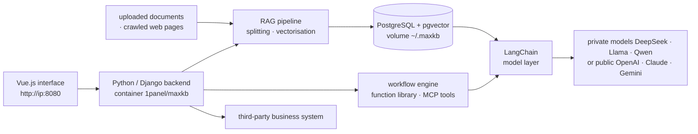

# 1Panel-dev/MaxKB

> **Self-hosted web platform for building question-answering agents over your own documents.**

## The problem

Giving a business team a documentary assistant means assembling file ingestion, chunking,
vectorisation, retrieval, model orchestration and a chat interface yourself, then maintaining
all of it. The building blocks exist separately; the assembly and the admin interface have to
be written again every time.

## What it actually does

MaxKB ("Max Knowledge Brain") ships that assembly as an application you start as one container.
The README claims five capabilities:

- **RAG pipeline**: direct document upload or automatic crawling of online documents, with
  automatic text splitting and vectorisation.
- **Agentic workflow**: a workflow engine, a function library and MCP tool-use, to chain steps
  beyond plain question-answering.
- **Integration**: insertion into third-party business systems, advertised as requiring no code.
- **Model-agnostic**: private models (DeepSeek, Llama, Qwen) as well as public ones (OpenAI,
  Claude, Gemini, MiniMax).
- **Multimodal**: text, image, audio and video in and out.

The README documents neither the chunking strategy, nor the retrieval strategies, nor the
workflow format: these are screens in the UI, not an API described here.

## How it is wired

No code-derived diagram exists for this repository: the graph below is reconstructed from the
README alone, from the stack it declares (Vue.js, Python/Django, LangChain, PostgreSQL +
pgvector) and from the `1panel/maxkb` container.



## Trying it

The README documents a single way in, through Docker:

```bash
docker run -d --name=maxkb --restart=always -p 8080:8080 -v ~/.maxkb:/opt/maxkb 1panel/maxkb
```

Then the web interface at `http://your_server_ip:8080`, with the default credentials the README
gives: user `admin`, password `MaxKB@123..`. No Python package install and no local development
procedure are described in this README. For users in China, a link to offline installation docs
is provided in case `docker pull` fails.

## Cost and gotchas

- **The software is free, the models are not.** MaxKB bundles no model: you need either a public
  API key (OpenAI, Claude, Gemini, MiniMax — billed per use) or a private model (DeepSeek, Llama,
  Qwen) you host yourself, and the GPU that comes with it. The README quotes neither VRAM nor
  cost figures.
- **Default credentials are public.** `admin` / `MaxKB@123..` appear in the README: change them
  before exposing anything, all the more so as the suggested command publishes port 8080 with no
  reverse proxy and no TLS.
- **GPLv3.** Strong copyleft: the no-code integration into third-party systems the README
  advertises deserves a legal read before shipping any distributed derivative.
- **Persistent state to back up**: everything lives in the `~/.maxkb` volume mounted on
  `/opt/maxkb`, PostgreSQL database and vector indexes included.
- **Docker required**: no other installation route is documented in this README.

## What it is not

- **Not a RAG library you import.** It is a complete application with its own UI and database;
  the README documents no programmatic entry point. To build your own pipeline you would take
  LangChain directly — which MaxKB uses internally.
- **Not a model and not a hosted service**: there is nothing to query until you plug in a model
  provider, with the bill or the GPU that implies.
- **Not a community project**: the repository is driven by the vendor behind 1Panel, with its own
  product documentation and commercial offering; the project follows the company's trajectory,
  not a foundation's.

## Alternatives

| | When to prefer it |
|---|---|
| **langgenius/dify** | Same family: self-hosted platform with UI, RAG and agent workflow orchestration. Compare on licence and plugin ecosystem rather than on the advertised features, which are very close to MaxKB's. |
| **pipeshub-ai/pipeshub-ai** | Worth a look when the hard part is connecting to enterprise sources and continuous ingestion rather than building agents through a UI. |
| **LangChain** | Named in the README as a MaxKB internal building block. Prefer it when you want to write the pipeline yourself and embed it in your own application, without inheriting an admin interface. |

## For you

Useful as a shortcut: stand up a credible enterprise-RAG demo in one command, with a UI and
document management, to frame a business need before writing any code. Something to watch rather
than adopt as a foundation: GPLv3, vendor-driven, and no programmatic surface documented in the
README — if the target is a RAG pipeline embedded in your own code, you will end up back on
LangChain or an equivalent.
