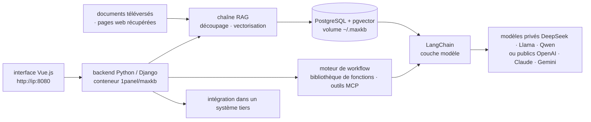

# 1Panel-dev/MaxKB

> **Plateforme web auto-hébergée pour monter des agents de questions-réponses sur ses propres documents.**

## Le problème

Mettre un assistant documentaire au service d'une équipe métier suppose d'assembler soi-même
l'ingestion des fichiers, le découpage, la vectorisation, la recherche, l'orchestration des
appels au modèle et une interface de discussion — puis de tout maintenir. Le code existe en
briques séparées, l'assemblage et l'interface d'administration restent à écrire à chaque fois.

## Ce que ça fait vraiment

MaxKB (« Max Knowledge Brain ») livre cet assemblage déjà fait, sous forme d'une application
qu'on démarre en un conteneur. Le README annonce cinq capacités :

- **Chaîne RAG** : téléversement direct de documents ou récupération automatique de documents
  en ligne, découpage du texte et vectorisation automatiques.
- **Flux agentique** : un moteur de workflow, une bibliothèque de fonctions et l'usage d'outils
  via MCP, pour enchaîner des étapes au-delà du simple question-réponse.
- **Intégration** : insertion dans un système tiers annoncée sans code à écrire, pour greffer
  la discussion sur un applicatif existant.
- **Indépendance du modèle** : modèles privés (DeepSeek, Llama, Qwen) comme publics (OpenAI,
  Claude, Gemini, MiniMax).
- **Multimodal** : entrée et sortie en texte, image, audio et vidéo.

Le README ne détaille ni la découpe des documents, ni les stratégies de recherche, ni le format
des workflows : ce sont des cases de l'interface, pas une API documentée ici.

## Comment c'est branché

Aucun diagramme tiré du code n'existe pour ce dépôt : ce schéma est reconstruit depuis le seul
README, à partir de la pile technique qu'il déclare (Vue.js, Python/Django, LangChain,
PostgreSQL + pgvector) et du conteneur `1panel/maxkb`.



## Essayer

Le README ne documente qu'une seule voie de démarrage, par Docker :

```bash
docker run -d --name=maxkb --restart=always -p 8080:8080 -v ~/.maxkb:/opt/maxkb 1panel/maxkb
```

Puis l'interface web sur `http://your_server_ip:8080`, avec les identifiants par défaut donnés
par le README : utilisateur `admin`, mot de passe `MaxKB@123..`. Aucune installation par paquet
Python, aucune procédure de développement local n'est décrite dans ce README. Pour les
utilisateurs en Chine, un lien vers une documentation d'installation hors ligne est fourni en
cas d'échec du `docker pull`.

## Coût et pièges

- **Le logiciel est gratuit, les modèles non.** MaxKB n'embarque aucun modèle : il faut soit une
  clé d'API publique (OpenAI, Claude, Gemini, MiniMax — facturées à l'usage), soit un modèle
  privé (DeepSeek, Llama, Qwen) qu'on héberge, et donc le GPU qui va avec. Le README ne chiffre
  ni la VRAM ni le coût.
- **Identifiants par défaut publics.** `admin` / `MaxKB@123..` figurent dans le README : à
  changer avant toute exposition, d'autant que la commande proposée publie le port 8080 sans
  reverse proxy ni TLS.
- **Licence GPLv3.** Copyleft fort : l'intégration « sans code » dans un système tiers, mise en
  avant par le README, mérite une lecture juridique avant tout produit dérivé distribué.
- **État persistant à sauvegarder** : tout vit dans le volume `~/.maxkb` monté sur `/opt/maxkb`,
  base PostgreSQL et index vectoriels compris.
- **Docker requis** : aucune autre voie d'installation n'est documentée dans ce README.

## Ce que ce n'est pas

- **Ce n'est pas une bibliothèque RAG à importer dans son code.** C'est une application complète
  avec son interface et sa base ; le README ne documente aucun point d'entrée programmatique.
  Pour construire sa propre chaîne, on prend LangChain directement — que MaxKB utilise en
  interne.
- **Ce n'est pas un modèle ni un service hébergé** : il n'y a rien à interroger tant qu'on n'a
  pas branché un fournisseur de modèle, avec la facture ou le GPU correspondants.
- **Ce n'est pas un projet communautaire** : le dépôt est porté par l'éditeur de 1Panel, avec sa
  documentation produit et son offre en propre ; la trajectoire du projet suit celle de
  l'entreprise, pas celle d'une fondation.

## Alternatives

| | Quand le préférer |
|---|---|
| **langgenius/dify** | Même famille : plateforme auto-hébergée avec interface, RAG et orchestration de workflows d'agents. À comparer sur la licence et l'écosystème de greffons plutôt que sur les fonctions annoncées, très proches de celles de MaxKB. |
| **pipeshub-ai/pipeshub-ai** | À regarder si l'enjeu est surtout la connexion aux sources d'entreprise et l'ingestion continue, plutôt que la construction d'agents par interface. |
| **LangChain** | Nommé dans le README comme brique interne de MaxKB. À préférer quand on veut écrire la chaîne soi-même et l'intégrer à son propre applicatif, sans reprendre l'interface d'administration. |

## Pour toi

Utile comme raccourci : monter en une commande une démonstration de RAG d'entreprise crédible,
avec interface et gestion des documents, pour cadrer un besoin métier avant d'écrire la moindre
ligne. À surveiller plutôt qu'à adopter comme socle technique : GPLv3, produit d'éditeur, et
aucune surface programmatique documentée dans le README — si la cible est une chaîne RAG
intégrée à ton code, tu retomberas sur LangChain ou équivalent.
