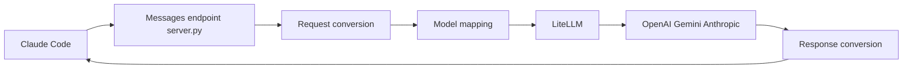

# 1rgs/claude-code-proxy

> Serveur proxy qui fait passer Claude Code pour un client Anthropic tout en utilisant OpenAI ou Gemini.

## Le problème
Claude Code ne parle que l'API Messages d'Anthropic ; impossible de le brancher tel quel sur un autre fournisseur.

## Ce que ça fait vraiment
Un serveur FastAPI (`server.py`) reçoit les requêtes au format Anthropic, les convertit via LiteLLM vers OpenAI, Gemini (clé AI Studio ou Vertex AI) ou Anthropic, puis reconvertit la réponse, en flux ou non, outils compris. Les noms `haiku` et `sonnet` sont associés à `SMALL_MODEL` et `BIG_MODEL` selon `PREFERRED_PROVIDER`. Un point d'entrée sert au comptage de jetons.

## Comment c'est branché


## Essayer
```bash
git clone https://github.com/1rgs/claude-code-proxy.git
cd claude-code-proxy
cp .env.example .env
uv run uvicorn server:app --host 0.0.0.0 --port 8082 --reload
ANTHROPIC_BASE_URL=http://localhost:8082 claude
```

## Coût et pièges
Clés d'API à ta charge chez le fournisseur choisi (OpenAI obligatoire par défaut, Gemini ou Vertex si `PREFERRED_PROVIDER=google`). Les correspondances de modèles du README citent des versions datées ; à revoir dans `.env`.

## Ce que ce n'est pas
Pas une équivalence de qualité : Claude Code est réglé pour les modèles Claude, les autres peuvent mal utiliser les outils. Aucune licence déclarée, donc réutilisation du code incertaine.

## Alternatives
Aucune alternative n'est nommée dans le README ; il s'appuie sur LiteLLM, que tu peux aussi exploiter directement.

## Pour toi
À surveiller : utile pour tester Claude Code sur d'autres modèles, mais sans licence, un seul auteur et 70 issues ouvertes.
