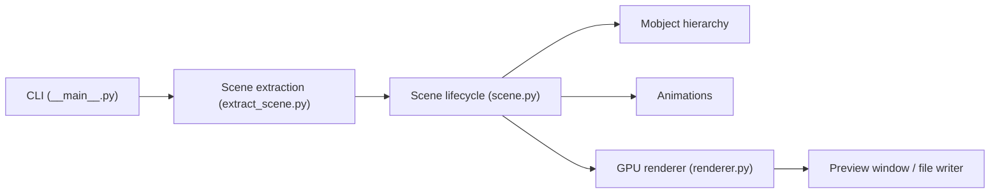

# 3b1b/manim

> Moteur d'animations mathématiques programmées, dans la version personnelle de l'auteur de 3Blue1Brown.

## Le problème
Illustrer des notions de maths par une animation précise, image par image, sans logiciel de montage.

## Ce que ça fait vraiment
On écrit des scènes en Python (mobjects, animations, caméra) ; la CLI `manimgl` importe le module, choisit les classes `Scene` et joue la scène en aperçu interactif ou l'écrit en vidéo ou image via FFmpeg. Le rendu passe par OpenGL avec des shaders WGSL ; LaTeX (optionnel) et Pango (Linux) servent au texte. Le paquet s'appelle `manimgl`, pas `manim`.

## Comment c'est branché


## Essayer
```bash
pip install manimgl
manimgl
manimgl example_scenes.py OpeningManimExample
```

## Coût et pièges
Gratuit. Il faut Python 3.10+, FFmpeg, OpenGL, et LaTeX si tu veux des formules (MacTeX pèse environ 6 Go, BasicTeX est plus léger). Le README avertit de ne pas mélanger les instructions avec celles de la version communautaire.

## Ce que ce n'est pas
Ce n'est pas la version communautaire (Manim Community), qui est un fork plus stable, mieux testé et plus facile à prendre en main d'après le README. La documentation est décrite comme « en cours ».

## Alternatives
- Manim Community (fork de 2020) : plus stable, mieux testé, réactif aux contributions.

## Pour toi
À surveiller : intéressant pour produire des animations explicatives (ML, maths), mais l'installation est lourde et la version communautaire est plus sûre pour démarrer.

