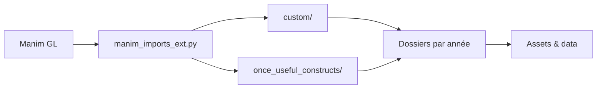

# 3b1b/videos

> Code Manim des vidéos de mathématiques de 3Blue1Brown, pour apprendre ou s'en inspirer.

## Le problème
Voir comment sont construites des animations mathématiques pédagogiques demande d'accéder aux sources réelles.

## Ce que ça fait vraiment
Des scènes Python rendues par `manimgl`, rangées par année (`_2015` à `_2026`). Une couche `custom/` fournit le style de la chaîne, `once_useful_constructs/` des aides réutilisables, `manim_imports_ext.py` centralise les imports. Le README décrit aussi un flux interactif avec points de contrôle sous Sublime.

## Comment c'est branché


## Essayer
```bash
sudo apt install texlive texlive-latex-extra texlive-fonts-extra texlive-science
git clone git@github.com:3b1b/videos.git
cd videos
manimgl e_field.py WavesIn3D
```

## Coût et pièges
Gratuit. Le contenu est sous CC BY-NC-SA 4.0, donc usage commercial exclu ; GitHub ne reconnaît pas la licence. Les anciens projets peuvent ne pas tourner avec les versions récentes de manim.

## Ce que ce n'est pas
Pas une bibliothèque : c'est un dépôt d'exemples, avec `manimgl` à installer depuis les sources. La bibliothèque Manim elle-même est sous MIT.

## Alternatives
ManimCommunity, version maintenue par la communauté, citée par le README.

## Pour toi
Surveiller : riche source d'exemples pour visualiser des concepts d'IA (transformers, réseaux de neurones), mais non commercialisable.

