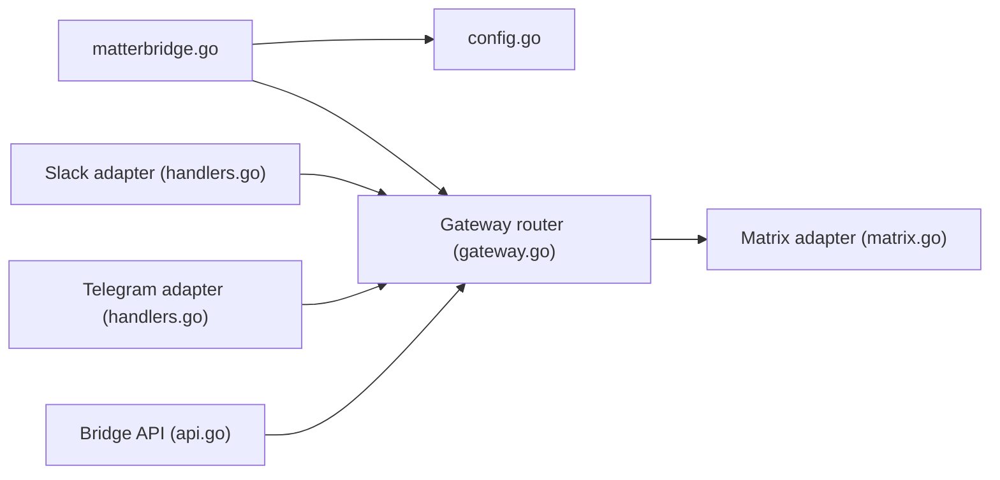

# 42wim/matterbridge

> Passerelle de chat qui relie plusieurs messageries, configurée en TOML.

## Le problème
Des équipes réparties sur Slack, Discord, IRC, Matrix, Telegram, etc. ne peuvent pas se parler.

## Ce que ça fait vraiment
Adaptateurs de protocoles qui normalisent les messages vers un routeur de passerelles et les redistribuent. Édition et suppression de messages, fils, pièces jointes, usurpation de pseudo et d'avatar, groupes privés, plusieurs passerelles, API pour intégrations tierces.

## Comment c'est branché


## Essayer
```bash
go install github.com/42wim/matterbridge
matterbridge -conf matterbridge.toml
```

## Coût et pièges
Gratuit ; comptes bot sur chaque plateforme. Compilation complète : environ 3 Go de RAM (0,5 Go sans le pont Teams).

## Ce que ce n'est pas
Dernier push décembre 2024 : les API des messageries évoluent, certains ponts peuvent être cassés (non vérifié).

## Alternatives
Aucune nommée comme remplaçant ; plugin Mattermost cité parmi les projets liés.

## Pour toi
À ignorer pour ta veille : pertinent seulement si tu dois relayer des alertes entre messageries, et le projet ralentit.

