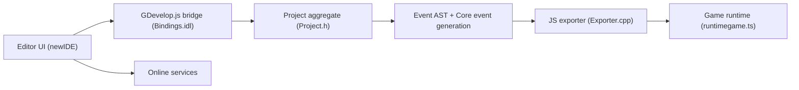

# 4ian/GDevelop

> Éditeur de jeux sans code, 2D et 3D, à base d'événements, publiable sur mobile, bureau et web.

## Le problème
Créer un jeu demande normalement de programmer ; un outil visuel abaisse la barrière pour designers et débutants.

## Ce que ça fait vraiment
Un éditeur (React, Electron) manipule un modèle de projet en C++ (Core) exposé en JavaScript par WebAssembly (GDevelop.js). Les règles du jeu s'écrivent en événements conditions/actions, qu'un générateur convertit en JavaScript exécuté par le moteur GDJS (PixiJS pour la 2D, Three.js pour la 3D). Des extensions ajoutent objets et comportements, dont la physique Box2D ou Jolt en WebAssembly. Les services en ligne (build, cloud, IA) sont séparés du moteur.

## Comment c'est branché

## Essayer
Aucune commande dans le README pour l'usage : il renvoie à la page d'accueil pour télécharger l'application. La contribution suit la section « Technical architecture » et la doc dédiée.

## Coût et pièges
Le catalogue signale une licence présente mais non identifiée par GitHub : à vérifier avant tout usage commercial. Certains services en ligne sont proposés en offres payantes (Asset Store, services pour professionnels) selon le README. 625 issues ouvertes.

## Ce que ce n'est pas
Ce n'est pas seulement un moteur : l'éditeur, le moteur et des services cloud forment un ensemble. Le « sans code » n'exclut pas un modèle événementiel à apprendre.

## Alternatives
- Aucune alternative nommée dans le README.

## Pour toi
Ignorer : outil de création de jeux, hors périmètre data/IA/MLOps, avec une licence à clarifier.

