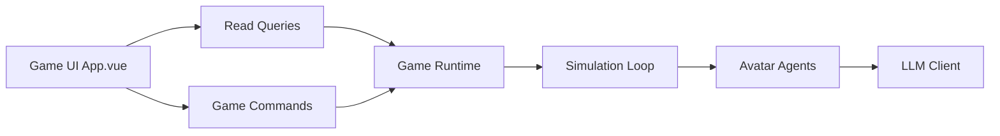

# 4thfever/cultivation-world-simulator

> Simulateur de monde de cultivation où chaque personnage est un agent LLM et le joueur est le « Dao ».

## Le problème
Les jeux de cultivation sont scriptés ou reposent sur des machines à états simplistes ; les mondes vivants sont hors de portée des lecteurs.

## Ce que ça fait vraiment
Chaque cultivateur est un agent piloté par LLM, avec personnalité, mémoire et relations, encadré par des règles (royaumes, sectes, objets, événements comme ventes aux enchères). Le joueur observe et intervient. Backend Python simulant avatars, sectes et monde, front Vue, API de contrôle `/api/v1/query/*` et `/api/v1/command/*` pour agents externes. Modèles configurables : DeepSeek, MiniMax, Ollama. README en chinois.

## Comment c'est branché


## Essayer
```bash
pip install -r requirements.txt
cd web && npm install && cd ..
python src/server/main.py --dev
```

## Coût et pièges
Un fournisseur de modèle est requis dès la première partie (facturation par token si API). Python 3.10+ et Node 18+. Le déploiement Docker est marqué « non testé » ; version desktop sur Epic Games Store.

## Ce que ce n'est pas
Pas un outil de travail : un jeu de simulation. Licence présente mais non identifiée, à vérifier avant réutilisation.

## Alternatives
- Aucune alternative nommée dans le README.

## Pour toi
Ignorer pour ton travail data/MLOps ; seul l'exemple de simulation multi-agents encadrée par règles peut inspirer.
