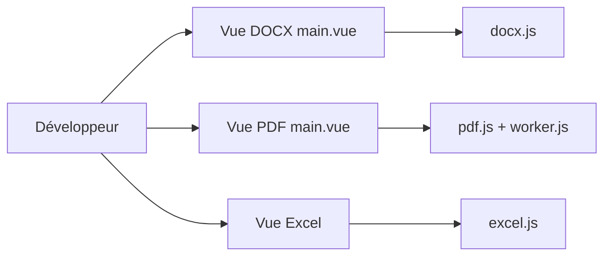

# 501351981/vue-office

> Composants Vue 2/3 pour prévisualiser des fichiers docx, xlsx, pdf et pptx dans le navigateur.

## Le problème
Afficher des documents Office et PDF dans une application web oblige à assembler une bibliothèque par format.

## Ce que ça fait vraiment
Quatre paquets npm (`@vue-office/docx`, `excel`, `pdf`, `pptx`). On passe une URL, un ArrayBuffer ou un Blob à l'attribut `src`. Rendu docx via docx-preview, pdf via pdfjs avec liste virtuelle, excel via exceljs et x-data-spreadsheet, pptx via une bibliothèque maison. Événements `rendered` et `error`. Fonctionne aussi hors Vue en JavaScript natif.

## Comment c'est branché


## Essayer
```bash
npm install @vue-office/docx vue-demi@0.14.6
npm install @vue-office/excel vue-demi@0.14.6
npm install @vue-office/pdf vue-demi@0.14.6
npm install @vue-office/pptx vue-demi@0.14.6
```

## Coût et pièges
Gratuit, mais le code de la bibliothèque pptx est payant à l'auteur (source sur demande). Depuis décembre 2024 l'auteur dit ne plus traiter les issues rapidement ; 222 issues ouvertes. Vue 2.6 demande `@vue/composition-api`.

## Ce que ce n'est pas
Pas un éditeur de documents : prévisualisation seule. Les anomalies docx relèvent de docx-preview, non traitées ici. README en chinois.

## Alternatives
Aucune alternative nommée dans le README (les bibliothèques sous-jacentes y sont citées comme dépendances).

## Pour toi
Ignorer : composant front de prévisualisation sans lien avec data/IA ; à n'envisager que pour un tableau de bord Vue qui affiche des documents.

