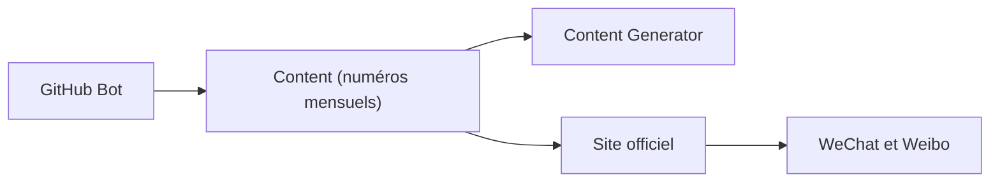

# 521xueweihan/HelloGitHub

> Revue mensuelle en chinois d'open source GitHub amusants et accessibles aux débutants.

## Le problème
Découvrir des projets open source accessibles, sans passer des heures à parcourir GitHub, surtout pour un public sinophone débutant.

## Ce que ça fait vraiment
Un numéro paraît le 28 de chaque mois, avec des projets « intéressants et d'entrée de gamme », des livres open source, des projets pratiques et des projets d'entreprise. Le README liste les numéros (de la 86e à la 125e période dans la table fournie), renvoie au site officiel et au compte WeChat, invite à proposer des projets et affiche des sponsors (UCloud, OpenIM, 七牛云, OfoxAI). Le README est court : fiche minimale.

## Comment c'est branché
Le graphe fourni est un schéma d'intention (couches contenu, automatisation, diffusion), pas un câblage vérifié ; nœuds d'après l'arbre de fichiers.

## Essayer
Aucune commande documentée dans le README.

## Coût et pièges
Gratuit. Contenu en chinois, dont la lecture demande une traduction. Aucune licence déclarée.

## Ce que ce n'est pas
Pas un outil ni une liste exhaustive : une sélection éditoriale à périodicité mensuelle, sans critères techniques publiés dans ce README.

## Alternatives
Aucune alternative nommée dans le README.

## Pour toi
À ignorer : ta veille GitHub filtrée data/IA existe déjà, et cette revue est généraliste, en chinois et sans licence.

