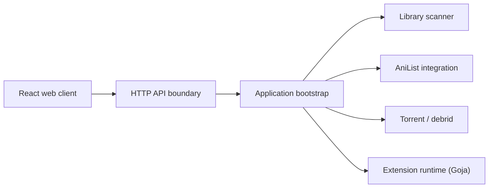

# 5rahim/seanime

> Serveur média avec interface web et application de bureau pour bibliothèque d'animes et mangas.

## Le problème
Gérer une bibliothèque locale d'animes et de mangas, ses téléchargements et la lecture depuis un seul outil.

## Ce que ça fait vraiment
Serveur Go (`main.go`) avec API HTTP et WebSockets, scanner de bibliothèque sans convention de nommage stricte, intégration AniList, recherche et téléchargement de torrents (qBittorrent, Transmission, services debrid), lecture directe ou transcodage, lecteurs externes MPV/VLC/MPC-HC. Extensions JavaScript exécutées par Goja ; client React et client Electron « Denshi ».

## Comment c'est branché


## Essayer
```bash
# Installation : voir le guide d'installation lié au README.
# Compilation : Node.js et Go requis (commandes non détaillées).
```

## Coût et pièges
Gratuit ; certains fournisseurs debrid sont payants côté tiers. Les extensions sont non affiliées et peuvent être retirées pour raisons de droit d'auteur.

## Ce que ce n'est pas
Ne fournit ni n'héberge aucun contenu. Projet d'une personne : pas de support MyAnimeList/Trakt ni de traduction prévus.

## Alternatives
- Le README renvoie vers « d'autres outils » sans en nommer.

## Pour toi
À ignorer : sujet de loisir, hors périmètre data/IA/MLOps, et dépendant d'un seul mainteneur.

