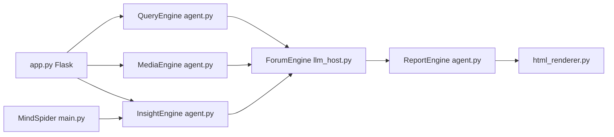

# 666ghj/BettaFish

> Système multi-agents d'analyse d'opinion sur réseaux sociaux chinois, produisant des rapports HTML.

## Le problème
Suivre l'opinion publique sur des dizaines de plateformes et des millions de commentaires dépasse l'analyse manuelle.

## Ce que ça fait vraiment
Trois agents en parallèle — QueryEngine (web/actualités), MediaEngine (multimodal), InsightEngine (base privée + analyse de sentiment) — débattent via un ForumEngine animé par un LLM « modérateur ». ReportEngine assemble ensuite un rapport : choix de gabarit, plan, budget de mots, chapitres JSON validés par une IR, rendu HTML/PDF. MindSpider crawle Weibo, Xiaohongshu, Douyin via Playwright. Modèles de sentiment fournis (BERT LoRA, Qwen, ML classique).

## Comment c'est branché


## Essayer
```bash
docker compose up -d
pip install -r requirements.txt
playwright install chromium
python app.py
python report_engine_only.py --query "土木工程行业分析"
```

## Coût et pièges
Clés d'API OpenAI-compatibles pour chaque agent, PostgreSQL, Chromium. Le README interdit tout usage commercial, ce qui entre en tension avec la GPL-2.0 : à clarifier. Le crawl de plateformes engage ta responsabilité juridique.

## Ce que ce n'est pas
Pas un outil pour réseaux occidentaux : sources et modèles centrés sur la Chine. Pas une licence libre pour un usage pro, vu l'avertissement.

## Alternatives
Aucune nommée (MiroFish est la suite du même auteur).

## Pour toi
Architecture multi-agents + IR de rapport à étudier ; pas à déployer en entreprise.
