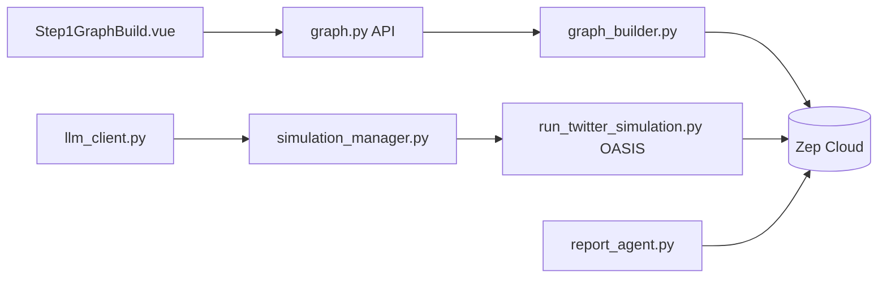

# 666ghj/MiroFish

> Simulateur multi-agents qui construit un monde social à partir de documents pour produire des « prédictions ».

## Le problème
Tester l'effet d'une annonce ou d'un événement sur une opinion publique sans pouvoir l'expérimenter en vrai.

## Ce que ça fait vraiment
Cinq étapes. Les documents fournis sont transformés en graphe de connaissances (`text_processor.py`, `ontology_generator.py`, `graph_builder.py`) stocké dans Zep Cloud. Des profils d'agents sont générés (`oasis_profile_generator.py`), puis `simulation_manager.py` lance des simulations OASIS de type Twitter et Reddit (`run_twitter_simulation.py`).
Ensuite `report_agent.py` analyse le monde simulé et rédige un rapport ; on peut discuter avec les agents.
Frontend Vue, backend Python ; LLM via une API compatible OpenAI (`llm_client.py`), Qwen-plus recommandé.

## Comment c'est branché


## Essayer
```bash
cp .env.example .env
npm run setup:all
npm run dev
docker compose up -d
```

## Coût et pièges
Deux clés : LLM (le README prévient d'une « forte consommation », commencer sous 40 tours) et Zep Cloud (quota mensuel gratuit). Licence AGPL-3.0.

## Ce que ce n'est pas
Une simulation pilotée par LLM, pas une méthode de prévision validée : le README ne fournit aucune mesure de justesse. La mémoire du monde simulé est chez Zep, un service tiers.

## Alternatives
Aucune alternative nommée dans le README (OASIS de CAMEL-AI est le moteur utilisé, pas un concurrent).

## Pour toi
À surveiller comme démonstration de simulation multi-agents ; rien à en tirer pour décider.
