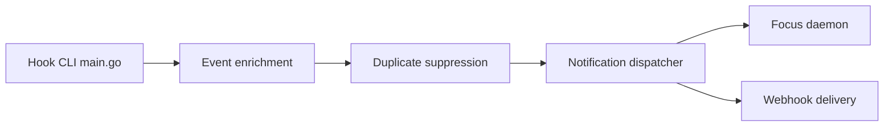

# 777genius/claude-notifications-go

> Notifications de bureau et sons quand Claude Code ou Codex termine ou attend une validation.

## Le problème
On laisse un agent tourner et on rate le moment où il a fini ou attend une autorisation.

## Ce que ça fait vraiment
Un CLI Go reçoit les événements des hooks, ajoute projet, branche et session, filtre et dédoublonne. Il envoie une notification, un son ou un webhook (Slack, Discord, Telegram…). Un clic ramène au terminal d'origine.

## Comment c'est branché


## Essayer
```bash
(set -o pipefail; curl -fsSL https://raw.githubusercontent.com/777genius/agent-notifications/a512deb5819c3f8c7c3be8335f713cc8bb734fc3/bin/setup.sh | bash)
agent-notifications config path
```

## Coût et pièges
Gratuit. L'installation exécute un script téléchargé (épinglé à un commit). Sous Codex, il faut relire et approuver les hooks installés.

## Ce que ce n'est pas
Pas un outil de suivi de coûts ni de logs. Le README annonce GPL-3.0-or-later, alors que le catalogue ne déclare pas de licence, et le CLA permet une licence commerciale additionnelle.

## Alternatives
Aucune alternative nommée dans le README.

## Pour toi
À adopter : petit gain concret si tu lances des tâches longues avec un agent, en gardant l'œil sur la licence GPL.
