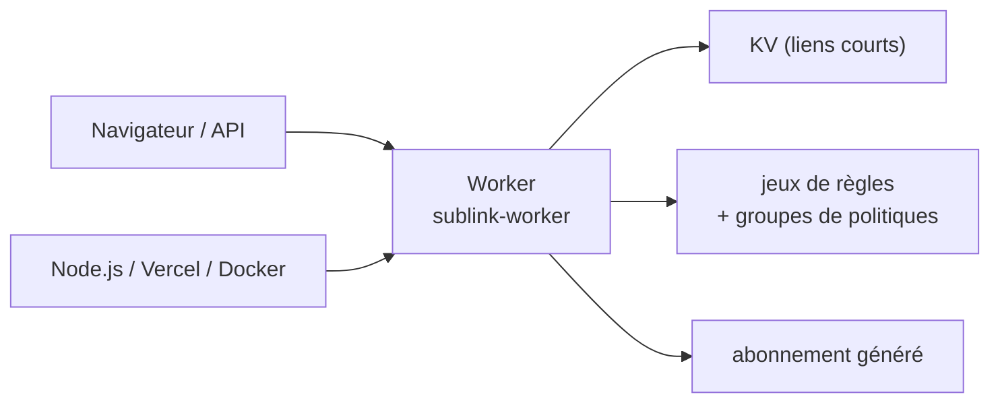

# 7Sageer/sublink-worker

> Convertisseur d'abonnements proxy déployé en un Worker, avec interface web et liens courts.

## Le problème
Les clients proxy attendent chacun leur format d'abonnement ; convertir à la main ou dépendre d'un
convertisseur public tiers oblige à confier ses listes de serveurs à quelqu'un d'autre.

## Ce que ça fait vraiment
Importe des abonnements depuis plusieurs sources et génère des liens courts, fixes ou aléatoires,
stockés dans un KV. Fournit une interface web avec jeux de règles prédéfinis et groupes de politiques
personnalisables, un thème clair/sombre, et une API pour scripter. Multilingue : chinois, anglais,
persan, russe. Le README ne décrit ni les formats d'entrée ni les formats de sortie.

## Comment c'est branché


## Essayer
```bash
npm run build:node && node dist/node-server.cjs
vercel deploy
docker pull ghcr.io/7sageer/sublink-worker:latest
docker compose up -d
```

## Coût et pièges
Gratuit, mais le déploiement « un clic » suppose un compte chez l'hébergeur du Worker, et le KV des
liens courts se configure dans les réglages du projet. Docker Compose embarque un Redis.

## Ce que ce n'est pas
Pas un VPN ni un proxy : ça ne fait que transformer des descripteurs d'abonnement. Le README tient en
quelques lignes et ne documente aucune option, donc rien n'est vérifiable avant de l'exécuter. Le
dépôt porte un avertissement explicite : usage d'apprentissage, responsabilité de l'utilisateur.

## Alternatives
Aucune alternative nommée dans le README.

## Pour toi
Hors périmètre data / IA / MLOps : rien à en tirer.
