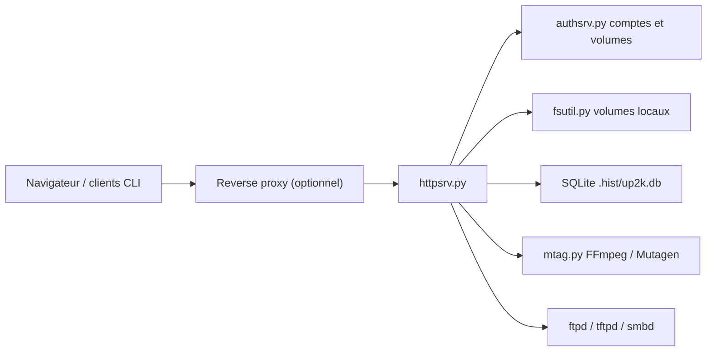

# 9001/copyparty

> Serveur de fichiers en Python, lancé en un fichier, pour transférer et partager des données depuis un navigateur.

## Le problème
Déplacer de gros fichiers entre machines demande d'installer un serveur FTP, WebDAV ou Nextcloud, de configurer comptes et protocoles, et les transferts coupés repartent de zéro.

## Ce que ça fait vraiment
Un seul processus Python expose des dossiers en HTTP, WebDAV, FTP, SFTP, TFTP et SMB, avec comptes et permissions par volume. L'upload « up2k » découpe les fichiers en morceaux vérifiés et reprend après coupure. Une base SQLite `.hist/up2k.db` gère l'index, la recherche, la déduplication et l'annulation des envois. Miniatures et tags passent par FFmpeg, Pillow ou Mutagen si présents.

## Comment c'est branché


## Essayer
```bash
python3 -m pip install --user -U copyparty
uv tool run copyparty
python copyparty-sfx.py -e2dsa -a kevin:okgo -v .::r:A,kevin
docker run --rm -it copyparty/ac --help
```

## Coût et pièges
Gratuit, Python seul suffit ; FFmpeg et Pillow sont optionnels. Lancé sans argument, il donne lecture/écriture à tous sur le dossier courant. Le README juge SMB « unsafe » et déconseille le HTTPS intégré au profit d'un reverse proxy.

## Ce que ce n'est pas
Ni un Nextcloud (pas de synchronisation bidirectionnelle, « never be supported ») ni un stockage objet. Le README dit lui-même « do all the things, and do an okay job » et prévient que d'autres outils conviennent parfois mieux.

## Alternatives
- Nextcloud : synchronisation bidirectionnelle des dossiers.
- Syncthing : synchronisation, cité comme compatible avec copyparty.
- rclone : client de montage et synchro, jusqu'à 5× plus rapide selon le README.

## Pour toi
Surveiller : pratique pour faire circuler des jeux de données volumineux entre machines avec reprise d'envoi, mais à n'exposer qu'avec proxy et comptes stricts vu la surface de protocoles et un mainteneur unique.

