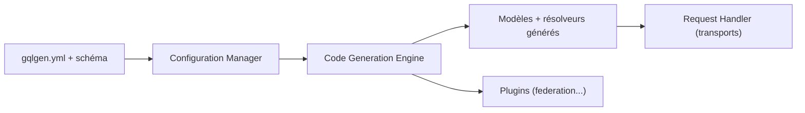

# 99designs/gqlgen

> Bibliothèque Go qui génère un serveur GraphQL typé à partir d'un schéma, sans `map[string]interface{}`.

## Le problème
Écrire un serveur GraphQL en Go à la main mène à du code répétitif et peu typé.

## Ce que ça fait vraiment
Tu écris le schéma GraphQL et un fichier `gqlgen.yml` ; le générateur produit modèles Go et squelettes de résolveurs. À l'exécution, un gestionnaire sert les requêtes (HTTP, WebSocket, SSE) avec extensions (complexité, introspection, fédération). Les résolveurs de champs tournent en goroutines, avec une limite configurable (`worker_limit`). Des plugins étendent la génération.

## Comment c'est branché


## Essayer
```bash
go mod init example
go get -tool github.com/99designs/gqlgen
go tool gqlgen init
go run server.go
```

## Coût et pièges
Gratuit. Le README mentionne qu'il faut demander explicitement un résolveur pour éviter de charger des objets enfants inutiles (`forceResolver`), sinon les relations sont chargées d'office.

## Ce que ce n'est pas
Pas un client GraphQL ni un outil « code first » : l'approche est schéma d'abord. Il ne concerne que Go.

## Alternatives
Le README renvoie vers une comparaison avec d'autres implémentations Go, sans nom précis.

## Pour toi
À ignorer sauf si ton backend est en Go : pour du data/IA en Python il ne t'apporte rien.

