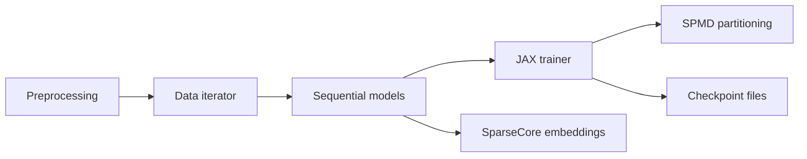

# AI-Hypercomputer/RecML

> Bibliothèque de recommandation Keras/JAX optimisée pour Cloud TPU et SparseCore, pour chercheurs et praticiens.

## Le problème
Entraîner des recommandeurs avec de grandes tables d'embeddings sur TPU demande de réécrire données, partitionnement et métriques.

## Ce que ça fait vraiment
Fournit des implémentations de référence (SASRec, BERT4Rec, Mamba4Rec, HSTU, DLRM v2), des couches réutilisables, des API d'embedding pour SparseCore et des métriques standard (AUC, NDCG@K, MRR, Recall@K). Un entraîneur unifié cible TPU ou GPU avec sharding SPMD, checkpoints et journalisation (par ex. BigQuery). Le README exprime une vision plus qu'un mode d'emploi.

## Comment c'est branché


## Essayer
```bash
# Aucune commande documentée dans le README.
```

## Coût et pièges
Pensée pour Cloud TPU (facturé par Google Cloud) ; GPU possible. Installation non documentée dans le README.

## Ce que ce n'est pas
Pas une bibliothèque prête à installer d'après le README : « aims to house », c'est une ambition. Certains modèles listés ne sont pas confirmés dans le code échantillonné.

## Alternatives
Aucune alternative nommée dans le README.

## Pour toi
Surveiller : intéressant si tu construis des recommandeurs sur TPU, mais rien à installer ni à lancer d'après le README.
