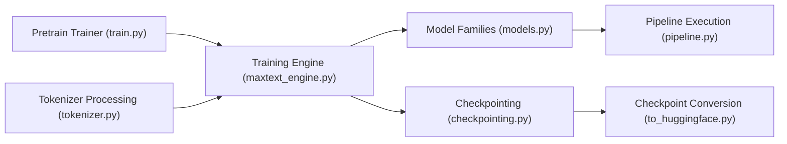

# AI-Hypercomputer/maxtext

> Bibliothèque JAX de Google pour pré-entraîner et post-entraîner des LLM à grande échelle sur TPU et GPU.

## Le problème
Entraîner des modèles de plusieurs milliards de paramètres sur des milliers de puces demande un code de sharding, de checkpoint et de pipeline très optimisé.

## Ce que ça fait vraiment
Bibliothèque de modèles en Python/JAX (Gemma, Llama, DeepSeek, Qwen, Mistral, Kimi, GPT-OSS) avec pré-entraînement, SFT et RL (GRPO, GSPO) via Tunix, vLLM pour l'échantillonnage. S'appuie sur Flax, Orbax, Optax et Grain. Inférence hors ligne, conversion de checkpoints vers Hugging Face, évaluation. Un « mode découplé » évite les dépendances GCP.

## Comment c'est branché

## Essayer
Le README ne contient pas de commande : il renvoie à un guide d'installation (pip depuis PyPI), au mode découplé et à des guides SFT/RL.

## Coût et pièges
Vise les TPU et GPU Google Cloud : matériel très coûteux. Python 3.12 recommandé. La branche `main` n'est pas prête pour la production : préférer les versions PyPI.

## Ce que ce n'est pas
Pas un outil de fine-tuning léger pour une seule carte. Le README mentionne aussi un dépôt séparé pour les modèles de diffusion.

## Alternatives
- MaxDiffusion : dépôt voisin pour les modèles de diffusion.

## Pour toi
À surveiller : référence sérieuse si tu entraînes sur TPU ; sans cluster, un outil trop lourd pour ton usage.
