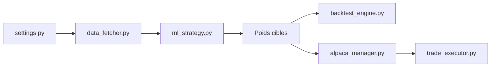

# AI4Finance-Foundation/FinRL-Trading

> Infrastructure Python modulaire pour backtester et exécuter des stratégies de trading à poids de portefeuille.

## Le problème
Les stratégies diffèrent entre backtest et exécution réelle ; il faut un contrat commun entre logique de stratégie et courtier.

## Ce que ça fait vraiment
Le vecteur de poids cible est l'unique interface entre sélection d'actions, allocation, timing et surcouche de risque. Les données viennent de Yahoo, FMP ou WRDS (cache SQLite), le backtest utilise `bt`, l'exécution passe par Alpaca (multi-comptes, contrôles de risque). Trois cas d'usage : allocations classiques et DRL, sélection trimestrielle par ML et DRL, rotation adaptative d'actifs. Un script `deploy.sh` enchaîne données, stratégie et mode papier.

## Comment c'est branché


## Essayer
```bash
git clone https://github.com/AI4Finance-Foundation/FinRL-Trading.git
cd FinRL-Trading
./deploy.sh --strategy adaptive_rotation --mode backtest
./deploy.sh --strategy adaptive_rotation --mode paper --dry-run
```

## Coût et pièges
Yahoo Finance est gratuit ; FMP et Alpaca demandent des clés dans `.env`. Les CSV de prix doivent exister sous `data/fmp_daily/` avant un lancement manuel.

## Ce que ce n'est pas
Les rendements du README (backtest 2018-2025, papier octobre 2025 à mars 2026) sont publiés par les auteurs, sans audit. Le dépôt se déclare à but éducatif, sans conseil financier.

## Alternatives
Le tableau du README compare avec Qlib, TradingAgents, Zipline/Backtrader et QuantConnect Lean.

## Pour toi
À surveiller : structure claire pour tester des stratégies ML/DRL, mais performances non vérifiées et beaucoup de dépendances de données externes.
