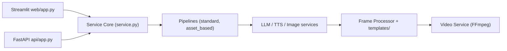

# AIDC-AI/Pixelle-Video

> Moteur qui transforme un sujet en vidéo courte narrée, en enchaînant LLM, images, voix et montage.

## Le problème
Produire une vidéo courte demande de rédiger, illustrer, enregistrer la voix et monter. Chaque étape mobilise un outil différent.

## Ce que ça fait vraiment
À partir d'un thème ou d'un script fourni, il génère le texte via un LLM, planifie un storyboard, produit images ou clips (workflows ComfyUI ou RunningHub, ou API directes DashScope, OpenAI, Seedream, Seedance, Kling), synthétise la voix (Edge-TTS, Index-TTS), applique des modèles HTML par résolution et compose avec FFmpeg. Interface Streamlit et API FastAPI avec gestionnaire de tâches.

## Comment c'est branché


## Essayer
```bash
git clone https://github.com/AIDC-AI/Pixelle-Video.git
cd Pixelle-Video
uv run streamlit run web/app.py
```

## Coût et pièges
Prérequis : `uv` et `ffmpeg`. Le README cite une option gratuite (Ollama + ComfyUI local) ; les API de modèles cloud sont facturées à l'usage. Un paquet Windows clé en main existe.

## Ce que ce n'est pas
Ce n'est pas un modèle : il orchestre des services externes. La qualité dépend des modèles branchés. Licence Apache-2.0 (dépôt visible aussi sous ATH-MaaS avec le même contenu).

## Alternatives
- MoneyPrinterTurbo : outil de génération vidéo cité comme inspiration.
- NarratoAI : commentaire automatisé de films.
- MoneyPrinterPlus : plateforme de création vidéo.

## Pour toi
Surveiller : bon exemple d'orchestration LLM + ComfyUI à étudier, mais son usage principal est la création de contenu, pas ton cœur de métier.

