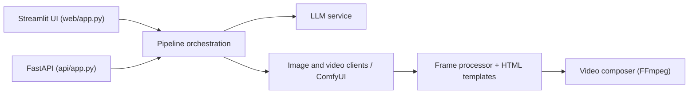

# ATH-MaaS/Pixelle-Video

> Moteur qui transforme un sujet en vidéo courte narrée ; même README que AIDC-AI/Pixelle-Video.

## Le problème
Produire une vidéo courte exige de rédiger, illustrer, enregistrer et monter, avec des outils distincts.

## Ce que ça fait vraiment
Le README et l'architecture sont identiques à ceux d'AIDC-AI/Pixelle-Video : sujet ou script, LLM pour le texte et les prompts, génération de médias via ComfyUI/RunningHub ou API directes (DashScope, OpenAI, Seedream, Seedance, Kling), voix TTS, modèles HTML, composition FFmpeg. Interface Streamlit (`web/app.py`), API FastAPI (`api/app.py`), config typée et gestionnaire de tâches. Le catalogue affiche 28 213 étoiles et 168 issues, très proches de l'autre dépôt.

## Comment c'est branché


## Essayer
```bash
git clone https://github.com/AIDC-AI/Pixelle-Video.git
cd Pixelle-Video
uv run streamlit run web/app.py
```
(le README pointe vers le dépôt AIDC-AI, pas ATH-MaaS)

## Coût et pièges
Mêmes que l'original : `uv`, `ffmpeg`, clés d'API des fournisseurs, option locale gratuite (Ollama + ComfyUI). Anomalie : deux dépôts au contenu identique ; la relation (miroir, renommage ou copie) n'est pas documentée.

## Ce que ce n'est pas
Ce n'est pas un modèle de génération ; il pilote des services externes. Rien n'indique que ce dépôt soit la source principale.

## Alternatives
- AIDC-AI/Pixelle-Video : dépôt vers lequel le README lui-même renvoie pour le clonage.
- MoneyPrinterTurbo : outil inspirateur cité.

## Pour toi
Surveiller, en préférant le dépôt AIDC-AI cité dans le README : bon exemple d'orchestration, hors de ton cœur de métier.

