# AUTOMATIC1111/stable-diffusion-webui

> **Local web interface for running Stable Diffusion on your own graphics card, no remote service.**

## The problem

Running Stable Diffusion by hand means one script per use case: one for txt2img, one for
img2img, another for masking, another for upscaling — and remembering yourself which settings
produced a good image. Nothing links generation, face restoration, upscaling and embedding
training together; nothing carries the settings from one attempt to the next.

## What it actually does

A web interface built with the Gradio library, exposing in one place the two original modes
(txt2img and img2img) plus the long list of features the README enumerates: outpainting,
inpainting, color sketch, prompt matrix, X/Y/Z plot, img2img loopback, negative prompt, saved
styles, variations, seed resizing, prompt editing mid-generation, batch processing, "Highres
Fix", tiling support, and interrupting processing at any time.

The README documents an attention syntax of its own — `((tuxedo))` or `(tuxedo:1.21)`, with
`Ctrl+Up` / `Ctrl+Down` to adjust the weight of selected text — plus composable diffusion,
where several prompts are separated by uppercase `AND` and can carry weights. It also states
there is no 75-token prompt limit, unlike original Stable Diffusion.

An "Extras" tab bundles third-party networks: GFPGAN and CodeFormer for faces, RealESRGAN,
ESRGAN, SwinIR, Swin2SR and LDSR for upscaling. A training tab covers embeddings and
hypernetworks, with image preprocessing (cropping, mirroring, autotagging via BLIP or
deepdanbooru). Generation parameters are written into the image itself — PNG chunks, EXIF for
JPEG — and can be restored by dragging the image onto the PNG info tab.

The rest is ecosystem: loading `safetensors` checkpoints on the fly, merging up to three
checkpoints, a separate VAE, Loras, hypernetworks, clip skip, CLIP interrogator,
DeepDanbooru, `--xformers` for select cards, announced support for Stable Diffusion 2.0,
Alt-Diffusion, RunwayML's dedicated inpainting model and Segmind SSD-1B. An API and a custom
scripts / community extensions mechanism round it out.

## How it is wired

```mermaid
flowchart TD
    %% UI Layer
    subgraph "UI Layer"
        UI1("webui.py"):::ui
        UI2("HTML Assets"):::ui
        UI3("JavaScript Assets"):::ui
    end

    %% API/Controller Layer
    subgraph "API/Controller Layer"
        API1("api.py"):::api
        API2("models.py"):::api
    end

    %% Core Processing Modules
    subgraph "Core Processing Modules"
        CP1("txt2img.py"):::cp
        CP2("img2img.py"):::cp
        CP3("processing.py"):::cp
        CP4("ui.py"):::cp
    end

    %% Model & AI Backend
    subgraph "Model & AI Backend"
        MA1("Models"):::ma
        MA2("Diffusion"):::ma
        MA3("SD3"):::ma
    end

    %% Extensions/Plugins
    subgraph "Extensions/Plugins"
        EX1("extensions-builtin"):::ex
    end

    %% Configuration & Dependency
    subgraph "Configuration & Dependency"
        CFG1("configs"):::cfg
        CFG2("environment-wsl2.yaml"):::cfg
        CFG3("pyproject.toml"):::cfg
        CFG4("requirements.txt"):::cfg
    end

    %% Testing & CI
    subgraph "Testing & CI"
        TST1("test"):::tst
        TST2(".github/workflows"):::tst
    end

    %% Connections between layers
    UI1 -->|"triggers"| API1
    API1 -->|"uses"| API2
    API1 -->|"calls"| CP1
    CP1 -->|"invokes"| MA1
    CP1 -->|"loads"| EX1

    %% Configuration influences
    CFG1 -.->|"configures"| API1
    CFG1 -.->|"configures"| CP1

    %% Testing connections
    TST1 -.->|"tests"| API1
    TST1 -.->|"tests"| CP1

    %% Styles
    classDef ui fill:#FFD700,stroke:#333,stroke-width:2px;
    classDef api fill:#87CEEB,stroke:#333,stroke-width:2px;
    classDef cp fill:#90EE90,stroke:#333,stroke-width:2px;
    classDef ma fill:#FFB6C1,stroke:#333,stroke-width:2px;
    classDef ex fill:#DDA0DD,stroke:#333,stroke-width:2px;
    classDef cfg fill:#FFA07A,stroke:#333,stroke-width:2px;
    classDef tst fill:#B0C4DE,stroke:#333,stroke-width:2px;

    %% Click Events
    click UI1 "https://github.com/automatic1111/stable-diffusion-webui/blob/master/webui.py"
    click UI2 "https://github.com/automatic1111/stable-diffusion-webui/tree/master/html/"
    click UI3 "https://github.com/automatic1111/stable-diffusion-webui/tree/master/javascript/"
    click API1 "https://github.com/automatic1111/stable-diffusion-webui/blob/master/modules/api/api.py"
    click API2 "https://github.com/automatic1111/stable-diffusion-webui/blob/master/modules/api/models.py"
    click CP1 "https://github.com/automatic1111/stable-diffusion-webui/blob/master/modules/txt2img.py"
    click CP2 "https://github.com/automatic1111/stable-diffusion-webui/blob/master/modules/img2img.py"
    click CP3 "https://github.com/automatic1111/stable-diffusion-webui/blob/master/modules/processing.py"
    click CP4 "https://github.com/automatic1111/stable-diffusion-webui/blob/master/modules/ui.py"
    click MA1 "https://github.com/automatic1111/stable-diffusion-webui/tree/master/models/"
    click MA2 "https://github.com/automatic1111/stable-diffusion-webui/tree/master/modules/models/diffusion/"
    click MA3 "https://github.com/automatic1111/stable-diffusion-webui/tree/master/modules/models/sd3/"
    click EX1 "https://github.com/automatic1111/stable-diffusion-webui/tree/master/extensions-builtin/"
    click CFG1 "https://github.com/automatic1111/stable-diffusion-webui/tree/master/configs/"
    click CFG2 "https://github.com/automatic1111/stable-diffusion-webui/blob/master/environment-wsl2.yaml"
    click CFG3 "https://github.com/automatic1111/stable-diffusion-webui/blob/master/pyproject.toml"
    click CFG4 "https://github.com/automatic1111/stable-diffusion-webui/blob/master/requirements.txt"
    click TST1 "https://github.com/automatic1111/stable-diffusion-webui/tree/master/test/"
    click TST2 "https://github.com/automatic1111/stable-diffusion-webui/tree/master/.github/workflows"
```



This diagram is derived from the repository's code, not from the README: `webui.py` is the
entry point, `modules/api/api.py` and `modules/api/models.py` the calling layer, and
`modules/txt2img.py`, `modules/img2img.py`, `modules/processing.py` and `modules/ui.py` the
processing core. Models live under `models/` and `modules/models/`, plugins under
`extensions-builtin/`, loaded by the processing layer. Files in `configs/` configure the API
and the processing path; `requirements.txt`, `pyproject.toml` and `environment-wsl2.yaml` pin
the environment.

## Trying it

On Windows 10/11 with an NVidia GPU, using the release package:

```
1. Download `sd.webui.zip` from v1.0.0-pre and extract its contents.
2. Run `update.bat`.
3. Run `run.bat`.
```

Automatic installation on Windows: install Python 3.10.6 ("Newer version of Python does not
support torch") with "Add Python to PATH" checked, install git, then
`git clone https://github.com/AUTOMATIC1111/stable-diffusion-webui.git`, then run
`webui-user.bat` from Windows Explorer as a normal, non-administrator user.

On Linux:

```bash
# Debian-based:
sudo apt install wget git python3 python3-venv libgl1 libglib2.0-0
# Red Hat-based:
sudo dnf install wget git python3 gperftools-libs libglvnd-glx
# openSUSE-based:
sudo zypper install wget git python3 libtcmalloc4 libglvnd
# Arch-based:
sudo pacman -S wget git python3
```

```bash
wget -q https://raw.githubusercontent.com/AUTOMATIC1111/stable-diffusion-webui/master/webui.sh
```

or `git clone https://github.com/AUTOMATIC1111/stable-diffusion-webui`, then run `webui.sh`
and check `webui-user.sh` for options. On very new systems the README asks for python3.10 or
python3.11 and an `export python_cmd="python3.11"`.

## Cost and pitfalls

- **Pinned Python version**: the README points explicitly at Python 3.10.6 on Windows, on the
  grounds that newer versions are not supported by torch. On Linux, 3.10 or 3.11 via
  deadsnakes or yay. This is the first friction point on an up-to-date machine.
- **Graphics card**: the README claims 4GB VRAM card support ("also reports of 2GB working")
  and embedding training on 8GB ("also reports of 6GB working"). Installation paths are split
  by hardware — NVidia (recommended), AMD, Intel CPUs/GPUs and Ascend NPUs, the last two
  pointing at external wiki pages.
- **The documentation is not in the repository**: the README states it was moved to the
  project's wiki. Installation, dependencies, detailed features, xformers — all outside the
  README. No summary replaces reading that wiki.
- **AGPL-3.0 license** in the catalogue, with a README that mentions "Now with a license!"
  and points borrowed-code licenses to the `Settings -> Licenses` screen and
  `html/licenses.html`. AGPL copyleft reaches network use: settle this before any exposed
  internal deployment.
- **`--allow-code`**: the README states that running arbitrary python code from the UI exists
  and is unlocked by that flag. A door to leave shut.
- **Models are not shipped**: the README refers to checkpoints, VAEs, an inpainting model and
  Segmind SSD-1B, all fetched elsewhere. Disk and download cost are not documented here.
- **Extensions are third-party**: the History tab, Aesthetic Gradients and the custom scripts
  all point to other repositories, each with its own maintenance.

## What it is not

- **It is not a model.** It is an interface: Stable Diffusion, the upscalers and the face
  restorers all come from elsewhere, and the README credits them one by one (Stability-AI,
  k-diffusion, Spandrel, GFPGAN, CodeFormer, ESRGAN, SwinIR, MiDaS and more). With no
  checkpoint downloaded there is nothing to generate.
- **It is not a library you import**: the entry point is a launch script and a Gradio UI. An
  API exists, mentioned in a single README line, but it is documented in the wiki, not here.
- **It is not a hosted service**: the README points to a list of online services and to
  Google Colab for people without a machine. The repository itself assumes a local graphics
  card and an installation.
- **It is not effortlessly cross-platform**: four distinct installation pages by hardware,
  two of them maintained outside the repository.

## Alternatives

| | When to prefer it |
|---|---|
| **huggingface/diffusers** | A catalogue neighbour, and the only genuinely comparable option here: a Python library you import to drive diffusion from your own code. Prefer it as soon as you want to script, industrialise or integrate; prefer this web UI for hands-on exploration. |
| **invoke-ai/InvokeAI** | Named in the README credits (cross-attention layer optimization). Another full interface for Stable Diffusion, worth a look if the AGPL license is a problem or if you want different governance. |
| **Stability-AI/stablediffusion** | Named in the credits: the model repository itself. Prefer it when you want the upstream reference without an interface layer. |

The other catalogue neighbours — `netease-youdao/EmotiVoice`, `unslothai/unsloth`,
`ToolJet/ToolJet` — are not comparable: speech synthesis, language-model fine-tuning and an
internal app builder have no overlap with diffusion image generation.

## For you

Worth watching more than adopting inside a production chain: it is the reference workbench for
trying a checkpoint, a Lora or a sampler setting by hand, and the fact that generation
parameters are embedded in the image makes attempts replayable. But the AGPL-3.0 license, the
pinned Python version and documentation living entirely outside the repository make it a
workstation tool, not a service building block. To put diffusion into a pipeline, move to a
library you can call from code.
