# AUTOMATIC1111/stable-diffusion-webui

> **Interface web locale pour piloter Stable Diffusion sur sa propre carte graphique, sans service distant.**

## Le problème

Faire tourner Stable Diffusion à la main, c'est écrire un script par usage : un pour le
txt2img, un pour l'img2img, un autre pour le masquage, encore un pour l'agrandissement, et
retenir soi-même les paramètres d'une image réussie. Rien ne relie la génération, la
restauration de visages, l'agrandissement et l'entraînement d'embeddings ; rien ne conserve
les réglages d'un essai à l'autre.

## Ce que ça fait vraiment

Une interface web construite avec Gradio, qui expose au même endroit les deux modes d'origine
(txt2img et img2img) et une longue liste de fonctions listées dans le README : outpainting,
inpainting, croquis couleur, matrice de prompts, tracé X/Y/Z, boucle img2img, prompt négatif,
styles enregistrés, variations, redimensionnement de graine, édition de prompt en cours de
génération, traitement par lot, « Highres Fix », support du tuilage, interruption à tout
moment.

Le README décrit une syntaxe d'attention propre à l'outil — `((tuxedo))` ou `(tuxedo:1.21)`,
et `Ctrl+Up` / `Ctrl+Down` pour ajuster le poids du texte sélectionné — ainsi que la
composition de plusieurs prompts séparés par `AND` majuscule, avec poids. Il annonce aussi
l'absence de la limite de 75 jetons de Stable Diffusion d'origine.

Un onglet « Extras » regroupe des réseaux tiers : GFPGAN et CodeFormer pour les visages,
RealESRGAN, ESRGAN, SwinIR, Swin2SR et LDSR pour l'agrandissement. Un onglet d'entraînement
couvre embeddings et hypernetworks, avec prétraitement des images (recadrage, miroir,
étiquetage automatique via BLIP ou deepdanbooru). Les paramètres de génération sont écrits
dans l'image elle-même — chunks PNG, EXIF pour le JPEG — et se rechargent en glissant l'image
dans l'onglet « PNG info ».

Le reste tient à l'écosystème : chargement de checkpoints `safetensors` à chaud, fusion de
trois checkpoints, VAE séparé, Loras, hypernetworks, clip skip, interrogateur CLIP,
DeepDanbooru, `--xformers` pour certaines cartes, support annoncé de Stable Diffusion 2.0,
Alt-Diffusion, du modèle d'inpainting de RunwayML et de Segmind SSD-1B. Une API et un
mécanisme de scripts personnalisés et d'extensions communautaires complètent l'ensemble.

## Comment c'est branché

```mermaid
flowchart TD
    %% UI Layer
    subgraph "UI Layer"
        UI1("webui.py"):::ui
        UI2("HTML Assets"):::ui
        UI3("JavaScript Assets"):::ui
    end

    %% API/Controller Layer
    subgraph "API/Controller Layer"
        API1("api.py"):::api
        API2("models.py"):::api
    end

    %% Core Processing Modules
    subgraph "Core Processing Modules"
        CP1("txt2img.py"):::cp
        CP2("img2img.py"):::cp
        CP3("processing.py"):::cp
        CP4("ui.py"):::cp
    end

    %% Model & AI Backend
    subgraph "Model & AI Backend"
        MA1("Models"):::ma
        MA2("Diffusion"):::ma
        MA3("SD3"):::ma
    end

    %% Extensions/Plugins
    subgraph "Extensions/Plugins"
        EX1("extensions-builtin"):::ex
    end

    %% Configuration & Dependency
    subgraph "Configuration & Dependency"
        CFG1("configs"):::cfg
        CFG2("environment-wsl2.yaml"):::cfg
        CFG3("pyproject.toml"):::cfg
        CFG4("requirements.txt"):::cfg
    end

    %% Testing & CI
    subgraph "Testing & CI"
        TST1("test"):::tst
        TST2(".github/workflows"):::tst
    end

    %% Connections between layers
    UI1 -->|"triggers"| API1
    API1 -->|"uses"| API2
    API1 -->|"calls"| CP1
    CP1 -->|"invokes"| MA1
    CP1 -->|"loads"| EX1

    %% Configuration influences
    CFG1 -.->|"configures"| API1
    CFG1 -.->|"configures"| CP1

    %% Testing connections
    TST1 -.->|"tests"| API1
    TST1 -.->|"tests"| CP1

    %% Styles
    classDef ui fill:#FFD700,stroke:#333,stroke-width:2px;
    classDef api fill:#87CEEB,stroke:#333,stroke-width:2px;
    classDef cp fill:#90EE90,stroke:#333,stroke-width:2px;
    classDef ma fill:#FFB6C1,stroke:#333,stroke-width:2px;
    classDef ex fill:#DDA0DD,stroke:#333,stroke-width:2px;
    classDef cfg fill:#FFA07A,stroke:#333,stroke-width:2px;
    classDef tst fill:#B0C4DE,stroke:#333,stroke-width:2px;

    %% Click Events
    click UI1 "https://github.com/automatic1111/stable-diffusion-webui/blob/master/webui.py"
    click UI2 "https://github.com/automatic1111/stable-diffusion-webui/tree/master/html/"
    click UI3 "https://github.com/automatic1111/stable-diffusion-webui/tree/master/javascript/"
    click API1 "https://github.com/automatic1111/stable-diffusion-webui/blob/master/modules/api/api.py"
    click API2 "https://github.com/automatic1111/stable-diffusion-webui/blob/master/modules/api/models.py"
    click CP1 "https://github.com/automatic1111/stable-diffusion-webui/blob/master/modules/txt2img.py"
    click CP2 "https://github.com/automatic1111/stable-diffusion-webui/blob/master/modules/img2img.py"
    click CP3 "https://github.com/automatic1111/stable-diffusion-webui/blob/master/modules/processing.py"
    click CP4 "https://github.com/automatic1111/stable-diffusion-webui/blob/master/modules/ui.py"
    click MA1 "https://github.com/automatic1111/stable-diffusion-webui/tree/master/models/"
    click MA2 "https://github.com/automatic1111/stable-diffusion-webui/tree/master/modules/models/diffusion/"
    click MA3 "https://github.com/automatic1111/stable-diffusion-webui/tree/master/modules/models/sd3/"
    click EX1 "https://github.com/automatic1111/stable-diffusion-webui/tree/master/extensions-builtin/"
    click CFG1 "https://github.com/automatic1111/stable-diffusion-webui/tree/master/configs/"
    click CFG2 "https://github.com/automatic1111/stable-diffusion-webui/blob/master/environment-wsl2.yaml"
    click CFG3 "https://github.com/automatic1111/stable-diffusion-webui/blob/master/pyproject.toml"
    click CFG4 "https://github.com/automatic1111/stable-diffusion-webui/blob/master/requirements.txt"
    click TST1 "https://github.com/automatic1111/stable-diffusion-webui/tree/master/test/"
    click TST2 "https://github.com/automatic1111/stable-diffusion-webui/tree/master/.github/workflows"
```



Ce schéma est tiré du code du dépôt, pas du README : `webui.py` est le point d'entrée,
`modules/api/api.py` et `modules/api/models.py` la couche d'appel, `modules/txt2img.py`,
`modules/img2img.py`, `modules/processing.py` et `modules/ui.py` le cœur du traitement. Les
modèles vivent sous `models/` et `modules/models/`, les greffons sous `extensions-builtin/`,
chargés par le traitement. Les fichiers de `configs/` paramètrent l'API et le traitement ;
`requirements.txt`, `pyproject.toml` et `environment-wsl2.yaml` fixent l'environnement.

## Essayer

Sous Windows 10/11 avec carte NVidia, par le paquet de release :

```
1. Download `sd.webui.zip` from v1.0.0-pre and extract its contents.
2. Run `update.bat`.
3. Run `run.bat`.
```

Installation automatique sous Windows : installer Python 3.10.6 (« Newer version of Python
does not support torch ») en cochant « Add Python to PATH », installer git, puis
`git clone https://github.com/AUTOMATIC1111/stable-diffusion-webui.git`, puis lancer
`webui-user.bat` depuis l'explorateur, en utilisateur non administrateur.

Sous Linux :

```bash
# Debian-based:
sudo apt install wget git python3 python3-venv libgl1 libglib2.0-0
# Red Hat-based:
sudo dnf install wget git python3 gperftools-libs libglvnd-glx
# openSUSE-based:
sudo zypper install wget git python3 libtcmalloc4 libglvnd
# Arch-based:
sudo pacman -S wget git python3
```

```bash
wget -q https://raw.githubusercontent.com/AUTOMATIC1111/stable-diffusion-webui/master/webui.sh
```

ou bien `git clone https://github.com/AUTOMATIC1111/stable-diffusion-webui`, puis exécuter
`webui.sh` et lire `webui-user.sh` pour les options. Sur système très récent, le README
demande python3.10 ou 3.11 et un `export python_cmd="python3.11"`.

## Coût et pièges

- **Version de Python figée** : le README renvoie explicitement à Python 3.10.6 sous Windows,
  au motif que les versions plus récentes ne sont pas supportées par torch. Sous Linux, 3.10
  ou 3.11 via deadsnakes ou yay. C'est le premier point de friction sur une machine à jour.
- **Carte graphique** : le README annonce le support des cartes 4 Go de VRAM (« also reports
  of 2GB working ») et l'entraînement d'embeddings sur 8 Go (« also reports of 6GB
  working »). Les chemins d'installation sont séparés par matériel — NVidia (recommandé),
  AMD, Intel CPU/GPU et NPU Ascend, ces deux derniers renvoyant à des wikis externes.
- **La documentation n'est pas dans le dépôt** : le README dit lui-même qu'elle a été déplacée
  vers le wiki. Installation, dépendances, fonctionnalités détaillées, xformers : tout est
  hors README. Une fiche ne peut donc pas remplacer la lecture du wiki.
- **Licence AGPL-3.0** au catalogue, avec un README qui mentionne « Now with a license! » et
  renvoie les licences du code emprunté vers `Settings -> Licenses` et `html/licenses.html`.
  Le copyleft AGPL s'étend à l'usage en réseau : à trancher avant tout déploiement interne
  exposé.
- **`--allow-code`** : le README indique que l'exécution de code Python arbitraire depuis
  l'interface existe et se débloque par cet argument. C'est une porte à laisser fermée.
- **Les modèles ne sont pas fournis** : le README parle de checkpoints, de VAE, de modèles
  d'inpainting et de Segmind SSD-1B, tous à récupérer ailleurs. Le coût en disque et en
  téléchargement n'est pas documenté ici.
- **Les extensions sont tierces** : History tab, Aesthetic Gradients et les scripts
  personnalisés renvoient à d'autres dépôts, avec leur propre maintenance.

## Ce que ce n'est pas

- **Ce n'est pas un modèle.** C'est une interface : Stable Diffusion, les agrandisseurs, les
  restaurateurs de visages viennent tous d'ailleurs, et le README les crédite un par un
  (Stability-AI, k-diffusion, Spandrel, GFPGAN, CodeFormer, ESRGAN, SwinIR, MiDaS…). Sans
  checkpoint téléchargé, il n'y a rien à générer.
- **Ce n'est pas une bibliothèque qu'on importe** : le point d'entrée est un script de
  lancement et une interface Gradio. Une API existe, mentionnée en une ligne du README, mais
  elle est documentée dans le wiki, pas ici.
- **Ce n'est pas un service hébergé** : le README renvoie vers une liste de services en ligne
  et vers Google Colab pour ceux qui n'ont pas de machine. Le dépôt, lui, suppose une carte
  graphique locale et une installation.
- **Ce n'est pas multiplateforme sans effort** : quatre pages d'installation distinctes selon
  le matériel, dont deux maintenues hors du dépôt.

## Alternatives

| | Quand le préférer |
|---|---|
| **huggingface/diffusers** | Voisin du catalogue, et la seule alternative réellement comparable ici : bibliothèque Python à importer pour piloter la diffusion depuis son propre code. À préférer dès qu'on veut scripter, industrialiser ou intégrer ; cette interface web à préférer pour explorer à la main. |
| **invoke-ai/InvokeAI** | Nommé dans les crédits du README (optimisation de la couche de cross-attention). Autre interface complète pour Stable Diffusion, à regarder si la licence AGPL pose problème ou si l'on cherche un projet à gouvernance différente. |
| **Stability-AI/stablediffusion** | Nommé dans les crédits : le dépôt du modèle lui-même. À préférer si l'on veut la référence amont sans couche d'interface. |

Les autres voisins du catalogue — `netease-youdao/EmotiVoice`, `unslothai/unsloth`,
`ToolJet/ToolJet` — ne sont pas comparables : synthèse vocale, réglage fin de modèles de
langage et constructeur d'applications internes n'ont pas d'intersection avec la génération
d'images par diffusion.

## Pour toi

À surveiller plus qu'à adopter dans une chaîne de production : c'est l'atelier de référence
pour essayer un checkpoint, un Lora ou un réglage de sampler à la main, et le fait que les
paramètres de génération soient écrits dans l'image rend les essais rejouables. Mais la
licence AGPL-3.0, la version de Python figée et la documentation entièrement hors dépôt en
font un outil de poste de travail, pas une brique de service. Pour intégrer la diffusion dans
un pipeline, passer à une bibliothèque appelable depuis le code.
