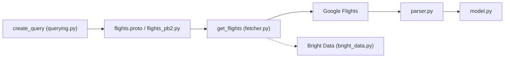

# AWeirdDev/flights

> Scraper Python typé de Google Flights, pour développeurs qui veulent des prix de vols sans API officielle.

## Le problème
Google a fermé son API publique de vols en 2018 ; les alternatives gratuites sont limitées en quotas et en prix.

## Ce que ça fait vraiment
Construit une requête typée (`FlightQuery`, `create_query`), l'encode en Protobuf/Base64 dans le paramètre `tfs` de l'URL Google Flights, récupère la page et parse les données JavaScript embarquées en itinéraires. Filtres : escales, compagnies, horaires, durée, bagages, prix max. Résultat riche : vols, alternatives moins chères, insights de prix, options de réservation.

## Comment c'est branché


## Essayer
```bash
pip install fast-flights
```
```python
from fast_flights import FlightQuery, Passengers, create_query, get_flights
query = create_query(
    flights=[FlightQuery(date="YYYY-MM-DD", from_airport="MYJ", to_airport="TPE")],
    seat="economy", trip="one-way", passengers=Passengers(adults=1), language="zh-TW",
)
res = get_flights(query)
```

## Coût et pièges
Gratuit ; l'intégration Bright Data (protection d'IP) est optionnelle et suppose un compte tiers. Le README ne documente aucun quota ni risque de blocage.

## Ce que ce n'est pas
Ce n'est pas une API officielle : ça repose sur le format interne des URL Google, qui peut changer (la v3 a déjà changé de méthode). Aucun outil de réservation.

## Alternatives
- hugoglvs/google-flights-scraper : basé sur Playwright, décrit par l'auteur comme très lent.
- SerpApi : scrape Google aussi, en service géré.

## Pour toi
À surveiller : utile pour un prototype de données de prix de vols, mais fragile car dépendant d'un format Google non contractuel et d'un seul mainteneur.
