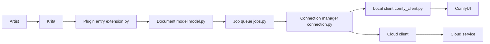

# Acly/krita-ai-diffusion

> Plugin Krita de génération et retouche d'images par IA, adossé à ComfyUI.

## Le problème
Les outils de génération d'images sont centrés sur les paramètres IA, pas sur un flux de peinture/retouche réel.

## Ce que ça fait vraiment
Inpainting sur sélection, peinture live, upscaling, modèles d'édition par instruction texte.
ControlNet (scribble, line art, pose, depth…), IP-Adapter, régions textuelles par calque, file de jobs et historique.
Backend ComfyUI local installé automatiquement, serveur existant/distant, ou génération cloud.
Modèles supportés : Flux 2, Z-Image, SD 1.5, XL, Illustrious.

## Comment c'est branché

## Essayer
Aucune commande : installation via Krita (Tools ▸ Scripts ▸ Import Python Plugin from File…, puis Settings ‣ Dockers ‣ AI Image Generation).

## Coût et pièges
Gratuit en local avec un GPU capable ; génération cloud payante (interstice.cloud). Krita 5.2.0+ requis. GPL-3.0.

## Ce que ce n'est pas
Pas une bibliothèque ou une API : un plugin d'application graphique. Pas un modèle.

## Alternatives
Aucune nommée dans le README.

## Pour toi
À ignorer pour un usage data/MLOps : très bon outil créatif, mais aucune brique réutilisable dans un pipeline ML.
