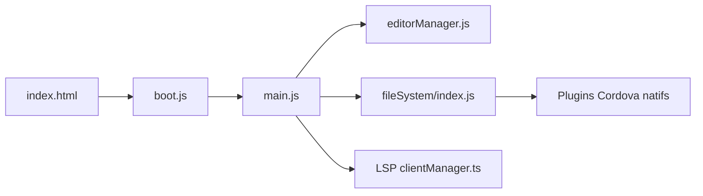

# Acode-Foundation/Acode

> Éditeur de code pour Android, avec terminal Alpine, SFTP et plugins communautaires.

## Le problème
Éditer du code sur un téléphone ou une tablette avec de vrais outils (terminal, LSP, accès distant).

## Ce que ça fait vraiment
Application Cordova : l'interface JavaScript/TypeScript (CodeMirror) tourne dans une WebView et appelle des plugins natifs (système de fichiers, terminal, FTP/SFTP, serveur local, aperçu navigateur). Terminal Alpine (proot) intégré, serveurs LSP, gestionnaire de plugins. L'architecture montre aussi des achats intégrés et des publicités (AdMob).

## Comment c'est branché

## Essayer
Aucune commande documentée dans le README : l'installation se fait depuis les plateformes de distribution (liens non reproduits).

## Coût et pièges
Gratuit à l'installation ; le code contient des modules d'achat intégré et de publicité. Le README n'en parle pas.

## Ce que ce n'est pas
Pas un IDE complet : le terminal Alpine et le LSP sont des ajouts ; la puissance dépend de l'appareil.

## Alternatives
Aucune alternative nommée dans le README.

## Pour toi
À ignorer : éditeur mobile utile en dépannage, mais sans place dans un flux data/IA/MLOps.

