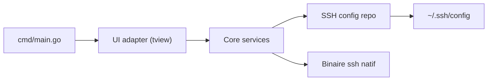

# Adembc/lazyssh

> Gestionnaire SSH en terminal, piloté au clavier, à partir de `~/.ssh/config`.

## Le problème
Retenir adresses, alias et options SSH d'un parc de serveurs, et éditer `~/.ssh/config` à la main.

## Ce que ça fait vraiment
Interface TUI (tview/tcell) qui lit votre configuration SSH : liste défilante, recherche floue, tags, épinglage, tri, ping, ajout et édition par onglets, transferts de ports. La connexion passe par le binaire `ssh` système. Écritures atomiques avec sauvegardes (une originale, dix glissantes).

## Comment c'est branché


## Essayer
```bash
brew install Adembc/homebrew-tap/lazyssh
git clone https://github.com/Adembc/lazyssh.git
cd lazyssh
make run
```

## Coût et pièges
Gratuit. Il modifie votre `~/.ssh/config` : les sauvegardes automatiques limitent le risque. Le transfert de fichiers et le déploiement de clés sont encore « à venir ».

## Ce que ce n'est pas
Pas un gestionnaire de secrets : clés et mots de passe ne sont ni stockés ni transmis. Pas un outil de configuration de flotte.

## Alternatives
- lazydocker et k9s : inspiration, pour Docker et Kubernetes.

## Pour toi
À adopter si tu jongles avec beaucoup de serveurs ou de machines GPU : gain de temps immédiat, risque limité par les sauvegardes.

