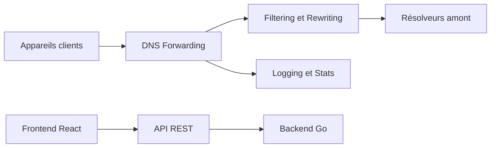

# AdguardTeam/AdGuardHome

> Serveur DNS auto-hébergé qui bloque publicités et traqueurs pour tous les appareils d'un réseau.

## Le problème
Bloquer pubs et traqueurs appareil par appareil est impossible sur téléviseurs ou objets connectés, où l'on ne peut rien installer.

## Ce que ça fait vraiment
Il fait office de serveur DNS et redirige les domaines de suivi vers un « trou noir ». Le backend Go gère la redirection DNS, le filtrage et la réécriture, un DHCP intégré, les statistiques et journaux, et le chiffrement (DoH, DoT, DNSCrypt en amont). Une interface React sert d'administration via une API REST. Il ne peut pas bloquer les publicités qui partagent le domaine du contenu (YouTube, par exemple).

## Comment c'est branché


## Essayer
```bash
curl -s -S -L https://raw.githubusercontent.com/AdguardTeam/AdGuardHome/master/scripts/install.sh | sh -s -- -v
git clone https://github.com/AdguardTeam/AdGuardHome
cd AdGuardHome
make
```

## Coût et pièges
Gratuit. Il faut une machine allumée en permanence et configurer les appareils pour l'utiliser. Compiler demande Go 1.25 et Node 24.10. Le README indique l'absence de collecte de statistiques d'usage.

## Ce que ce n'est pas
Ce n'est pas un bloqueur de contenu complet : le blocage par DNS reste limité. Licence GPL-3.0 : copyleft, à intégrer avec prudence dans un produit fermé.

## Alternatives
- Pi-Hole : comparé dans le README ; AdGuard Home l'emporte sur le HTTPS de l'interface, le DoH natif et le multiplateforme.

## Pour toi
À surveiller : utile pour un réseau perso ou de labo, sans lien direct avec le cœur data/IA ; note le GPL-3.0 avant de l'embarquer.

