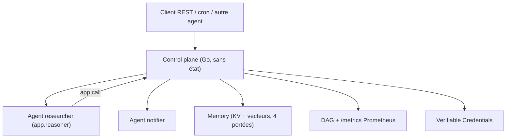

# Agent-Field/agentfield

> Plan de contrôle qui expose des fonctions d'agent en API REST et orchestre leur fan-out.

## Le problème
Dès qu'un deuxième service doit appeler ton agent, tu te mets à écrire des files, des reprises,
de la découverte de services et du tracing à la main.

## Ce que ça fait vraiment
Tu écris des fonctions Python, Go ou TypeScript décorées `@app.reasoner()` (jugement IA) ou
`@app.skill()` (code déterministe) ; `app.run()` les expose en `POST /api/v1/execute/{agent}.{func}`.
`app.call()` route vers d'autres agents à travers le plan de contrôle, donc une récursion
devient un fan-out distribué ; `app.pause()` suspend pour une validation humaine ;
`app.memory` offre du clé-valeur et de la recherche vectorielle sur quatre portées sans Redis.
Chaque agent reçoit une identité cryptographique (DID W3C + Ed25519) et chaque exécution un
justificatif vérifiable hors ligne.

## Comment c'est branché


## Essayer
```bash
curl -fsSL https://agentfield.ai/install.sh | bash
af init my-agent --defaults
af server          # Terminal 1 → Dashboard at http://localhost:8080
python main.py     # Terminal 2 → Agent auto-registers
docker run -p 8080:8080 agentfield/control-plane:latest
af install https://github.com/Agent-Field/sec-af
```

## Coût et pièges
Le plan de contrôle est gratuit mais chaque appel LLM passe par ta propre clé (LiteLLM, 100+
modèles). L'installateur macOS enregistre un service launchd et une icône de barre de menus ;
un `kill` simple est interprété comme un crash et relance. Télémétrie d'installation et de
cycle de vie activée par défaut, à couper avec `AGENTFIELD_TELEMETRY_ENABLED=false`. Surcoût de
routage annoncé à 100-200 ms par saut entre agents.

## Ce que ce n'est pas
Ce n'est pas un framework d'écriture d'agents : LangGraph ou CrewAI peuvent tourner à
l'intérieur d'un reasoner. Ce n'est pas non plus un simple serveur HTTP — c'est une
infrastructure avec identité, politiques et audit, donc un objet à exploiter.

## Alternatives
- Temporal ou Airflow : moteurs de workflow, cités comme couvrant l'async et les retries mais
  pas la logique d'agent.
- n8n ou Zapier : constructeurs visuels, API REST prêtes mais pas de mesh d'agents.
- LangChain, CrewAI, PydanticAI, OpenAI Agents SDK : pour écrire l'agent, pas pour l'exploiter.

## Pour toi
Pertinent le jour où tes agents doivent être appelés par le reste du SI, pas avant.
