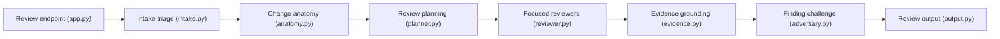

# Agent-Field/pr-af

> Relecteur de pull requests par agents, plusieurs passes, avec preuves tirées du code, sur la plateforme AgentField.

## Le problème
Les résumés de diff superficiels ratent les bugs et produisent des commentaires non fondés.

## Ce que ça fait vraiment
Chaque PR est triée, cartographiée, puis des « dimensions » de revue sont générées et confiées à des agents spécialisés. Les constats sont confrontés au code (extraction AST), soumis à des portes de falsifiabilité, regroupés pour détecter des risques composés, puis publiés en commentaires GitHub. Le README annonce un rappel de 0,706 sur Martian Code-Review-Bench avec GLM-5.2, mesuré par les auteurs.

## Comment c'est branché


## Essayer
```bash
af install https://github.com/Agent-Field/pr-af
af run pr-af
af call pr-af.review --in '{"pr_url": "https://github.com/owner/repo/pull/123"}'
```

## Coût et pièges
`OPENROUTER_API_KEY` et `GH_TOKEN` requis ; plafond par run de 2 $ et 3 600 s par défaut. Une revue dure typiquement 35 à 50 minutes. Aucune licence déclarée au catalogue.

## Ce que ce n'est pas
Pas une revue interactive rapide : le README recommande Claude Code en local et PR-AF comme dernière barrière en CI. Les résultats de benchmark ne sont pas indépendants.

## Alternatives
- Claude Code CLI : pour une boucle de développement rapide.
- CodeRabbit ou Codex (SaaS) : interface GitHub plus soignée, revue en quelques minutes.

## Pour toi
À surveiller comme barrière de revue en CI à coût plafonné ; l'absence de licence bloque une adoption tant qu'elle n'est pas clarifiée.
