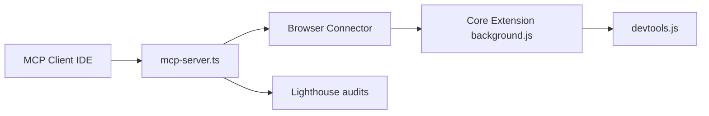

# AgentDeskAI/browser-tools-mcp

> Serveur MCP et extension Chrome qui donnent à un agent de code ta session navigateur.

## Le problème
Les MCP basés sur CDP pilotent un navigateur vierge : impossible de déboguer l'app sur laquelle tu es déjà connecté.

## Ce que ça fait vraiment
Une extension DevTools capture la console, le réseau, les captures d'écran et l'élément sélectionné.
Des outils MCP (`getConsoleErrors`, `getNetworkLogs`, `takeScreenshot`…) et des audits Lighthouse (performance, accessibilité, SEO).
Chaque onglet est suivi séparément ; les gros volumes passent en ressources MCP (HAR, rapports).
Écoute en loopback seulement, jeton d'authentification, identifiants caviardés.

## Comment c'est branché


## Essayer
```bash
npx @agentdeskai/browser-tools-mcp --doctor
npx @agentdeskai/browser-tools-server --verbose
```

## Coût et pièges
Gratuit ; il faut Node 22.19+. La version 1.2.x a une vulnérabilité critique : mettre à jour.

## Ce que ce n'est pas
Pas un outil d'automatisation de tests. Firefox n'est pas vérifié, et le réseau n'est capturé qu'une fois DevTools ouvert.

## Alternatives
- Chrome DevTools MCP : navigateur automatisé neuf, pour les tests.
- Playwright MCP : même logique, orienté tests.

## Pour toi
À surveiller : utile si tu débogues des fronts avec Claude Code, mais il faut exiger la version 2.x à cause de la faille de 1.x.
