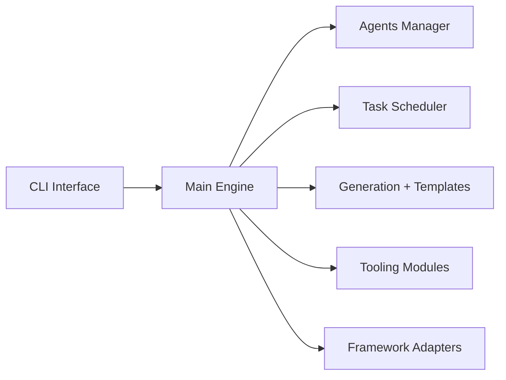

# AgentOps-AI/AgentStack

> Générateur de squelette pour projets d'agents IA en ligne de commande, façon create-react-app.

## Le problème
Démarrer un projet d'agents avec CrewAI, LangGraph ou d'autres frameworks demande de la configuration répétitive.

## Ce que ça fait vraiment
`agentstack init` crée l'arborescence, `agentstack generate agent/task` produit le code, `agentstack tools add` branche des outils ; agents et tâches se décrivent dans des YAML. Frameworks et gabarits sont des modules dans le paquet. La production n'est pas encore couverte (« bientôt »).

## Comment c'est branché


## Essayer
```bash
uv pip install agentstack
agentstack init <project_name>
agentstack generate agent/task <name>
agentstack tools add
agentstack run
```

## Coût et pièges
Clés de modèles à ta charge. Le fichier d'architecture contient telemetry.py : la collecte n'est pas décrite dans le README. Python 3.10 ou plus.

## Ce que ce n'est pas
Pas une solution low-code : il faut connaître le framework choisi. Pas un moteur d'agents lui-même.

## Alternatives
- Aucune alternative nommée dans le README.

## Pour toi
À surveiller : gain de temps pour lancer un prototype d'agents, mais l'abstraction et l'absence de voie vers la production limitent l'intérêt pour un usage sérieux.
