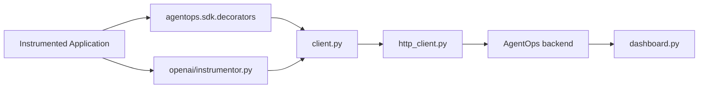

# AgentOps-AI/agentops

> SDK Python d'observabilité pour agents LLM : traces, coûts et rejeu de sessions.

## Le problème
Un agent multi-étapes échoue sans qu'on sache quel appel LLM, quel outil ou quelle dépense a dérapé.

## Ce que ça fait vraiment
`agentops.init()` instrumente automatiquement les appels LLM (OpenTelemetry) et les envoie au backend.
Décorateurs `@session`, `@agent`, `@operation`, `@workflow` pour structurer les spans.
Intégrations CrewAI, AG2, LangChain, LlamaIndex, OpenAI Agents, Anthropic, Mistral, LiteLLM…
Tableau de bord : graphes d'exécution, rejeu, coût ; application auto-hébergeable (dossier `app/`).

## Comment c'est branché


## Essayer
```bash
pip install agentops
pip install 'crewai[agentops]'
pip install agentops[langchain]
```

## Coût et pièges
Clé AgentOps requise (compte) ; les prompts et réponses partent vers le backend sauf auto-hébergement.

## Ce que ce n'est pas
Pas un framework d'agents : il observe ceux des autres. Les exemples du README mélangent anciennes API (`end_session`) et nouvelles.

## Alternatives
Aucune alternative nommée dans le README.

## Pour toi
À surveiller : utile pour tracer des agents CrewAI ou LangChain, mais envoyer ses traces à un SaaS se discute ; l'auto-hébergement est la voie à tester.
