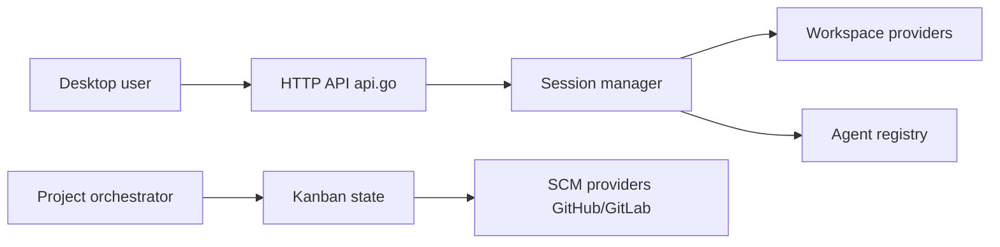

# AgentWrapper/agent-orchestrator

> Application de bureau pour lancer plusieurs agents de code en parallèle et suivre leurs PR sur un Kanban.

## Le problème
Plusieurs agents en parallèle créent des collisions de branches et des terminaux éparpillés, sans vue commune de la revue et de la CI.

## Ce que ça fait vraiment
Chaque tâche reçoit un agent, une branche et un worktree Git. Un orchestrateur de projet découpe les plans et délègue à des workers. Un démon local suit activité, PR, CI et revues, et place chaque carte sur le Kanban (Working, Needs you, In review, Ready to merge).

## Comment c'est branché


## Essayer
```bash
git clone https://github.com/Untrivial-ai/agent-orchestrator.git
cd agent-orchestrator
```
Pas d'autre commande d'installation dans le README : l'application se télécharge depuis la page Releases.

## Coût et pièges
Tu apportes les agents et leurs abonnements ou clés. Télémétrie active : le README mentionne l'envoi du propriétaire GitHub du projet et du pseudo GitHub connecté, sans réglage séparé, sauf en coupant toute la télémétrie.

## Ce que ce n'est pas
Pas un agent de code lui-même, seulement un superviseur. Le diagramme ne couvre qu'une partie du code (source non échantillonnée). La licence n'est pas déclarée dans le catalogue.

## Alternatives
Aucune alternative nommée dans le README.

## Pour toi
À surveiller : intéressant si tu fais tourner plusieurs agents sur un dépôt, mais la télémétrie nominative et l'absence de licence connue appellent une vérification.
