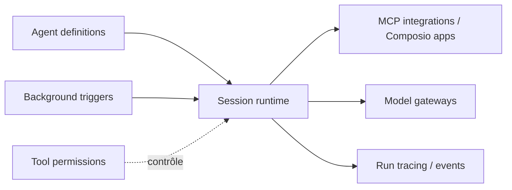

# Agenta-AI/agenta

> Espace de travail open source pour construire, partager et exécuter des agents, en chat ou en tâche de fond.

## Le problème
Bâtir des agents utiles, les partager en équipe, les déclencher sur événement et comprendre leurs échecs demande d'assembler plusieurs briques.

## Ce que ça fait vraiment
Tu décris le travail à un agent en chat, tu connectes des apps (MCP, ou plus de 1 000 apps via Composio) et tu règles les permissions par outil. Les agents tournent en interactif ou en arrière-plan (planning, événement). Chaque exécution est tracée avec tokens et coût estimé, et la configuration est versionnée. Harnais pris en charge : Claude Code, Pi, Codex. Le câblage runtime ci-dessous vient du README, pas de l'inspection du code.

## Comment c'est branché


## Essayer
```bash
# Auto-hébergement, selon le README (à coller dans ton agent) :
npx skills add Agenta-AI/agenta-skills
# puis : « Help me self-host Agenta with its repository. »
```

## Coût et pièges
Une version cloud existe ; l'auto-hébergement permet d'utiliser un abonnement Claude ou ChatGPT existant plutôt que la facturation à l'API. 349 issues ouvertes.

## Ce que ce n'est pas
Pas un constructeur de workflows à étapes fixes (le README le distingue de n8n, Zapier). Il ne remplace pas l'agent de code : il ajoute l'espace de travail autour.

## Alternatives
- n8n / Activepieces / Zapier : pour des processus prévisibles à étapes définies.
- Claude Cowork : espace lié à Claude, non ouvert.

## Pour toi
À surveiller : utile si tu veux traces, versions et permissions autour d'agents d'équipe, mais la licence est à vérifier avant tout usage professionnel.
