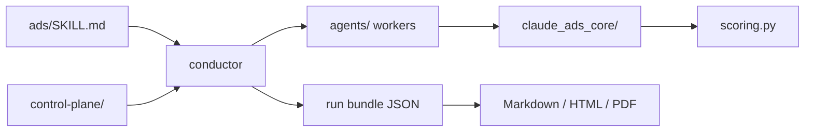

# AgriciDaniel/claude-ads

> Jeu de skills Claude pour auditer et piloter des comptes publicitaires, lecture seule par défaut.

## Le problème
Les audits paid media se font à la main, sans trace des sources ni des dates, et un agent qui écrit directement dans un compte peut casser des campagnes.

## Ce que ça fait vraiment
Transforme des exports autorisés ou des lectures de compte en audits datés, plans, briefs créatifs, expériences et rapports.
Douze plateformes (Google, Meta, YouTube, LinkedIn, TikTok, Microsoft, Reddit, Snapchat, X, Apple, Amazon, Pinterest), chacune avec son skill et son worker.
Le résultat canonique est du JSON versionné ; Markdown, HTML et PDF n'en sont que des rendus.
Toute écriture exige capacité testée, IDs explicites, diff avant/après, approbation, clé d'idempotence et rollback.

## Comment c'est branché


## Essayer
```bash
git clone https://github.com/AgriciDaniel/claude-ads.git
cd claude-ads
bash install.sh --source=local
python -m claude_ads_core --version
```

## Coût et pièges
Accès aux plateformes publicitaires à ta charge ; Playwright pour la capture navigateur, WeasyPrint et Pango pour le PDF. CPython 3.11 ou 3.12 seulement.

## Ce que ce n'est pas
Pas un outil qui pilote les campagnes : les écritures restent désactivées tant que les portes ne sont pas passées, et la suppression définitive n'existe pas en v2. Pas une source de données : il faut des exports ou des accès déjà obtenus. Couverture 60 à 79 % = audit « provisoire ».

## Alternatives
Le README ne nomme aucun projet concurrent, seulement son miroir communautaire `AI-Marketing-Hub/claude-ads`.

## Pour toi
Intéressant comme modèle d'architecture conducteur/workers avec contrats JSON, moins comme outil si tu ne fais pas de paid media.
