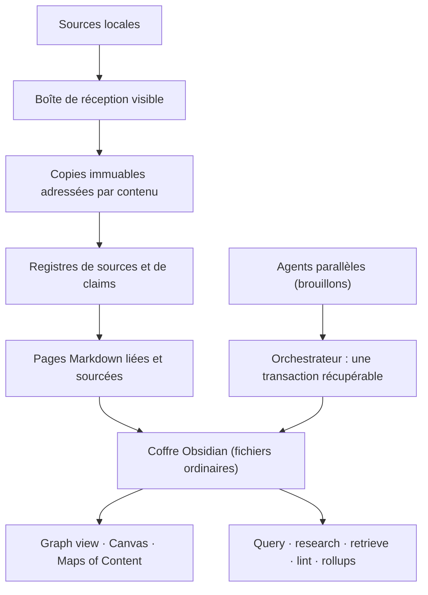

# AgriciDaniel/claude-obsidian

> Système de connaissance local pour Claude Code qui alimente et interroge un coffre Obsidian sourcé.

## Le problème
Les workflows de prise de notes par IA s'arrêtent au texte enregistré : la source disparaît, et rien ne dit si une affirmation est étayée.
Trois mois plus tard, le coffre est un tas de notes non reliées qu'on ne réinterroge jamais.

## Ce que ça fait vraiment
Une boucle en quatre temps : capturer la source via une boîte de réception visible en conservant des copies immuables adressées par contenu, ancrer chaque affirmation dans des registres de sources et de claims (autorité, fraîcheur, appui, contradiction, confiance, état de revue), relier le tout en pages, index, Maps of Content et vues Obsidian Canvas, puis réinterroger le coffre.
Le coffre reste un répertoire ordinaire de Markdown, JSON et fichiers sources — pas un cache de plugin, pas une base cloud.
Les agents parallèles ne peuvent pas se marcher dessus : les workers rendent des brouillons, un seul orchestrateur inspecte et applique une transaction récupérable.
Toute commande de configuration mutante prévisualise son opération exacte avant de pouvoir l'appliquer.

## Comment c'est branché


## Essayer
```bash
git clone https://github.com/AgriciDaniel/claude-obsidian.git
cd claude-obsidian
# Le checkout contient le produit, ce n'est pas ton coffre :
# l'étape suivante initialise un coffre séparé (non lue ici, README tronqué).
```

## Coût et pièges
Gratuit et local par défaut : la sortie réseau est présentée comme une décision explicite et séparée.
Le coût réel est celui des appels du modèle de l'agent hôte, et la première mise en place demande un checkout source plus un coffre utilisateur distincts.

## Ce que ce n'est pas
Le README le dit lui-même : ni enregistreur automatique de transcriptions, ni service de synchronisation cloud, ni oracle factuel.
Ce n'est pas non plus un substitut à des sauvegardes ni à un gestionnaire de versions.
Les adaptateurs optionnels sont détectés et se dégradent visiblement plutôt que d'être simulés — donc certaines capacités annoncées peuvent être absentes chez toi.

## Alternatives
Aucun dépôt concurrent n'est nommé dans la portion de README lue.

## Pour toi
À regarder si tu tiens déjà un coffre Obsidian et que la traçabilité des affirmations compte ; la maturité et la licence restent à vérifier avant d'y verser ta base.

---

## Note de production

Le fichier source `veille/.data/blocs/bloc-00.md` compte 2 183 lignes. La lecture
s'est arrêtée à la ligne 830 (plafond de tokens par lecture du harness), soit
5 dépôts sur 10, le cinquième coupé en plein README (`claude-obsidian`, étape 2
du quickstart).

Les 5 dépôts restants n'ont pas été lus : aucune fiche n'a été écrite pour eux
plutôt que d'en inventer le contenu, la règle 1 du PLAN interdisant toute
affirmation non traçable au README.

Pour les obtenir : relancer un bloc avec `offset=831` sur le même fichier.
