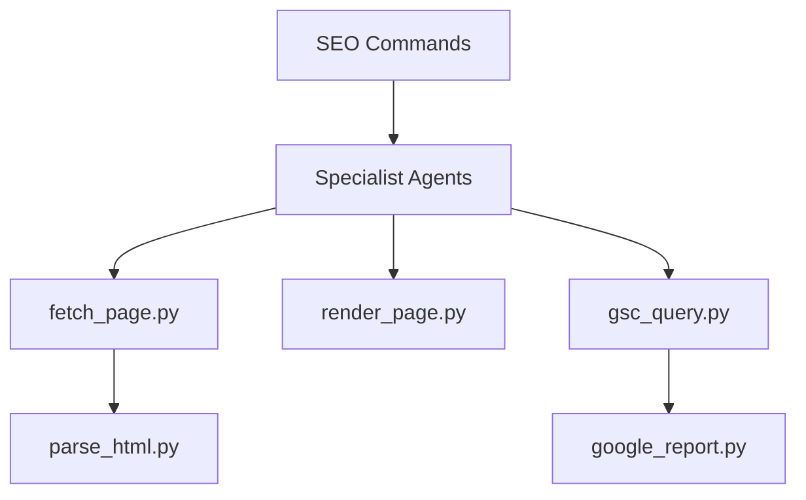

# AgriciDaniel/claude-seo

> Plugin Claude Code qui lance des audits SEO en parallèle avec 18 agents spécialisés.

## Le problème
Un audit SEO complet (technique, E-E-A-T, schema, recherche IA, local) prend des heures et varie d'un analyste à l'autre.

## Ce que ça fait vraiment
Il fournit 25 sous-skills, 18 agents et 32 commandes `/seo` (`audit`, `page`, `schema`, `geo`…).
Le rendu passe par Playwright Chromium et l'analyse de l'HTML par trafilatura. Les résultats sortent en rapports Markdown et PDF.
Les API Google (PSI, CrUX, GSC, GA4) sont optionnelles, par paliers.
Il existe 8 extensions MCP : DataForSEO, Ahrefs, Firecrawl…

## Comment c'est branché


## Essayer
```bash
/plugin marketplace add AgriciDaniel/claude-seo
/plugin install claude-seo@agricidaniel-claude-seo
/seo setup
/seo audit https://example.com
```

## Coût et pièges
Il faut un abonnement Claude Code. Depuis la v2.3.1, cinq agents tournent sur Opus, ce qui rend un audit plus cher. Les extensions exigent des comptes payants.

## Ce que ce n'est pas
Ce n'est pas un crawler complet : le README le dit lui-même, pour cela il faut Screaming Frog. Une variante privée, avec fonctions en avant-première, est réservée aux membres payants de la communauté.

## Alternatives
Le README ne nomme aucun dépôt alternatif. Il renvoie au portage Codex SEO du même auteur.

## Pour toi
À ignorer : le SEO sort de ton périmètre. Seule son architecture de sous-agents en parallèle mérite un coup d'œil.
